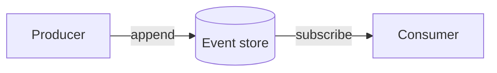

[Open with the question the reader is really asking — "why does X work this way?" or
"how should I think about Y?". Explanation pages build understanding; they do not give
step-by-step instructions and they do not list every API.]

## The idea

[Explain the concept in plain language. Define every term of art on first use.]

## How it fits together

[A diagram is often the clearest explanation. The mermaid fence below renders as an
interactive, zoomable diagram once the diagram support is in place.]

## Trade-offs

[Be honest about limits and alternatives. Explanation is where nuance lives.]
