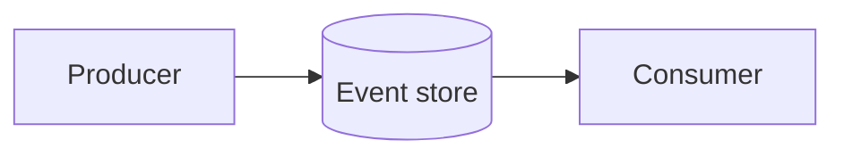

State the concept and the reader's reason to understand it.
Define each technical term at first use.

## Mechanism

Describe one subject per paragraph. Name the component that performs each action.

```mermaid
flowchart LR
  Producer --> Store[(Event store)]
  Store --> Consumer
```

## Constraints

State the limits and their effects.

## Related tasks

Link to the relevant procedures and reference.
