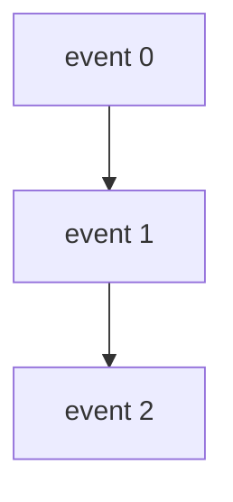

[A theory explainer is a deeper conceptual or mathematical essay. It lives in the
`explanation/` folder (theory IS explanation). Use it for the formal model behind a
library. Still define every symbol and term.]

<Callout type="info">
  This page goes deeper than the surrounding explanation pages. You can use the library
  fully without reading it; read it to understand the model precisely.
</Callout>

## The model

[Develop the formal idea. Introduce notation gently. A diagram often helps.]

## Why it matters in practice

[Connect the theory back to something the reader can do or rely on.]
