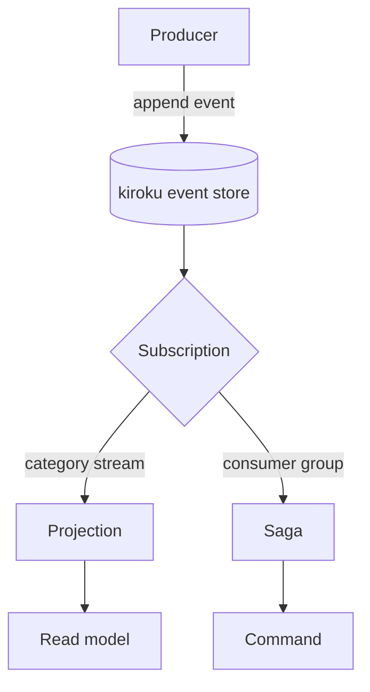
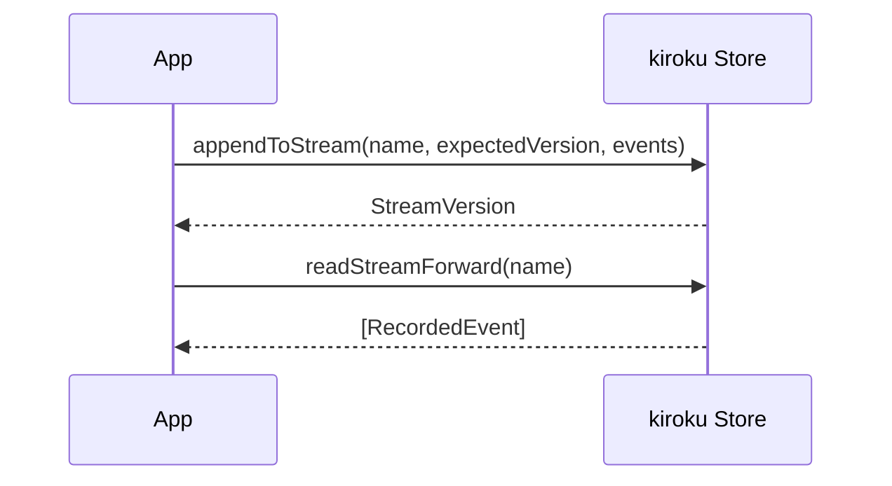

A flowchart of the kiroku write/read path:

```mermaid
flowchart TD
    A[Producer] -->|append event| B[(kiroku event store)]
    B --> C{Subscription}
    C -->|category stream| D[Projection]
    C -->|consumer group| E[Saga]
    D --> F[Read model]
    E --> G[Command]
```

A sequence diagram, to confirm non-flowchart diagrams render too:

```mermaid
sequenceDiagram
    participant App
    participant Store as kiroku Store
    App->>Store: appendToStream(name, expectedVersion, events)
    Store-->>App: StreamVersion
    App->>Store: readStreamForward(name)
    Store-->>App: [RecordedEvent]
```
