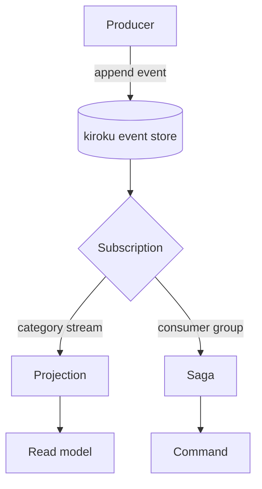
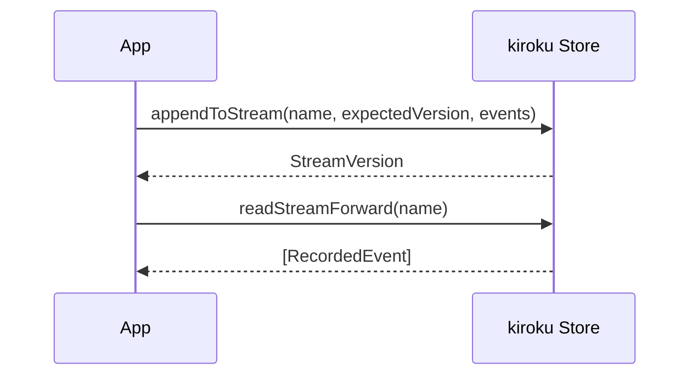

A flowchart of the kiroku write/read path:

A sequence diagram, to confirm non-flowchart diagrams render too:

A hand-authored SVG diagram. It uses the semantic classes from `src/styles/diagrams.css`, so it
follows the light and dark themes. The authoring guide is `content/diagrams/README.md`.

<Diagram
  src="kiroku/all-log-placements"
  alt="Six events in three source streams, orders-1 to orders-3. Each event also has a row in the $all log, at positions 1 to 6. A cursor points after position 4."
  caption="An SVG diagram rendered with the Diagram component."
/>
