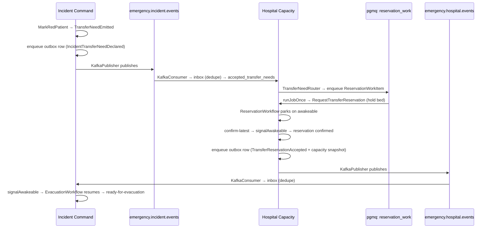

This is the payoff chapter. It follows a single critical patient through the **`mass-casualty-transfer`**
scenario — the full cross-boundary demo — from a triage in Incident Command to a confirmed bed in
Hospital Capacity and back. Every later chapter in this tour zooms into one mechanism named here.
The canonical narrative is the app's own `docs/scenarios/mass-casualty-transfer.md`.

## One picture

## The story in words

1. **A transfer need is born.** A red-tag triage in Incident Command emits `TransferNeedEmitted`
   (see [Incident Command · aggregates](/docs/example-app/incident-command/01-aggregates-and-transducers)).
2. **It becomes an outbox row.** `triageEventToOutboxEvent` turns that private event into a public
   `IncidentTransferNeedDeclared` integration message and enqueues it transactionally
   ([outbox &amp; publishing](/docs/example-app/cross-service/02-outbox-and-publishing)).
3. **A worker publishes it to Kafka** on `emergency.incident.events`.
4. **Hospital Capacity consumes it exactly once.** Its Kafka consumer hands the envelope to the
   inbox, which dedupes on the message's idempotency key and writes `accepted_transfer_needs`
   ([inbox &amp; consuming](/docs/example-app/cross-service/03-inbox-and-consuming)).
5. **The transfer-need router fans out to reservation work.** It resolves candidate hospitals and
   enqueues a `ReservationWorkItem` onto the **pgmq** queue
   ([pgmq work queue](/docs/example-app/hospital-capacity/05-the-pgmq-reservation-work-queue)).
6. **A job drains and holds a bed.** `runJobOnce` decodes the item and runs
   `RequestTransferReservation`; the [reservation workflow](/docs/example-app/hospital-capacity/04-the-reservation-workflow)
   holds the bed and **parks** on its confirmation awakeable.
7. **Confirmation flows back.** Once confirmed, Hospital Capacity enqueues a
   `TransferReservationAccepted` message (and a capacity snapshot) to its outbox and publishes to
   `emergency.hospital.events`.
8. **Incident Command consumes the response** through its inbox and **signals the evacuation
   workflow's awakeable** — which resumes and reaches `ready-for-evacuation`
   ([evacuation workflow](/docs/example-app/incident-command/06-the-evacuation-workflow)).

The whole journey is **one OpenTelemetry trace**: a W3C `traceparent` rides with every message
across Kafka and pgmq ([telemetry &amp; trace continuity](/docs/example-app/cross-service/04-telemetry-and-trace-continuity)).

## What each moment exercises

From the scenario's own feature map (`docs/scenarios/mass-casualty-transfer.md`):

| Moment | Feature |
|---|---|
| Hazardous dispatch rejected before perimeter | Keiki aggregate guard |
| Incident events persisted | Kiroku private event stream |
| Escalation scheduled | keiro process manager + timer |
| Evacuation waits for capacity | keiro workflow + awakeable |
| Transfer need published | keiro outbox + Kafka |
| Hospital accepts message once | keiro inbox |
| Candidate hospital receives reservation command | keiro Router |
| Reservation work leased and acknowledged | Shibuya + pgmq adapter |
| Spans connect scenario, workers, keiro, Kafka, pgmq | OpenTelemetry |

The remaining chapters dissect the contract, the outbox, the inbox, and the telemetry that make this
flow work.
