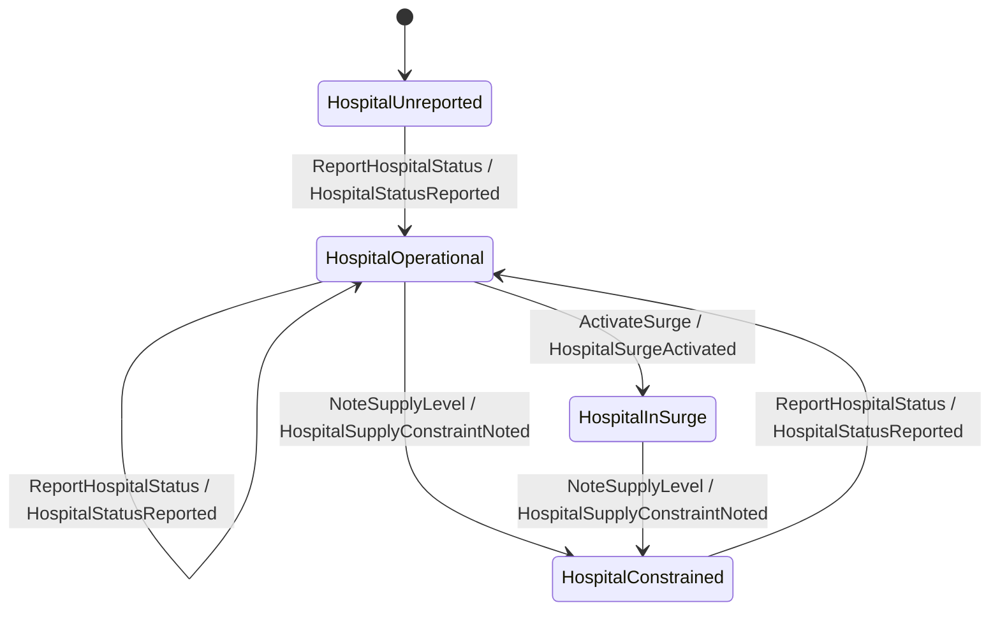
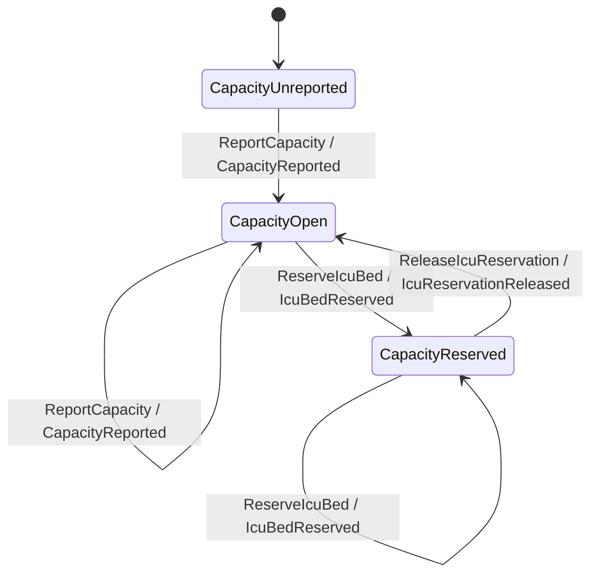
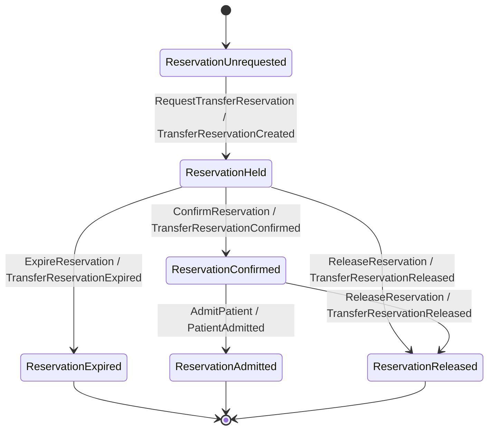

`hospital-capacity` has three aggregates — **Hospital**, **Capacity**, and **Reservation** — each a
**Keiki transducer** paired with a keiro **EventStream**, exactly as in
[Incident Command's chapter 01](/docs/example-app/incident-command/01-aggregates-and-transducers).
Rather than repeat the mechanics, this chapter focuses on what is specific to this service. Read the
keiro [event stream &amp; stream](/docs/keiro/reference/event-stream-and-stream) reference alongside.

## Hospital — operational posture

The Hospital aggregate tracks a facility's capacity level, divert posture, and surge mode. Its key
guard rejects a status report whose `activeRegionalDemand` is negative, and it can move into surge or
supply-constrained states:



`ActivateSurge` is the command the [surge process manager](/docs/example-app/hospital-capacity/03-the-surge-process-manager)
emits.

## Capacity — bed accounting

The Capacity aggregate is the bed ledger. Its guards are arithmetic — a `ReportCapacity` is only
accepted when staffed/available/reserved bed counts are non-negative, and an ICU bed can only be
reserved while `availableIcuBeds > 0`:



## Reservation — the transfer lifecycle

The Reservation aggregate is the heart of the cross-service story: it models one transfer
reservation from request to admission. Its declaring guard is the domain's most interesting one — a
`RequestTransferReservation` is rejected when the destination is in **total divert** *unless* the
request carries a **life-critical override**:



The command that creates a reservation, `RequestTransferReservationData`, is exactly what the
[pgmq work queue](/docs/example-app/hospital-capacity/05-the-pgmq-reservation-work-queue) decodes
from a job and what the reservation workflow holds — so it is worth knowing its fields:
`reservationId`, `hospitalId`, `commandId`, `patientAcuity`, `requiredBedType`, `sourceMessageId`,
`expirationDeadline`, `divertStatus`, and `lifeCriticalOverride`.

## The EventStream pattern

Each aggregate's EventStream follows the same shape as Incident Command's — a hand-written `Codec`,
a per-id stream name (`hospital-<id>`, `reservation-<id>`), `snapshotPolicy = Never`:

```haskell
-- services/hospital-capacity/src/HospitalCapacity/Reservation/EventStream.hs
reservationEventStream :: ReservationEventStream
reservationEventStream =
  EventStream
    { transducer = reservationTransducer
    , initialState = ReservationUnrequested
    , initialRegisters = initialReservationRegs
    , eventCodec = reservationCodec
    , resolveStreamName = Stream.streamName
    , snapshotPolicy = Never
    , stateCodec = Nothing
    }

reservationStream :: TransferReservationId -> Stream ReservationEventStream
reservationStream reservationId = stream ("reservation-" <> idText reservationId)
```

They live in `Hospital/EventStream.hs`, `Capacity/EventStream.hs`, and
`Reservation/EventStream.hs`. The
process-manager state streams (`Surge`, `Supply`) follow the same pattern in their own modules and
are covered in [chapter 03](/docs/example-app/hospital-capacity/03-the-surge-process-manager).
