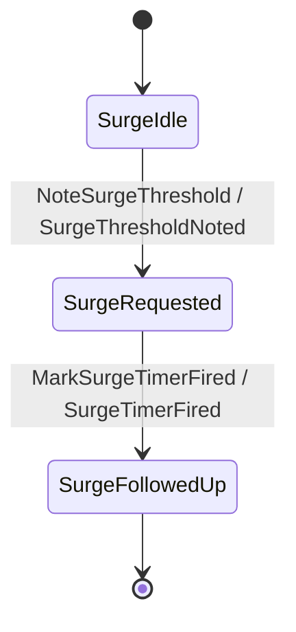

The surge process manager is the mirror of Incident Command's
[escalation PM](/docs/example-app/incident-command/05-escalation-process-manager-and-timers): a
long-lived reactor with its own state stream that reacts to capacity pressure, **commands the
Hospital aggregate to activate surge**, and schedules a follow-up **durable timer**. Read the keiro
[process managers &amp; sagas](/docs/keiro/explanation/process-managers-and-sagas) and
[durable timers](/docs/keiro/explanation/durable-timers) explanations alongside.

## The surge state machine

The PM's transducer (`Surge/Transducer.hs`) is small — note a threshold, then mark the follow-up
timer fired:



## The ProcessManager value

`hospitalSurgeProcessManager` differs from escalation in one important way: its `handle` returns
**both** a PM command to record *and* a `commands` list targeting another aggregate — it tells the
**Hospital** aggregate to `ActivateSurge` in the same step:

```haskell
-- services/hospital-capacity/src/HospitalCapacity/SurgeManager.hs
hospitalSurgeProcessManager :: HospitalSurgeProcessManager
hospitalSurgeProcessManager =
  ProcessManager
    { name = hospitalSurgeProcessName             -- "hospital-surge"
    , correlate = \input -> idText input.hospitalId
    , eventStream = surgeEventStream
    , streamFor = surgeStream . mustHospitalIdText
    , targetEventStream = hospitalEventStream
    , targetProjections = const [hospitalReadinessProjection]
    , handle = \input ->
        let timer = surgeTimerRequest input.hospitalId (surgeDeadline input.observedAt)
         in ProcessManagerAction
              { command = NoteSurgeThreshold NoteSurgeThresholdData { … }
              , commands =
                  [ PMCommand
                      { target = hospitalCommandStream input.hospitalId
                      , command = ActivateSurge ActivateSurgeData
                          { hospitalId = input.hospitalId, commandId = placeholderCommandId }
                      }
                  ]
              , timers = [timer]
              }
    }
```

Compare with escalation's `handle`, whose `commands` list was empty — there the target command came
later, when the timer fired. Here the surge activation is immediate; the timer is the *follow-up*.
The window is a flat five minutes:

```haskell
-- services/hospital-capacity/src/HospitalCapacity/SurgeManager.hs
surgeWindow :: NominalDiffTime
surgeWindow = 5 * 60

surgeTimerRequest :: HospitalId -> UTCTime -> TimerRequest
surgeTimerRequest hospitalId fireAt =
  TimerRequest
    { timerId = TimerId (namedUuid ("hospital-surge-timer:" <> idText hospitalId))
    , processManagerName = hospitalSurgeProcessName
    , correlationId = idText hospitalId
    , fireAt = fireAt
    , payload = object [ "kind" Aeson..= ("hospital-surge-follow-up" :: Text), … ]
    }
```

## The timer worker

`runHospitalSurgeTimerWorker` is the same shape as the escalation timer worker — it claims a due
timer via `runTimerWorker`, checks the PM name, and fires `MarkSurgeTimerFired` with a deterministic
event id, treating a `CommandRejected` (already fired) as handled:

```haskell
-- services/hospital-capacity/src/HospitalCapacity/SurgeManager.hs
runHospitalSurgeTimerWorker options now =
  runTimerWorker Nothing now $ \timer ->
    -- … if the timer belongs to "hospital-surge" …
      result <- runCommand options{eventIds = [firedEventId]} surgeEventStream (surgeStream hospitalId)
                  (MarkSurgeTimerFired MarkSurgeTimerFiredData{hospitalId, timerId = timerText})
      case result of
        Right{} -> pure (Just firedEventId)
        Left CommandRejected -> pure (Just firedEventId)
        Left{} -> pure Nothing
```

This is invoked by `hospital-capacity-worker timers once`. The `supply-shortage-escalation` scenario
exercises this PM together with the `Supply` transducer; the
[regional-surge scenario](/docs/example-app/running-it) drives it in `--durable` mode.
