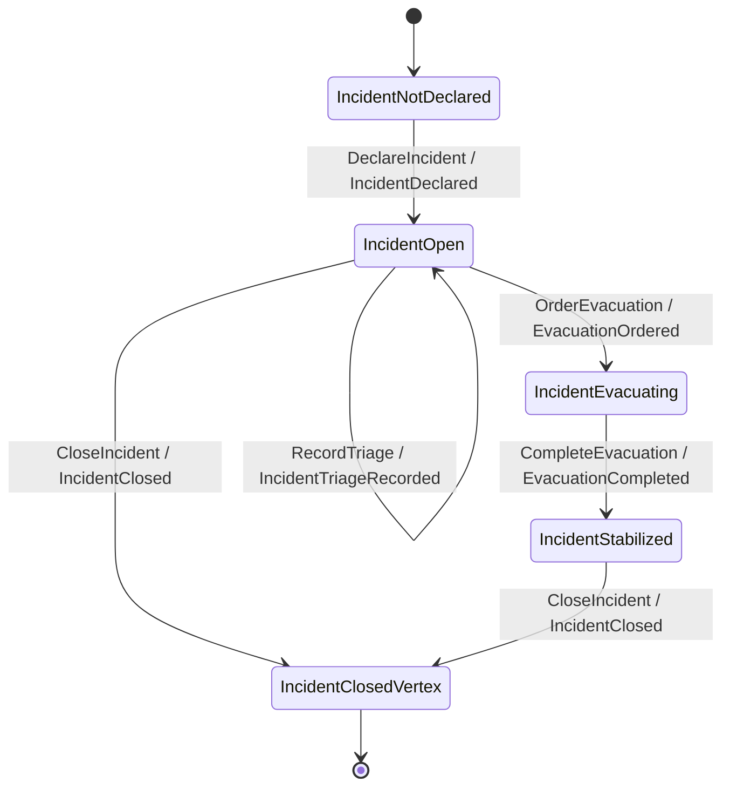
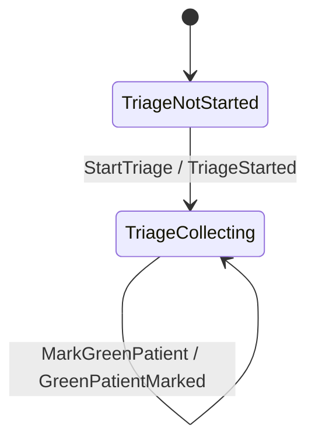

`incident-command` has three aggregates — **Incident**, **FieldResource**, and **Triage** — and
each is modelled the same way: a **Keiki transducer** (a typed state machine) paired with a keiro
**EventStream** (codec + stream naming + snapshot policy). This chapter reads the Incident pair in
full and shows where the other two live.

If "transducer" is new, read
[What is a transducer?](/docs/keiro/explanation/the-keiro-stack#what-is-a-transducer) and the keiro
[event stream &amp; stream](/docs/keiro/reference/event-stream-and-stream) reference first.

## The register file

A transducer's state is a typed **register file** — a heterogeneous list of named fields. The
Incident aggregate declares its registers as a type-level list and an initial value:

```haskell
-- services/incident-command/src/IncidentCommand/Incident/Transducer.hs
type IncidentRegs =
  '[ '("incidentId", IncidentId)
   , '("commander", CommanderId)
   , '("hasCommander", Bool)
   , '("severity", Severity)
   , '("activeResourceIds", [ResourceId])
   , '("redCount", Int)
   , '("yellowCount", Int)
   , '("greenCount", Int)
   , '("safetyPerimeterEstablished", Bool)
   , '("evacuationOrdered", Bool)
   , '("evacuationComplete", Bool)
   , '("pendingTransferNeeds", Int)
   , '("closed", Bool)
   ]
```

Alongside the registers, the module declares the **commands** (`IncidentCommand`) the aggregate
accepts and the **events** (`IncidentEvent`) it can emit — each a sum type of per-case record
payloads (`DeclareIncidentData`, `IncidentDeclaredData`, …). Template-Haskell splices derive the
constructor helpers the builder uses:

```haskell
-- services/incident-command/src/IncidentCommand/Incident/Transducer.hs
$(deriveAggregateCtorsWith ''IncidentCommand ''IncidentRegs
    defaultDeriveCtorOptions
      { suffixOverrides = Map.fromList [("DeclareIncident", "Declare")]
      }
  )

$(deriveWireCtorsAll ''IncidentEvent)
```

## The guarded transitions

The transducer itself is built with the high-level `Keiki.Builder` DSL: `B.from <vertex>` groups
the transitions valid in that state, `B.onCmd` matches a command, `B.requireGuard` rejects it
unless a predicate over the registers holds, `B.slot @"…" =:` writes a register, `B.emit` records
an event, and `B.goto` moves to the next vertex. The interesting guards are where the domain rules
live:

```haskell
-- services/incident-command/src/IncidentCommand/Incident/Transducer.hs
    B.from IncidentOpen do
      -- …
      B.onCmd inCtorDispatchResource $ \d -> B.do
        B.requireGuard (B.reg @"closed" .== lit False)
        B.requireGuard (B.reg @"safetyPerimeterEstablished" .== lit True)
        B.slot @"activeResourceIds" =: d.activeResourceIds
        B.emit wireResourceDispatched ResourceDispatchedTermFields { … }
        B.goto IncidentOpen

      B.onCmd inCtorOrderEvacuation $ \d -> B.do
        B.requireGuard (B.reg @"closed" .== lit False)
        B.requireGuard (B.reg @"severity" .== lit MassCasualty)
        B.requireGuard (B.reg @"hasCommander" .== lit True)
        B.slot @"evacuationOrdered" =: lit True
        B.emit wireEvacuationOrdered EvacuationOrderedTermFields { … }
        B.goto IncidentEvacuating
```

Read those guards as the safety rules of the domain: a resource cannot be dispatched until a
**safety perimeter is established**, and an evacuation cannot be ordered unless the incident is a
**mass-casualty** event *and* a **commander is assigned**. A command whose guard fails produces no
events — keiro turns that into a `CommandRejected`. This is the `hospital-divert-reroute` and
hazardous-dispatch-rejection behavior the scenarios exercise.

The whole machine, generated from this source, is:



## The EventStream

The transducer is pure. To make it a durable aggregate, keiro wraps it in an **EventStream** that
adds a codec (how events become JSON), a stream-name resolver, and a snapshot policy:

```haskell
-- services/incident-command/src/IncidentCommand/Incident/EventStream.hs
incidentEventStream :: IncidentEventStream
incidentEventStream =
  EventStream
    { transducer = incidentTransducer
    , initialState = IncidentNotDeclared
    , initialRegisters = initialIncidentRegs
    , eventCodec = incidentCodec
    , resolveStreamName = Stream.streamName
    , snapshotPolicy = Never
    , stateCodec = Nothing
    }

incidentStream :: IncidentId -> Stream IncidentEventStream
incidentStream incidentId = stream ("incident-" <> idText incidentId)
```

Each incident gets its own stream, named `incident-<typeid>` — so the stream name is
self-describing (and, as the [cross-service tour](/docs/example-app/cross-service)
shows, becomes the keiro command span name). The codec is a hand-written `Codec` that lists the
event-type tags, maps each event to its tag, sets `schemaVersion = 1`, and provides `encode` /
`decode` plus an (empty) `upcasters` list — the schema-evolution seam:

```haskell
-- services/incident-command/src/IncidentCommand/Incident/EventStream.hs
incidentCodec :: Codec IncidentEvent
incidentCodec =
  Codec
    { eventTypes = "IncidentDeclared" :| [ "CommanderAssigned", … , "IncidentClosed" ]
    , eventType = \case
        IncidentDeclared{} -> "IncidentDeclared"
        -- …
    , schemaVersion = 1
    , encode = encodeIncidentEvent
    , decode = parseIncidentEvent
    , upcasters = []
    }
```

`snapshotPolicy = Never` means this aggregate always hydrates by replaying its whole event log;
keiro supports periodic snapshots, but these streams are short enough not to need them.

## The other two aggregates

The **FieldResource** and **Triage** aggregates follow the identical pattern in their own
directories:

- `FieldResource/Transducer.hs` + `FieldResource/EventStream.hs` — a dispatchable unit moving
  between `ResourceAvailable` and `ResourceAssignedVertex`. This is the aggregate the
  [resource-dispatch router](/docs/example-app/incident-command/04-routers) targets.
- `Triage/Transducer.hs` + `Triage/EventStream.hs` — the triage tally. Its key edge is
  `MarkRedPatient`, which emits **both** `RedPatientMarked` and `TransferNeedEmitted` — the event
  that becomes the cross-service transfer need:



`TransferNeedEmitted` is where this service's story connects to Hospital Capacity; the
[command cycle](/docs/example-app/incident-command/02-the-command-cycle) shows how that event is
appended, and the [cross-service tour](/docs/example-app/cross-service) shows
how it leaves the service.
