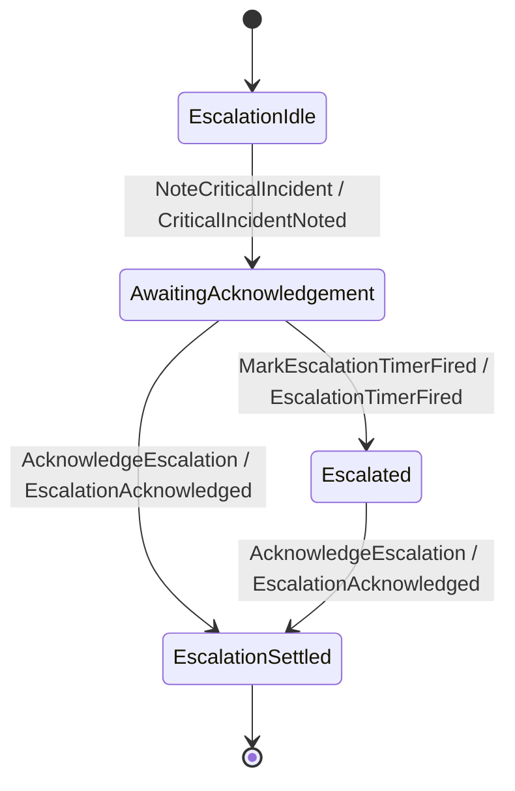

A **process manager** (PM) is a long-lived reactor with durable memory: it watches events, keeps
its own state stream, and emits commands and timers. Incident Command's escalation PM watches for a
critical incident, schedules a **durable timer**, and — if no one acknowledges before the deadline —
fires mutual-aid. Read the keiro
[process managers &amp; sagas](/docs/keiro/explanation/process-managers-and-sagas) and
[durable timers](/docs/keiro/explanation/durable-timers) explanations, plus the
[process manager](/docs/keiro/reference/process-manager) and [timers](/docs/keiro/reference/timers)
references, alongside this.

## The escalation state machine

The PM has its own Keiki transducer (`Escalation/Transducer.hs`) and its own EventStream
(`escalationEventStream` in `Escalation.hs`), stored per incident as
`incident-escalation-<typeid>`. Its states track acknowledgement and timer progress:



## The ProcessManager value

`incidentEscalationProcessManager` wires the PM together. A PM is parameterised by **two**
aggregates — its own state stream and the *target* aggregate it commands — and declares how to
correlate an input to a stream, how to handle the input, and which timers to schedule:

```haskell
-- services/incident-command/src/IncidentCommand/Escalation.hs
incidentEscalationProcessManager :: IncidentEscalationProcessManager
incidentEscalationProcessManager =
  ProcessManager
    { name = incidentEscalationProcessName            -- "incident-escalation"
    , correlate = \input -> idText input.incidentId
    , eventStream = escalationEventStream
    , streamFor = escalationStream . mustIncidentIdText
    , targetEventStream = incidentEventStream
    , targetProjections = const [incidentDashboardProjection]
    , handle = \input ->
        let timer = escalationTimerRequest input.incidentId (escalationDeadline input.raisedAt input.severity)
         in ProcessManagerAction
              { command = NoteCriticalIncident NoteCriticalIncidentData
                  { incidentId = input.incidentId
                  , severity = input.severity
                  , timerId = timerIdText timer.timerId
                  }
              , commands = []
              , timers = [timer]
              }
    }
```

`handle` returns a `ProcessManagerAction`: the PM command to record (`NoteCriticalIncident`) **and**
a list of timers to schedule. The deadline is severity-driven — a mass-casualty incident escalates
far faster than a minor one:

```haskell
-- services/incident-command/src/IncidentCommand/Escalation.hs
escalationWindow :: Severity -> NominalDiffTime
escalationWindow = \case
  Minor -> 60 * 60
  Major -> 15 * 60
  MassCasualty -> 5 * 60
  HazardousMaterials -> 5 * 60
```

The timer's id is **deterministic** — derived from the incident id via a V5 UUID — so scheduling
the same escalation twice is idempotent rather than creating duplicate timers:

```haskell
-- services/incident-command/src/IncidentCommand/Escalation.hs
escalationTimerRequest :: IncidentId -> UTCTime -> TimerRequest
escalationTimerRequest incidentId fireAt =
  TimerRequest
    { timerId = TimerId (namedUuid ("incident-escalation-timer:" <> idText incidentId))
    , processManagerName = incidentEscalationProcessName
    , correlationId = idText incidentId
    , fireAt = fireAt
    , payload = object [ "kind" Aeson..= ("incident-escalation-deadline" :: Text), … ]
    }
```

## The timer worker

Scheduling a timer only persists a row in `keiro_timers`. Something has to *fire* due timers — that
is the timer worker. `runIncidentEscalationTimerWorker` claims a due timer via keiro's
`runTimerWorker`, checks it belongs to this PM, and issues the `MarkEscalationTimerFired` command
with a **deterministic event id** so a re-claimed timer cannot double-append:

```haskell
-- services/incident-command/src/IncidentCommand/Escalation.hs
runIncidentEscalationTimerWorker options now =
  runTimerWorker Nothing now $ \timer ->
    let TimerRow { timerId = claimedTimerId, processManagerName = claimedProcessManagerName, correlationId = claimedCorrelationId } = timer
     in if claimedProcessManagerName == incidentEscalationProcessName
      then do
        let incidentId = mustIncidentIdText claimedCorrelationId
            firedEventId = EventId (namedUuid ("incident-escalation-fired:" <> claimedCorrelationId))
        result <- runCommand options{eventIds = [firedEventId]} escalationEventStream (escalationStream incidentId)
                    (MarkEscalationTimerFired MarkEscalationTimerFiredData{incidentId, timerId = timerText})
        case result of
          Right{} -> pure (Just firedEventId)
          Left CommandRejected -> pure (Just firedEventId)   -- already fired → treat as done
          Left{} -> pure Nothing
      else pure Nothing
```

Note the `Left CommandRejected -> pure (Just firedEventId)` branch: if the escalation was already
acknowledged (so the transducer rejects a late timer fire), the worker still marks the timer
**handled** rather than retrying forever — the guard in the transducer is the source of truth.

This one-shot is invoked by `incident-command-worker timers once` (see
[chapter 07](/docs/example-app/incident-command/07-wiring-and-the-cli)); the surrounding
`runDueEscalationTimerWithTelemetry` in `Store.hs` adds the application span
`incident-command.timer incident-escalation`.

<Callout type="info">
  The PM here reacts to a critical incident **declared in the same service** (the `--durable`
  scenario calls `runEscalationAfterIncidentDeclared` after declaring the incident). Hospital
  Capacity's [surge PM](/docs/example-app/hospital-capacity) follows the
  identical shape for capacity pressure.
</Callout>
