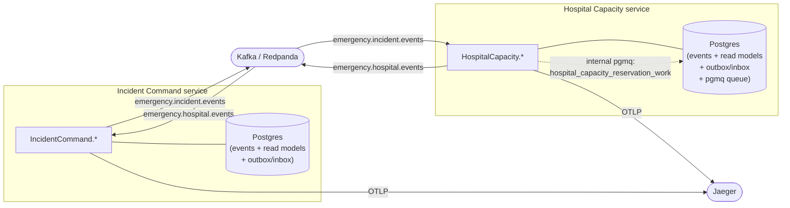

**`keiro-runtime-jitsurei`** is a standalone, runnable reference application that wires *nearly
the entire keiro runtime* together across two isolated microservices. Where the rest of this site
explains each subsystem on its own — the command cycle, the read side, process managers, durable
workflows, the outbox/inbox, pgmq background jobs — this section is a guided tour of an application
that uses **all of them at once**, with real domain code, to move a single request end-to-end
across a service boundary and stitch one OpenTelemetry trace across the whole path.

The application models **emergency-response coordination**. Two services own separate databases,
event stores, and message contracts, and share no Haskell code:

- **Incident Command** — declare incidents, assign commanders, dispatch field resources, triage
  casualties, order evacuations, and escalate on a durable timer.
- **Hospital Capacity** — track beds and capacity, run a surge protocol, and hold/confirm/release
  patient-transfer reservations, draining reservation work through a `keiro-pgmq` job queue.

The two services communicate **only** through versioned message contracts published over Kafka
topics (`emergency.incident.events`, `emergency.hospital.events`); Hospital Capacity additionally
drains an *internal* `keiro-pgmq` work queue for reservation processing.

<Callout type="info">
  **Two different things are called "jitsurei."** This section documents
  `keiro-runtime-jitsurei` — the *standalone* two-service application in its own repository. It is
  **not** the small in-repo demo that the keiro reference pages thread through their prose (order
  fulfillment + incident escalation), which is
  [the jitsurei example](/docs/keiro/explanation/the-jitsurei-example). Throughout this section the
  application is referred to literally as `keiro-runtime-jitsurei`.
</Callout>

## The shape of the system

Each service publishes its private decisions onto a public Kafka topic via an **outbox**, and
accepts the other service's messages exactly once via an **inbox**. A single W3C `traceparent`
travels with every message — across Kafka and across the internal pgmq queue — so one trace in
Jaeger spans both services.

## Where to go next

<Cards>
  <Card title="Overview" href="/docs/example-app/overview" description="What it demonstrates, the emergency-response domain, the two-service architecture, and the runtime-feature map." />
  <Card title="Incident Command" href="/docs/example-app/incident-command" description="A source tour of the incident-command service: aggregates, command cycle, read models, routers, escalation, the evacuation workflow, and wiring." />
  <Card title="Hospital Capacity" href="/docs/example-app/hospital-capacity" description="A source tour of the hospital-capacity service: aggregates, command cycle, the surge PM, the reservation workflow, and the pgmq reservation work queue." />
  <Card title="Cross-service integration" href="/docs/example-app/cross-service" description="How the two services actually talk: the end-to-end message flow, contracts, outbox/inbox, and trace continuity." />
  <Card title="Running it" href="/docs/example-app/running-it" description="Clone, build, migrate, and run the three packaged scenarios, then inspect the traces in Jaeger." />
</Cards>

<Callout type="info">
  **Under active construction.** `keiro-runtime-jitsurei` is a living example: its
  vertical-slice refactor is still in progress, so a few horizontal-composition modules
  (`Store.hs`, `CommandCli.hs`) still bundle multiple aggregates. These docs are *ported and
  cross-checked* against the application source at a pinned commit
  (`04420ed`) — they are not generated from it — and call out work-in-progress areas where they
  matter.
</Callout>
