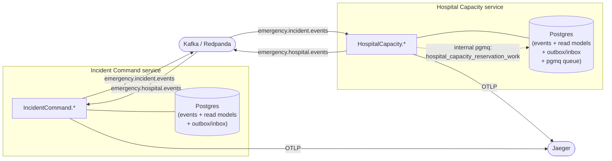

**`keiro-runtime-jitsurei`** is a standalone, runnable reference application that wires *nearly
the entire keiro runtime* together across two isolated microservices. Where the rest of this site
explains each subsystem on its own — the command cycle, the read side, process managers, durable
workflows, the outbox/inbox, pgmq background jobs — this section is a guided tour of an application
that uses **all of them at once**, with real domain code, to move a single request end-to-end
across a service boundary and inspect application, Kafka, and queue telemetry.

The application models **emergency-response coordination**. Two services own separate databases,
event stores, and message contracts, and share no service runtime implementation:

- **Incident Command** — declare incidents, assign commanders, dispatch field resources, triage
  casualties, order evacuations, and escalate on a durable timer.
- **Hospital Capacity** — track beds and capacity, run a surge protocol, and hold/confirm/release
  patient-transfer reservations, draining reservation work through a `keiro-pgmq` job queue.

The two services communicate **only** through versioned message contracts published over Kafka
topics (`emergency.incident.events`, `emergency.hospital.events`); Hospital Capacity additionally
drains an *internal* `keiro-pgmq` work queue for reservation processing.

<Callout type="info">
  **Reviewed at `e3c800e` (2026-08-08).** This tour is cross-checked against
  `mori://shinzui/keiro-runtime-jitsurei`. The app uses validated streams, generated DSL facts,
  service-owned migration plans, Shibuya application lifecycles, and typed PGMQ jobs.
  Its committed dependency baseline remains Keiro 0.3, Keiki 0.2, Kiroku Store 0.3.0.1,
  Shibuya/Kafka adapter 0.8.0.1, pgmq-hs 0.4, PGMQ adapter 0.12, and pg-migrate 1.1.
  It has not adopted all later library APIs documented elsewhere on this site.
</Callout>

<Callout type="info">
  **Two different things are called "jitsurei."** This section documents
  `keiro-runtime-jitsurei` — the *standalone* two-service application in its own repository. It is
  **not** the small in-repo demo that the keiro reference pages thread through their prose (order
  fulfillment + incident escalation), which is
  [the jitsurei example](/docs/keiro/explanation/the-jitsurei-example). Throughout this section the
  application is referred to literally as `keiro-runtime-jitsurei`.
</Callout>

## The shape of the system

```mermaid
flowchart LR
  subgraph IC["Incident Command service"]
    ICdb[("Postgres<br/>(events + read models<br/>+ outbox/inbox)")]
    ICapp["IncidentCommand.*"]
    ICapp --- ICdb
  end
  subgraph HC["Hospital Capacity service"]
    HCdb[("Postgres<br/>(events + read models<br/>+ outbox/inbox<br/>+ pgmq queue)")]
    HCapp["HospitalCapacity.*"]
    HCapp --- HCdb
  end
  ICapp -- "emergency.incident.events" --> K(["Kafka / Redpanda"])
  K -- "emergency.incident.events" --> HCapp
  HCapp -- "emergency.hospital.events" --> K
  K -- "emergency.hospital.events" --> ICapp
  HCapp -. "internal pgmq:<br/>hospital_capacity_reservation_work" .-> HCdb
  ICapp -- "OTLP" --> J(["Jaeger"])
  HCapp -- "OTLP" --> J
```

Each service publishes public messages via an outbox and deduplicates incoming delivery through
an inbox. Kafka producer/consumer parentage is verified. The pinned one-shot PGMQ path has a
separate trace-continuity limitation described in the
[telemetry chapter](/docs/example-app/cross-service/04-telemetry-and-trace-continuity).

## Where to go next

<Cards>
  <Card title="Overview" href="/docs/example-app/overview" description="What it demonstrates, the emergency-response domain, the two-service architecture, and the runtime-feature map." />
  <Card title="Incident Command" href="/docs/example-app/incident-command" description="A source tour of the incident-command service: aggregates, command cycle, read models, routers, escalation, the evacuation workflow, and wiring." />
  <Card title="Hospital Capacity" href="/docs/example-app/hospital-capacity" description="A source tour of the hospital-capacity service: aggregates, command cycle, the surge PM, the reservation workflow, and the pgmq reservation work queue." />
  <Card title="Cross-service integration" href="/docs/example-app/cross-service" description="How the two services actually talk: the end-to-end message flow, contracts, outbox/inbox, and trace continuity." />
  <Card title="Running it" href="/docs/example-app/running-it" description="Clone, build, migrate, and run the three packaged scenarios, then inspect the traces in Jaeger." />
</Cards>
