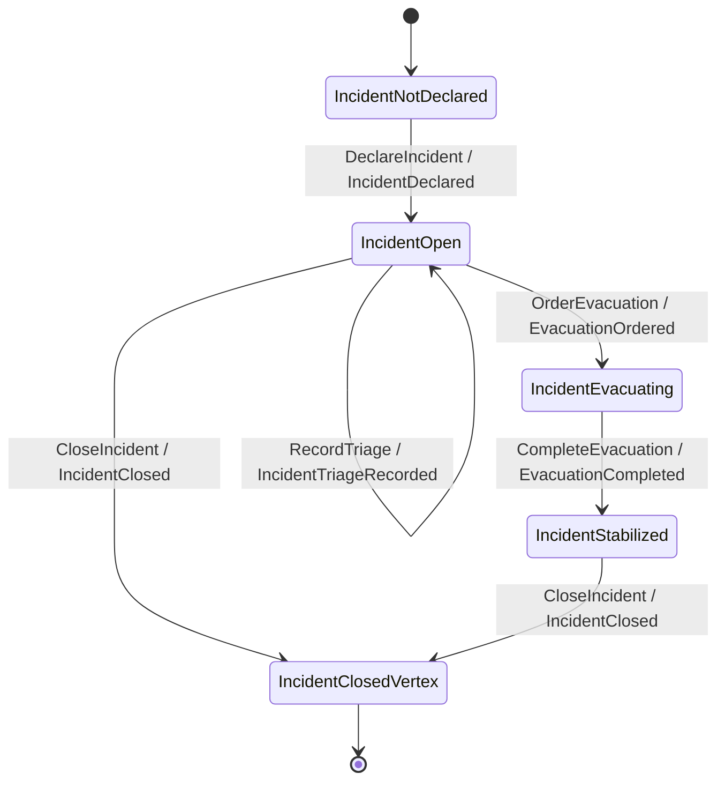
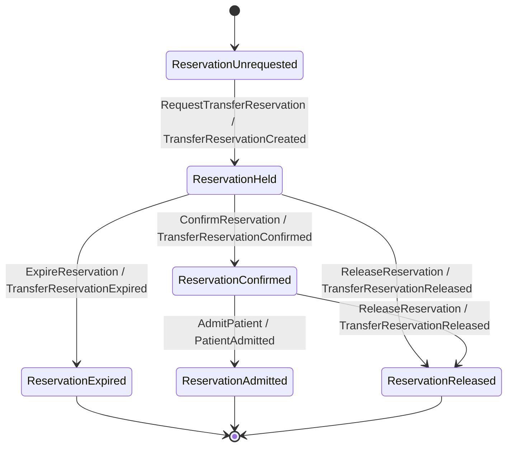

`keiro-runtime-jitsurei` models **emergency-response coordination** during a mass-casualty event.
Two bounded contexts cooperate: **Incident Command** runs the scene, and **Hospital Capacity**
absorbs the patients. This page is the ubiquitous-language reference for the whole section — the
nouns, the enums, and the identifiers you will meet in every later chapter.

## Aggregates

Each consistency boundary is a **Keiki transducer** — a typed state machine with a "register file"
of fields and guarded transitions — that keiro hydrates from an event stream and steps with each
command. (If "transducer" is new, read
[What is a transducer?](/docs/keiro/explanation/the-keiro-stack#what-is-a-transducer).)

There are six aggregates, three per service:

| Service | Aggregate | Owns the invariant for… |
|---|---|---|
| Incident Command | **Incident** | the lifecycle of a single incident (declare → open → evacuating → stabilized → closed), its commander, safety perimeter, dispatched resources, and triage counts |
| Incident Command | **FieldResource** | a dispatchable unit (ambulance, engine company, hazmat team, evacuation transport) and whether it is available or assigned |
| Incident Command | **Triage** | the triage tally for an incident, emitting a *transfer need* when a red-tag (critical) patient is marked |
| Hospital Capacity | **Hospital** | a hospital's operational status, divert posture, and surge mode |
| Hospital Capacity | **Capacity** | a hospital's bed accounting (staffed / occupied / reserved / available ICU beds) and reservations against it |
| Hospital Capacity | **Reservation** | the lifecycle of one transfer reservation (held → confirmed → admitted, or expired / released) |

Two more transducers model **process-manager state** rather than aggregates — `Escalation`
(Incident Command) and `Surge` (Hospital Capacity) — plus a `Supply` transducer in Hospital
Capacity. Those are covered in the process-manager chapters.

## The enums (ubiquitous language)

The domain vocabulary lives in two `Domain/Types.hs` modules. Incident Command's:

```haskell
-- services/incident-command/src/IncidentCommand/Domain/Types.hs
data Severity
  = Minor
  | Major
  | MassCasualty
  | HazardousMaterials

data ResourceCapability
  = Ambulance
  | EngineCompany
  | HazmatTeam
  | EvacuationTransport
```

Hospital Capacity's:

```haskell
-- services/hospital-capacity/src/HospitalCapacity/Domain/Types.hs
data BedType        = Icu | MedicalSurgical | EmergencyDepartment | Pediatric
data CapacityLevel  = Normal | Constrained | Surge | Critical
data DivertStatus   = Open | PartialDivert | TotalDivert
data PatientAcuity  = RedTag | YellowTag | GreenTag
data ServiceLine    = Trauma | IcuService | EmergencyMedicine | Pediatrics
data SupplyCode     = BloodOPositive | Ventilator | PersonalProtectiveEquipment
```

These enums are what the Keiki guards branch on: a hazardous dispatch is rejected before a safety
perimeter exists; a non-override ICU reservation is rejected while the destination hospital is in
`TotalDivert`.

## TypeID prefixes

Every identifier is a **TypeID** — a prefixed, sortable identifier (via `mmzk-typeid` + the
`typeid-hs` SQL functions). The prefix names the type, so an ID is self-describing in a log line or
a trace. Both services declare their prefixes in `Identity.hs`:

| Prefix | Identifies | Service |
|---|---|---|
| `inc` | Incident | Incident Command |
| `res` | FieldResource | Incident Command |
| `tri` | TriageRecord | Incident Command |
| `hosp` | Hospital | Hospital Capacity |
| `cap` | CapacitySnapshot | Hospital Capacity |
| `rsv` | TransferReservation | Hospital Capacity |
| `cmd` | Command | both |
| `msg` | integration Message | both |
| `wf` | Workflow | both |
| `out` / `inb` | outbox / inbox row | both |

```haskell
-- services/incident-command/src/IncidentCommand/Identity.hs
incidentPrefix, resourcePrefix, triagePrefix, commandPrefix, messagePrefix, workflowPrefix, outboxPrefix, inboxPrefix :: Prefix
incidentPrefix = Prefix "inc"
resourcePrefix = Prefix "res"
triagePrefix   = Prefix "tri"
commandPrefix  = Prefix "cmd"
-- …
```

Parsing checks the prefix, so a `rsv_…` value can never be accepted where an `inc_…` is expected —
the wrong-prefix case is a `Left` from `parseTypeId`. The TypeID chapter of each service tour shows
this in context.

## The aggregates as state machines

The application generates Mermaid state diagrams for every Keiki transducer
(`docs/diagrams/keiki.md`, regenerated by each service's `diagrams` CLI). Two are reproduced here to
ground the domain; the per-aggregate chapters embed the rest.

**Incident** — the central lifecycle, from undeclared to closed:



**Reservation** — the transfer-reservation lifecycle that Hospital Capacity drives:



The diagrams above are simplified to states, commands, and emitted events. The generated source in
`docs/diagrams/keiki.md` additionally annotates each edge with the registers it writes (`w:`) and
its guard (`g:`); the per-aggregate chapters quote those annotated forms where the guard logic
matters.
