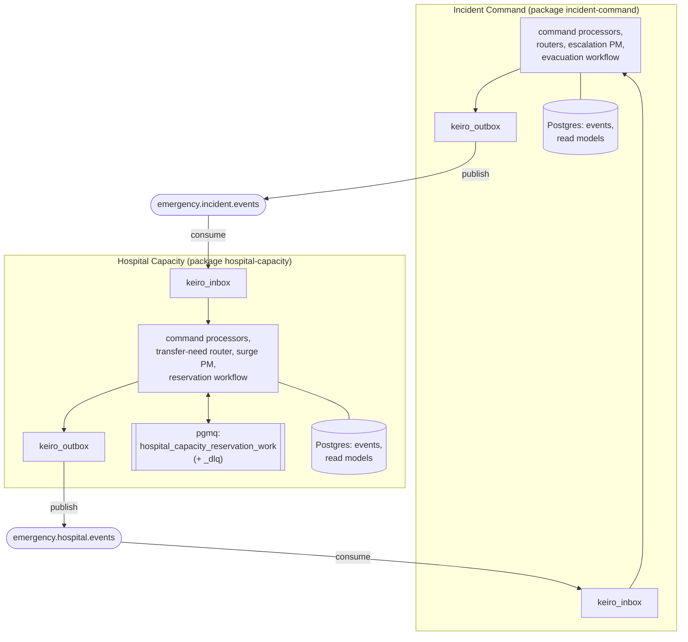

`keiro-runtime-jitsurei` is deliberately built as **two independent services that share no Haskell
code**. Each owns its own database, its own Kiroku event store, its own read models, its own
outbox and inbox, and — crucially — its own copy of the message contracts. They coordinate **only**
by exchanging versioned messages.

## The topology

Two Kafka topics carry the public traffic:

- **`emergency.incident.events`** — Incident Command's published decisions (a transfer need
  declared, etc.), consumed by Hospital Capacity.
- **`emergency.hospital.events`** — Hospital Capacity's published responses (reservation accepted /
  rejected, capacity snapshots), consumed by Incident Command.

Hospital Capacity additionally drains an **internal** `keiro-pgmq` queue,
`hospital_capacity_reservation_work` (with a dead-letter companion `…_dlq`), for reservation
processing. That queue is private to Hospital Capacity — it is *not* a service bus.

## Why no shared code

The application keeps the contract types **duplicated per service rather than shared in a common
package**. Each service has its own `Integration/Contracts.hs`. That is a deliberate decision, not
an oversight:

- **Independent evolution.** A shared contract library couples the two services' build and release
  cycles. Duplicating the wire types lets each service evolve its decoder on its own schedule, as
  long as both honor the same on-the-wire JSON (the canonical schema lives in
  `docs/contracts/schemas/integration-message.schema.json`, with golden fixtures under
  `docs/contracts/fixtures/`).
- **Honest boundaries.** Sharing Haskell types makes it tempting to share *more* — a domain type, a
  helper, an enum — and erode the boundary. With no shared code, the only contract is the message
  on the wire.

This mirrors the keiro guidance on [integration events](/docs/keiro/explanation/integration-events):
private events stay inside a service; only an explicit, versioned integration message crosses the
boundary. The [cross-service](/docs/example-app/cross-service) tour walks the two `Contracts.hs`
modules side by side.

## What each service owns

| Concern | Incident Command | Hospital Capacity |
|---|---|---|
| Database | own Postgres | own Postgres |
| Event store (Kiroku) | own streams + events tables | own streams + events tables |
| Read models | `incident_dashboard`, `field_resource_assignments`, `pending_transfer_needs`, `evacuation_zones`, `command_audit_history` | `hospital_readiness`, `transfer_decisions` |
| Outbox / inbox | `keiro_outbox` / `keiro_inbox` | `keiro_outbox` / `keiro_inbox` |
| Background queue | — | `hospital_capacity_reservation_work` (pgmq) |
| Publishes to | `emergency.incident.events` | `emergency.hospital.events` |
| Consumes from | `emergency.hospital.events` | `emergency.incident.events` |

Because each service owns its tables, the inbox/outbox tables are **never shared** between services
— the producing service writes its outbox in its own transaction; the consuming service accepts
into its own inbox exactly once. The [cross-service](/docs/example-app/cross-service) tour follows a
single message all the way across this topology.
