"keiro runtime" is an umbrella name for a family of five Haskell libraries — there
is no single `keiro-runtime` package. Two of them are "the foundation" in different
senses: kiroku is the foundation for _persistence_, and keiki is the foundation for
_pure semantics_.

## The five libraries

- **kiroku** (記録, "record") — an append-only PostgreSQL event store. The
  persistence foundation everything else writes through.
- **keiro** (経路, "route/path") — an event-sourcing framework and workflow engine.
  The top of the stack; depends on the other three.
- **keiki** (継起, "successive occurrence") — a pure, dependency-free mathematical
  core (a symbolic-register transducer). The pure-semantics foundation.
- **shibuya** — a supervised, Broadway-style queue-processing framework with
  backpressure, batching, and rate limiting.
- **pgmq** — a PostgreSQL-native message queue (the queue substrate), used from
  Haskell through `pgmq-hs` and consumed by shibuya via the
  [shibuya ⇄ pgmq adapter](/docs/integrations/shibuya-pgmq-adapter).

## How they depend on each other

```mermaid
flowchart TD
    keiro[keiro — framework + workflow engine]
    kiroku[(kiroku — event store)]
    keiki[keiki — pure core]
    shibuya[shibuya — queue processing]
    pgmq[(pgmq — queue substrate)]
    keiro --> kiroku
    keiro --> keiki
    keiro --> shibuya
    shibuya -. via shibuya-pgmq-adapter .-> pgmq
```

keiro sits on top and depends on kiroku for durable storage, keiki for pure
semantics, and shibuya for queue processing. shibuya, in turn, reads a pgmq queue
through the shibuya-pgmq-adapter when a project needs a general-purpose work queue.

## A note on `keiro-pgmq`

The keiro repository also ships a small companion package, **`keiro-pgmq`** (module
`Keiro.PGMQ`), that wraps the pgmq + shibuya stack above into a typed **background-job
queue** — declare a `Job` and write a `p -> Eff es JobOutcome` handler instead of wiring
the adapter by hand. It is not a sixth family member; it is an integration layer that lives
with keiro. See [Background jobs with
PGMQ](/docs/keiro/explanation/background-jobs-with-pgmq).
