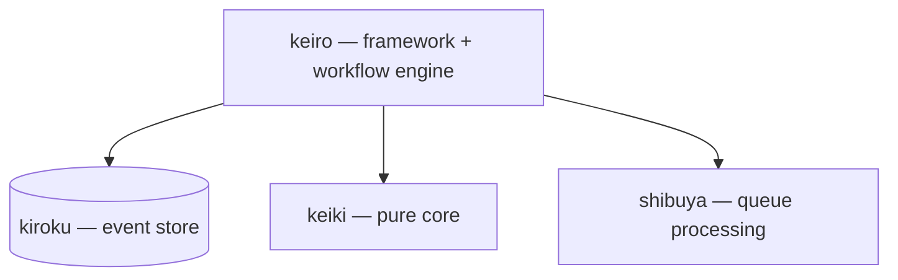

"keiro runtime" is an umbrella name for a family of four Haskell libraries — there
is no single `keiro-runtime` package. Two of them are "the foundation" in different
senses: kiroku is the foundation for _persistence_, and keiki is the foundation for
_pure semantics_.

## The four libraries

- **kiroku** (記録, "record") — an append-only PostgreSQL event store. The
  persistence foundation everything else writes through.
- **keiro** (経路, "route/path") — an event-sourcing framework and workflow engine.
  The top of the stack; depends on the other three.
- **keiki** (継起, "successive occurrence") — a pure, dependency-free mathematical
  core (a symbolic-register transducer). The pure-semantics foundation.
- **shibuya** — a supervised, Broadway-style queue-processing framework with
  backpressure, batching, and rate limiting.

## How they depend on each other

keiro sits on top and depends on kiroku for durable storage, keiki for pure
semantics, and shibuya for queue processing.
