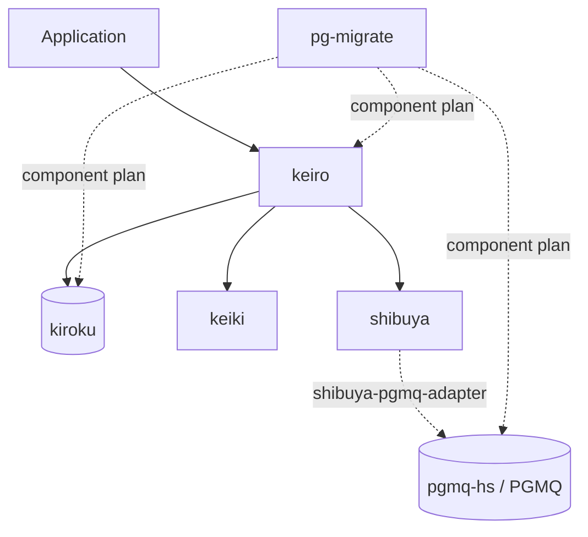

“keiro runtime” is an umbrella name, not a package. The family has five runtime
libraries with distinct ownership boundaries, plus pg-migrate for database
schema deployment.

## The five runtime libraries

- **keiro** (経路, “route/path”) is the highest-level framework. It owns typed
  command execution, read models, integration messaging, process managers,
  timers, and durable workflows.
- **kiroku** (記録, “record”) is the PostgreSQL event store. It owns streams,
  optimistic concurrency, global positions, transactions, and durable
  subscriptions.
- **keiki** (継起, “successive occurrence”) is the pure core. It owns
  symbolic-register transducers, replay validation, composition, shape
  identity, and JSON codec derivation.
- **shibuya** (渋谷) is the supervised worker runtime. It owns bounded inboxes,
  handler and acknowledgement contracts, ordering/concurrency policy, batching,
  shutdown, metrics, and tracing.
- **pgmq-hs** is the Haskell client family for the PostgreSQL-native PGMQ queue.
  It owns queue operations, topology reconciliation, topics, FIFO reads, and an
  optional extension-free schema component.

## Dependency direction

Keiro applications commonly use Kiroku and keiki, and use Shibuya where a
worker surface needs supervision. PGMQ is optional: choose it for PostgreSQL
work queues or use another Shibuya adapter. pg-migrate is a deployment tool,
not a runtime dependency of every process; it composes the schemas selected by
the application before pools and workers start.

## Companion packages

`keiro-pgmq` turns PGMQ plus Shibuya into typed Keiro background jobs. It owns
the `Job`, producer, codec, DLQ, and job-runner ergonomics while leaving PGMQ
leases and Shibuya supervision beneath it. See [Background jobs with
PGMQ](/docs/keiro/explanation/background-jobs-with-pgmq).

`keiro-dsl` is the `.keiro` authoring and evolution toolchain. It checks a
service specification, plans/scaffolds deterministic modules plus typed holes,
runs conformance harnesses, and classifies spec diffs. It is not required by a
running service. See [The keiro-dsl service
toolchain](/docs/keiro/explanation/the-keiro-dsl-toolchain).

The Shibuya adapter packages bridge source-specific progress and finalization
into one `Message`/`AckDecision` handler contract. Compare their compatibility
and durability boundaries in the [adapter
guide](/docs/integrations/shibuya-adapters).

## Where to go next

<Cards>
  <Card title="Choose a starting package" href="/docs/getting-started/choosing-a-library" description="Select the highest useful abstraction for your problem." />
  <Card title="Check release compatibility" href="/docs/getting-started/compatibility-and-upgrades" description="Current reviewed lines, adapter constraints, and upgrade order." />
  <Card title="Compose runtime schemas" href="/docs/pg-migrate/cookbook/compose-runtime-components" description="Kiroku, Keiro, PGMQ, and application components in one plan." />
</Cards>

<Callout type="warn">
  `keiro-runtime-jitsurei` has not yet been modernized for this release set.
  Its example-app pages remain an older architecture tour, not current API or
  compatibility evidence.
</Callout>
