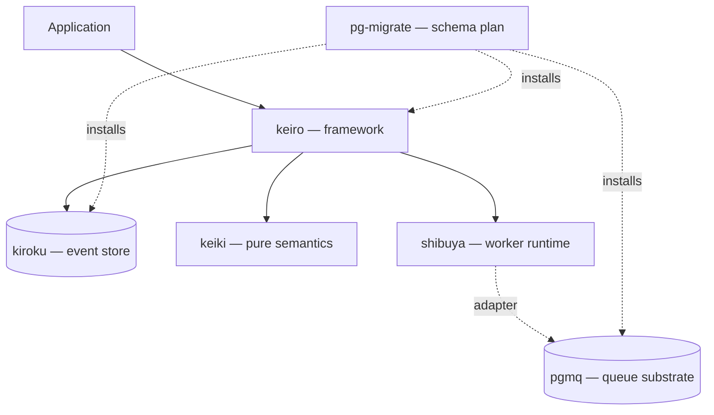

The **keiro runtime** is a composable Haskell stack for event-sourced systems.
**keiki** defines pure transition semantics, **kiroku** persists events in
PostgreSQL, **keiro** adds commands, read models, orchestration, and workflows,
**shibuya** supervises message processors, and **pgmq-hs** supplies a
PostgreSQL-native work queue. **pg-migrate** is the companion schema toolkit
used by the PostgreSQL packages and applications that compose them.

These docs review the July 2026 release lines: keiki 0.2, Keiro 0.3, Kiroku
0.3, Shibuya 0.8, pgmq-hs 0.4, and pg-migrate 1.1. Start with the
[compatibility and upgrades](/docs/getting-started/compatibility-and-upgrades)
page before combining packages.

## Choose a surface

<Cards>
  <Card title="keiro" href="/docs/keiro" description="経路 — the full event-sourcing framework: commands, read models, messaging, process managers, timers, and durable workflows." />
  <Card title="kiroku" href="/docs/kiroku" description="記録 — the append-only PostgreSQL event store and durable subscription substrate." />
  <Card title="keiki" href="/docs/keiki" description="継起 — pure symbolic-register transducers, replay validation, codecs, and composition." />
  <Card title="shibuya" href="/docs/shibuya" description="渋谷 — supervised queue processing with explicit acknowledgements, backpressure, batching, metrics, and tracing." />
  <Card title="pgmq" href="/docs/pgmq" description="The PostgreSQL-native queue substrate, through the pgmq-hs client and configuration packages." />
  <Card title="pg-migrate" href="/docs/pg-migrate" description="Manifest-backed migration components, application-owned plans, deployment gates, verification, and predecessor-history import." />
</Cards>

## How the stack fits

## Start here

<Cards>
  <Card title="Choose a library" href="/docs/getting-started/choosing-a-library" description="Map your problem to the smallest useful package or integration layer." />
  <Card title="Check compatibility" href="/docs/getting-started/compatibility-and-upgrades" description="Reviewed versions, adapter pairings, breaking changes, and upgrade order." />
  <Card title="Install and migrate" href="/docs/getting-started/installation" description="Add packages, compose database components, and start runtime resources in the right order." />
  <Card title="Explore integrations" href="/docs/integrations" description="Kiroku, PGMQ, Keiro, Shibuya, Kafka, and Message DB ownership boundaries." />
</Cards>

<Callout type="warn">
  The bundled `keiro-runtime-jitsurei` example is still awaiting modernization
  for the current release set. It remains available as an older architecture
  tour, but its build and scenarios are **not** evidence for the versions above.
  See [example status](/docs/example-app).
</Callout>
