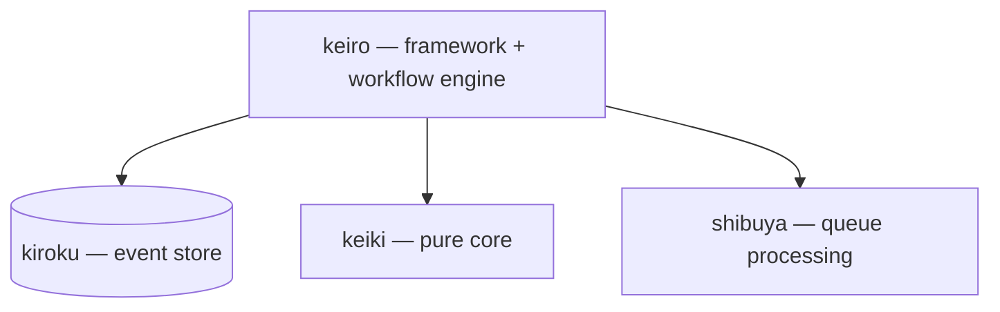

The **keiro runtime** is a family of four Haskell libraries for building
event-sourced systems. It has two foundations: **kiroku** is the foundation for
_persistence_ (durable event storage), and **keiki** is the foundation for _pure
semantics_ (law-abiding, IO-free composition).

## The libraries

<Cards>
  <Card
    title="kiroku"
    href="/docs/kiroku"
    description="記録 — an append-only PostgreSQL event store. The persistence foundation."
  />
  <Card
    title="keiro"
    href="/docs/keiro"
    description="経路 — an event-sourcing framework and workflow engine."
  />
  <Card
    title="keiki"
    href="/docs/keiki"
    description="継起 — a pure, dependency-free mathematical core."
  />
  <Card
    title="shibuya"
    href="/docs/shibuya"
    description="Supervised, Broadway-style queue processing."
  />
</Cards>

## How they fit together

## Start here

<Cards>
  <Card
    title="Getting Started"
    href="/docs/getting-started"
    description="What the keiro runtime is and how to read these docs."
  />
  <Card
    title="Choosing a library"
    href="/docs/getting-started/choosing-a-library"
    description="Which library solves which problem."
  />
</Cards>
