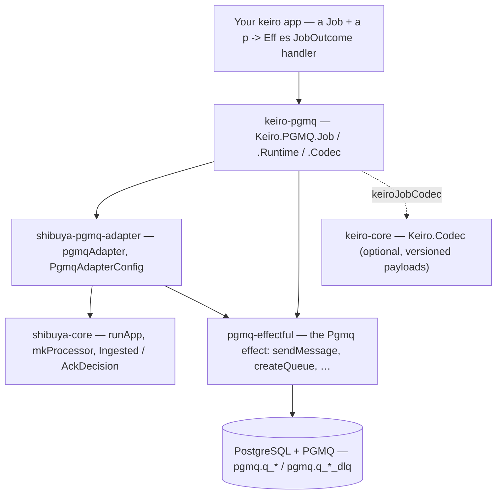

`keiro-pgmq` is the cross-package glue that turns [pgmq](/docs/pgmq) (the PostgreSQL-native message
queue) plus [shibuya](/docs/shibuya) (the supervised worker substrate) into a **typed background-job
queue** for [keiro](/docs/keiro) applications. This page is the *wiring* story — which packages
compose, where the boundary is, and how it relates to the layers beneath and beside it. For the
narrative on *why*, see [Background jobs with PGMQ](/docs/keiro/explanation/background-jobs-with-pgmq);
for the API and recipes, see the [background-jobs reference](/docs/keiro/reference/pgmq-jobs) and its
[how-tos](/docs/keiro/how-to/declare-a-background-job).

The reviewed release set is `keiro-pgmq 0.3.0.0`, pgmq-hs `0.4.0.1`,
`shibuya-pgmq-adapter 0.12.0.0`, and `shibuya-core 0.8.0.1`. The PGMQ schema is
installed through its native pg-migrate component before any job worker starts.

<Callout type="info">
`keiro-pgmq` is a **separate package in the keiro repository** (module root `Keiro.PGMQ`), not part
of `keiro-core` — exactly as shibuya keeps its adapters out of `shibuya-core` and keiro keeps
`hw-kafka-client` out of the framework. It depends on `pgmq-core`, `pgmq-effectful`, and
`shibuya-pgmq-adapter`; a keiro app adds it as one dependency to get a job queue.
</Callout>

## What composes

A background job is a four-package collaboration, and `keiro-pgmq` is the seam that hides it:

Before `keiro-pgmq`, every app wired the middle three boxes by hand: derive a PGMQ-legal queue name,
build a `PgmqAdapterConfig`, write a producer over `sendMessage`, and write a handler of type
`Message es Value -> Eff es AckDecision` that decodes JSON and maps failures to acks. `keiro-pgmq`
absorbs all of that behind a [`Job`](/docs/keiro/reference/pgmq-jobs#job) declaration and a plain
`p -> Eff es JobOutcome` handler. Newer queue needs stay in that layer too: producer helpers cover
headers, batch sends, traced sends, and FIFO message groups; queue provisioning covers standard,
unlogged, partitioned, and ordered/FIFO-indexed queues; operator helpers cover DLQ read/redrive,
archive/purge, queue metrics, and retention.

## Schema setup is below the job runtime

`keiro-pgmq`, `shibuya-pgmq-adapter`, and `PgmqAdapterEnv` do not install the
PGMQ schema. The application migration executable composes
`Pgmq.Migration.pgmqMigrations` into its final `pg-migrate` plan and runs that
plan with connection settings. In a service that also uses Keiro, the complete
order is Kiroku, Keiro, PGMQ, then application components.

A database created by `pgmq-migration` 0.3 or earlier needs its verified
`public.schema_migrations` history imported once before native `up`; the import
does not replay PGMQ DDL. Only after the migration gate succeeds should the
service create its Hasql pool, reconcile application queues, and start job
workers. See [Install or migrate the PGMQ
schema](/docs/pgmq/how-to/install-or-migrate-schema).

## The two-layer boundary

The package is split into two layers, on purpose:

- **`Keiro.PGMQ.Runtime`** (layer 1, transport-agnostic) — the plumbing *any* PGMQ user repeats:
  turning a logical queue name into a PGMQ-legal [`QueueRef`](/docs/keiro/reference/pgmq-jobs#queueref-and-queueref)
  (physical + `_dlq` names, sanitized to PGMQ's 47-char/`[a-z0-9_]` rules), and running the
  `Pgmq : Tracing : Error PgmqRuntimeError : IOE` stack against a pool with an optional tracer
  ([`JobRuntime`](/docs/keiro/reference/pgmq-jobs#jobruntime-and-the-runners)). It knows nothing about
  jobs.
- **`Keiro.PGMQ.Job`** (layer 2, the ergonomics) — the typed `Job`, the producers, and the two run
  shapes ([`runJobWorkers`](/docs/keiro/how-to/choose-a-job-run-cadence) /
  [`runJobOnce`](/docs/keiro/how-to/choose-a-job-run-cadence)), built on layer 1.
  `Keiro.PGMQ.Codec` holds the [payload codecs](/docs/keiro/reference/pgmq-jobs#jobcodec) both share.
  `Keiro.PGMQ.Dlq` and `Keiro.PGMQ.Metrics` add the operator surface without changing the job
  handler shape.

That boundary is not cosmetic — it is what keeps the [deferred case B](#the-deferred-design-case-b)
cheap.

## Its relationship to the shibuya ⇄ pgmq adapter (below)

`keiro-pgmq` sits directly on top of the [shibuya ⇄ pgmq adapter](/docs/integrations/shibuya-pgmq-adapter):
`jobProcessor` calls `pgmqAdapter` with a `PgmqAdapterConfig` it derives from the job's
[`RetryPolicy`](/docs/keiro/reference/pgmq-jobs#retrypolicy) and
[`JobTuning`](/docs/keiro/reference/pgmq-jobs#jobtuning-and-ordering) — max deliveries, visibility
timeout, batch size, polling mode, ordered-read strategy, and DLQ routing when the policy enables it.
The adapter's message type is always `aeson`'s `Value` (raw JSON); `keiro-pgmq` wraps the handler so
it decodes that `Value` with the job's codec, runs your typed handler, and maps the returned
`JobOutcome` back to the adapter's `AckDecision` (`Done → AckOk`, `Retry d → AckRetry d`,
`RetryDefault → AckRetry jobPolicy.defaultRetryDelay`, `Dead why → AckDeadLetter`).

Codec errors are classified before your handler runs. A malformed payload becomes
`JobPayloadMalformed` and is dead-lettered; a `keiroJobCodec` payload from a future schema version
becomes `JobPayloadFromFuture` and retries with the policy's default delay so rolling deploys can
finish.

**You generally do not use the adapter directly in a keiro app** — reach for `keiro-pgmq` and let it
own the config and the decode/ack boilerplate. Drop to the adapter only when you need a lower-level
transport shape the `Job` abstraction intentionally hides.

## Its relationship to the outbox (beside it)

`keiro-pgmq` is the **worker** primitive for **case A — transient background jobs that are not domain
events**: "go do this thing". It is deliberately *not* the messaging primitive. When the thing you
are sending is a domain event other contexts consume, that is an [integration
event](/docs/keiro/explanation/integration-events) — publish it transactionally with the
[outbox](/docs/keiro/explanation/the-outbox-pattern) and consume it idempotently through the
[inbox](/docs/keiro/explanation/the-inbox-pattern). Two consequences of that boundary worth
internalizing:

- A job queue has **no dedupe table** and **no transactional-publication guarantee**. `enqueue` runs
  in its own PGMQ transaction, so it is *not* atomic with a domain write. Use the header/traced/batch
  producers when a normal job send is enough; when you need exactly-once enqueue tied to a row, send
  via raw SQL in the same transaction (see [Enqueue a job
  transactionally](/docs/keiro/cookbook/transactional-job-enqueue)).
- Jobs, the outbox/inbox, and process managers/workflows are three different tools:
  jobs are the *worker*, the outbox/inbox are the *messaging*, and process managers and durable
  workflows are the *coordination* primitive. `keiro-pgmq` owns only the first.

## The deferred design (case B)

The two-layer split exists so a real future enhancement stays cheap: using PGMQ itself as a
**transport for integration events** — a Kafka alternative that leverages PGMQ topics/fan-out under
the inbox and outbox. That "case B" is **recorded but deferred** — not built. When it is picked up, it
will add `Keiro.PGMQ`-flavoured transport codecs on top of **`Keiro.PGMQ.Runtime`** (layer 1) and
must *not* depend on `Keiro.PGMQ.Job` (layer 2). Today's job queue (case A) and a future
event-transport (case B) thus share the runtime plumbing without entangling the abstractions.

## Two supported cadences

The package supports two run shapes without changing the `Job` declaration or
handler contract. `runJobWorkers` starts one or more continuously supervised
processors and returns an `AppHandle` for caller-owned shutdown.
`runJobOnceWithContext` drains up to a caller-selected number of messages and
returns the number disposed; `runJobOnce` uses default tuning and discards that
count. The first fits a long-lived worker process, while the second fits an
external scheduler or bounded test drain.

## Where to go next

<Cards>
  <Card title="Background jobs with PGMQ" href="/docs/keiro/explanation/background-jobs-with-pgmq" description="The narrative: the boilerplate it removes, the cadences, and when not to reach for a job." />
  <Card title="Background jobs reference" href="/docs/keiro/reference/pgmq-jobs" description="Every signature across Keiro.PGMQ.Runtime / .Codec / .Job." />
  <Card title="Declare and run a background job" href="/docs/keiro/how-to/declare-a-background-job" description="From a payload type to a supervised, running worker." />
  <Card title="shibuya ⇄ pgmq adapter" href="/docs/integrations/shibuya-pgmq-adapter" description="The lower-level bridge keiro-pgmq composes." />
</Cards>
