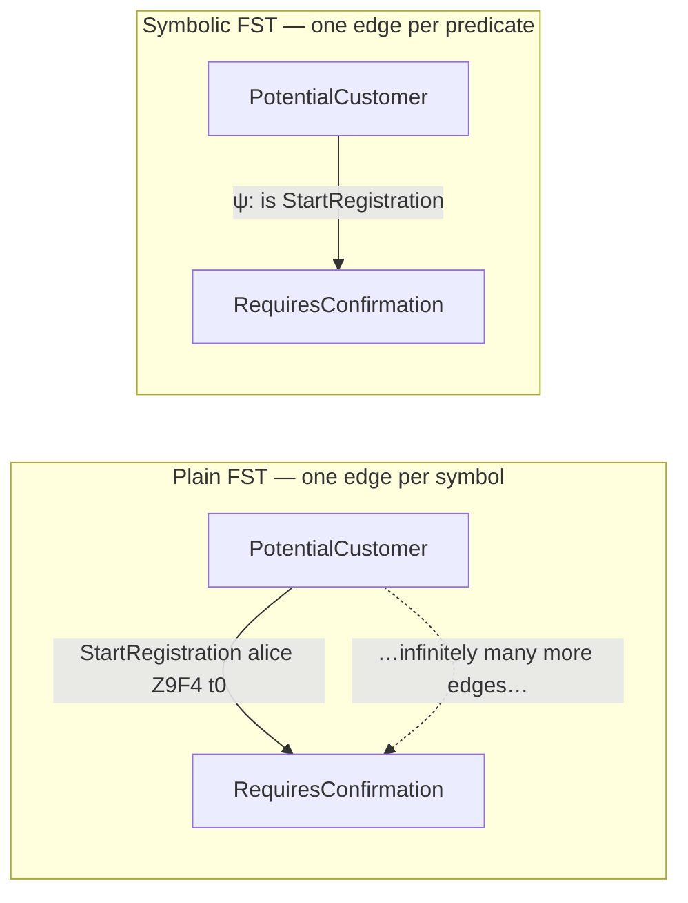

The classical finite-state transducer is a beautiful object: a finite set of states, a
finite alphabet of input symbols, and a transition function with one edge per symbol. It
is also, taken literally, useless for event-sourced domains. Real commands look like
`StartRegistration "alice@x.io" "Z9F4" 2026-04-30T10:00Z` — an email, a confirmation
code, and a timestamp drawn from sets that are, for all practical purposes, infinite. You
cannot draw one edge per input symbol when there are infinitely many symbols. This page
explains exactly what breaks, the obvious fix that disappoints, and the two ideas keiki
(継起) actually uses.

<Callout type="info">
  This page goes deeper than the surrounding explanation pages. You can use keiki fully
  without reading it; read it to understand *why* the model has the shape it does, so the
  concrete types feel inevitable rather than arbitrary.
</Callout>

## What breaks when the alphabet is infinite

A plain finite-state transducer derives its analytical power from enumeration. Mechanical
`evolve`/`apply` derivation — recovering the state change from an observed event — works by
enumerating every command and finding the one that would have produced that event:

```text
evolve s e = the unique s' such that
             ∃ c. δ(s, c) = Just s' AND ω(s, c) = Just e
```

When commands are `Enum, Bounded` there are finitely many, so "enumerate all commands" is a
concrete, terminating operation. When a command is
`StartRegistration Email ConfirmationCode UTCTime`, there is one command for every
combination of email, code, and timestamp — infinitely many. The enumeration never
finishes.

And it is not just derivation. Every analysis that leans on enumeration breaks the same
way: deadlock detection, reachability, language equivalence, contract checking. None of
them survive a naive move to infinite alphabets. The whole point of the formalism — that
you can ask mechanical questions and get mechanical answers — evaporates.

## The rejected attempt: opaque context

The obvious workaround is to keep the control flow finite and stash the data on the side.
Keep the states `s` enumerable, and carry the payload in an arbitrary context value `ctx`
that rides alongside. This is the textbook **Extended Finite-State Machine** (EFSM): the
transition, output, and an extra context-update function all take `(s, ctx, c)`.

This works for a surprising amount. The control graph stays finite, so deadlock detection
and reachability still operate on it. You can express "approve once N approvers have signed
off" by counting in `ctx`. For workflow *control flow*, it is enough.

But it surrenders the one property that motivated the formalism. `ctx` is **opaque** — the
machinery cannot see inside it. So when an output depends on a `ctx` value the formalism
cannot read, there is no mechanical way to invert `ω`. The author is forced back to writing
`apply` by hand and proving by test that it matches the emit logic — exactly the
error-prone, untrusted situation event-determinism was supposed to eliminate. keiki's
research notes explored this EFSM-with-opaque-context route early and rejected it for this
reason: it buys workflow support at the cost of the derivation property. See
[Deriving event sourcing](/docs/keiki/explanation/deriving-event-sourcing) for what that
property gives you and why it is worth protecting.

## Idea one: predicates, not symbols

The fix is to stop enumerating the alphabet symbol by symbol and start *describing* it. An
edge is no longer labelled by a single input symbol; it is labelled by a **predicate** over
the input. "Any `StartRegistration` command, for any email and code" is one edge that
covers infinitely many concrete inputs at once.

This is the **Symbolic Finite Transducer** (SFT): the alphabet is described, not
enumerated.



The output side gets the same treatment. Instead of an output *symbol*, an edge carries an
output *term* — a small expression that computes the event from the input. "Emit
`RegistrationStarted` with the email, code, and timestamp copied from the command."

For analysis to keep working, the predicate language needs **decidable satisfiability**:
given a guard, you can ask "is there any input that satisfies this?" and get a yes/no
answer. Linear arithmetic and boolean combinations of equalities qualify, and SMT solvers
(z3, cvc5) provide the engine. keiki's runtime is concrete and solver-free — guards are
evaluated directly against the input — and the solver is reserved for the *build-time*
analyses, which is where satisfiability questions actually arise.

In keiki the guard language is a first-class AST called `HsPred rs ci`: a predicate over the
register file `rs` and the command input `ci`. Its constructors (`PEq`, `PCmp`, `PAnd`,
`POr`, `PNot`, `PInCtor`) are normally written through dot-prefixed operators — `.==`,
`.>=`, `.<=`, `.&&`, `.||`, `pnot`, and the term arithmetic `.+`/`.-`/`.*` — that read as
the inequalities they are.

## Idea two: registers, not just states

Predicates handle a command's payload, but workflows also need to *remember* values across
transitions:

> "Confirm only if the code matches the one we issued at registration."

You cannot express that with predicates on the current command alone — the issued code was
seen on an *earlier* transition. keiki borrows the second idea from **Streaming String
Transducers** (Alur & Černý, 2011): each transition may update a small, typed **register
file**. The state of the machine is the pair `(control vertex, register file)`.

```haskell
type UserRegRegs =
  '[ '("email",        Email)
   , '("confirmCode",  ConfirmationCode)
   , '("registeredAt", UTCTime)
   , '("confirmedAt",  UTCTime)
   , '("deletedAt",    UTCTime)
   ]
```

Crucially, register updates are not arbitrary Haskell. They are written in a small, total
combinator language — keiki's `Update` — so that the analyses can introspect them:

```haskell
data Update rs w ci where
  UKeep    :: Update rs '[] ci
  USet     :: KnownSymbol s => IndexN s rs r -> Term rs ci ifs r -> Update rs '[s] ci
  UCombine :: Update rs w1 ci -> Update rs w2 ci -> Update rs (Concat w1 w2) ci
```

The right-hand side of a `USet` is a `Term` — an expression over registers and the input,
*as data*, not a Haskell function. That is precisely what lets keiki read it back. The same
`Term` language drives the output side: an `OutTerm` assembles an event from a wire
constructor and one `Term` per field. Because both are ASTs (`Term`/`OutTerm`), the library
can walk them, translate them to SMT, and invert them — none of which is possible for an
opaque `ctx -> ctx` function.

The type-level `w` index on `Update` records the set of slot names an update writes, and the
`combine` smart constructor demands those sets be disjoint. This is keiki's encoding of the
SST **copyless** restriction — no register's contents are duplicated on a single transition
— which is the property that keeps transducer equivalence decidable.

## keiki's actual shape: both ideas at once

keiki combines them. The formalism `SymTransducer phi rs s ci co` is a hybrid: SFT
predicates on guards, SST-style register file for accumulated data.

```haskell
data Edge phi rs ci co s where
  Edge :: { guard  :: phi                  -- predicate over (regs, input)
          , update :: Update rs w ci       -- copyless register update
          , output :: [OutTerm rs ci co]   -- terms producing the emitted events
          , target :: s                    -- next control vertex
          } -> Edge phi rs ci co s

data SymTransducer phi rs s ci co = SymTransducer
  { edgesOut    :: s -> [Edge phi rs ci co s]
  , initial     :: s
  , initialRegs :: RegFile rs
  , isFinal     :: s -> Bool
  }
```

Specialized to keiki's guard AST, the everyday alias is
`type Guarded rs s ci co = SymTransducer (HsPred rs ci) rs s ci co`. The
[user registration aggregate](/docs/keiki/explanation/deriving-event-sourcing) is exactly a
`Guarded UserRegRegs Vertex UserCmd UserEvent` — four control vertices, a five-slot register
file, predicate-labelled edges, and output terms that copy command fields onto the wire.

The plain FST from the classical theory is the degenerate case of this type where `rs = '[]`,
every update is `UKeep`, and every guard matches one specific symbol. The rejected EFSM is
the case with one opaque register and an un-introspectable update. The symbolic-register
transducer subsumes both — and, unlike the EFSM, it keeps the data *visible*, which is what
lets `apply` derivation come back.

## The hidden-input check

Visibility is not automatic; it is enforced. Because the runtime recovers a command from an
observed event by inverting the edge's output term (`solveOutput`), the recovery only
succeeds when every command field the edge *needs* is reachable from the event's fields. If
an edge's `update` or `guard` reads an input field that the output term never puts on the
wire, replay cannot reconstruct it — the value is *hidden*.

keiki catches this at build time. The **hidden-input check** (`checkHiddenInputs`) walks
every edge and flags any whose update or guard reads a command field that the output does
not carry, naming the offending input constructor and the missing slot. This is why the
running example exists in two versions: `Jitsurei.UserRegistration` carries `confirmCode` in
its `AccountConfirmed` event, while `Jitsurei.UserRegistrationV0` drops it — a deliberately
broken schema whose only purpose is to make the check fire. The fix is to widen the event
schema until the command is recoverable from invertible fields alone, restoring the
"the event determines the command" contract the EFSM had to abandon.

## What you give up

This is not free. Some analytical questions get harder. Language *inclusion* is decidable for
plain finite-alphabet FSTs but undecidable for symbolic transducers in general; keiki targets
the deterministic, single-valued machines event-sourced systems actually write, where
equivalence stays decidable (Veanes, 2012). Other analyses move from "decidable, polynomial"
to "decidable, needs SMT" — they still terminate, they just cost more, and the cost is paid
once at build time rather than on every command.

## Where this goes next

This page argued for the *kind* of machine keiki uses. It deliberately did not pin down every
parameter — the meaning of `phi`, `rs`, `s`, `ci`, `co`, how the register file relates to the
control state, or how guards and output terms are evaluated step by step. The next layer of
the documentation, **The SymTransducer** (`/docs/keiki/explanation/the-symtransducer`) and
**Registers vs. state** (`/docs/keiki/explanation/registers-vs-state`), develops the concrete
model parameter by parameter, with the user-registration aggregate as the worked spine.

## Vocabulary recap

<TypeTable
  type={{
    "Symbolic alphabet": {
      type: "concept",
      description: "An input domain described by predicates rather than enumerated; may be infinite.",
    },
    "Symbolic Finite Transducer (SFT)": {
      type: "concept",
      description: "A transducer whose edges are labelled by predicates and output terms instead of single symbols.",
    },
    "Register file": {
      type: "RegFile rs",
      description: "A typed tuple of values the transducer carries alongside its control vertex.",
    },
    "Update language": {
      type: "Update rs w ci",
      description: "A small total combinator language for modifying registers; analyzable, not arbitrary Haskell.",
    },
    "Copyless update": {
      type: "Disjoint w1 w2",
      description: "No register is duplicated on one transition; the restriction that keeps equivalence decidable.",
    },
    "Guard language": {
      type: "HsPred rs ci",
      description: "keiki's first-class predicate AST over the register file and command input.",
    },
    "Symbolic-register transducer": {
      type: "SymTransducer phi rs s ci co",
      description: "keiki's hybrid of SFT predicates and an SST-style register file — the actual library type.",
    },
    "Hidden-input check": {
      type: "checkHiddenInputs",
      description: "Build-time analysis flagging edges whose guard or update reads a command field the output never emits.",
    },
  }}
/>
