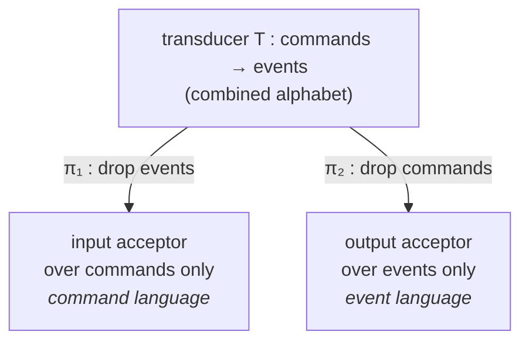

This is the chapter where keiki's (継起's) central insight clicks. In the standard decider pattern
you write two functions — `decide` (command → events) and `evolve` (event → next state) — and you
hope they agree. keiki writes neither. You declare *one* object, a `SymTransducer phi rs s ci co`,
and both functions fall out of it as **projections**. Because they come from the same source, they
cannot silently disagree.

<Callout type="info">
  This page goes deeper than the surrounding explanation pages. You can use keiki fully without
  reading it; read it to understand precisely *why* `decide` and replay are guaranteed consistent —
  the property that motivates the entire library.
</Callout>

## Two views of one machine

A transducer reads a **combined alphabet**: its transitions are labelled by an input symbol (a
command, `ci`) and produce an output symbol (an event, `co`). At any moment we can ask two
questions, and each answer is itself an acceptor — a state machine over a *single* alphabet:

1. **What command sequences are valid?** Drop the events; look only at the control flow over
   commands.
2. **What event sequences are valid?** Drop the commands; look only at the control flow over
   events.

These two acceptors are the **projections** of the transducer. We write π₁ for the projection that
drops events to recover the **command language**, and π₂ for the projection that drops commands to
recover the **event language**.



Both projections share the transducer's state set, its initial state, and its final states. They
differ only in what their transition function reads — a command, or an event.

## Building both projections by hand

Take a User Registration transducer with four control states:

```haskell
-- States  : PotentialCustomer | RequiresConfirmation | Confirmed | Deleted
-- Initial : PotentialCustomer
-- Final   : { Deleted }

-- Transitions, written (state, command) -> event -> next state:
--   (PotentialCustomer,    StartRegistration)  -> RegistrationStarted -> RequiresConfirmation
--   (RequiresConfirmation, ConfirmAccount)     -> AccountConfirmed    -> Confirmed
--   (RequiresConfirmation, ResendConfirmation) -> ConfirmationResent  -> RequiresConfirmation
--   (RequiresConfirmation, FulfillGDPRRequest) -> ε (silent)          -> Deleted
--   (Confirmed,            FulfillGDPRRequest) -> AccountDeleted       -> Deleted
```

### The input projection π₁ (drop events)

Erase the event labels and you are left with an acceptor over commands. Its **language** is the set
of command sequences the aggregate accepts:

```haskell
-- π₁(T) over commands:
--   (PotentialCustomer,    StartRegistration)  -> RequiresConfirmation
--   (RequiresConfirmation, ConfirmAccount)     -> Confirmed
--   (RequiresConfirmation, ResendConfirmation) -> RequiresConfirmation
--   (RequiresConfirmation, FulfillGDPRRequest) -> Deleted
--   (Confirmed,            FulfillGDPRRequest) -> Deleted

-- [StartRegistration, ConfirmAccount, FulfillGDPRRequest]  ✓
-- [ConfirmAccount]                                          ✗  (no edge out of PotentialCustomer)
-- [StartRegistration, StartRegistration]                   ✗  (no edge out of RequiresConfirmation)
```

π₁ answers: *which command sequences are permitted by the model?*

### The output projection π₂ (drop commands)

Now erase the *command* labels instead. Its language is the set of event sequences the aggregate
can produce. The silent (ε) GDPR transition from `RequiresConfirmation` carried no event, so it
contributes no edge here:

```haskell
-- π₂(T) over events:
--   (PotentialCustomer,    RegistrationStarted) -> RequiresConfirmation
--   (RequiresConfirmation, AccountConfirmed)    -> Confirmed
--   (RequiresConfirmation, ConfirmationResent)  -> RequiresConfirmation
--   (Confirmed,            AccountDeleted)       -> Deleted

-- [RegistrationStarted, AccountConfirmed, AccountDeleted]  ✓
-- [AccountConfirmed]                                       ✗  (no edge out of PotentialCustomer)
-- [RegistrationStarted, AccountDeleted]                    ✗  (no edge out of RequiresConfirmation)
```

π₂ answers: *which event sequences could possibly have come from the model?*

## The key result

Look at π₂'s transition function again, then look at `evolve` from a hand-written decider:

```haskell
-- π₂'s transition function:
evolve PotentialCustomer    RegistrationStarted = RequiresConfirmation
evolve RequiresConfirmation AccountConfirmed    = RequiresConfirmation  -- via ConfirmationResent
evolve RequiresConfirmation AccountConfirmed    = Confirmed
evolve Confirmed            AccountDeleted      = Deleted
evolve _                    _                   = error "no transition"  -- partial, as in π₂
```

**The output projection's transition function — π₂'s — IS `evolve`.** Same edges, same partiality
(no transition for invalid state/event pairs). They are the same thing under two names. You do not
write `evolve`; you declare the transducer, project out the events, and `evolve` is *derived*.

Replay falls straight out of this. Reconstituting state from a stored event log is nothing more
than running π₂ over the event sequence — a left fold of the derived `evolve`:

```haskell
reconstitute :: [Event] -> Maybe State
reconstitute = foldlM evolve initialState
--             ^ foldlM threads the Maybe: the first event with no valid
--               transition makes the whole replay fail, exactly as π₂ rejects it.
```

Event sourcing's replay is therefore **derived, not hand-written**. The same `foldlM`/`foldl`
shape that you would otherwise hand-code, audit, and test is generated for you from the one
declaration.

## What `decide` becomes

The other half is symmetric. `decide` is the transducer's output function ω, **restricted to
commands valid in the current state**. Reject anything the transition function δ does not accept;
otherwise emit ω's event:

```haskell
decide :: Cmd -> State -> [Event]
decide cmd state = case (delta state cmd, omega state cmd) of
  (Nothing, _)       -> []   -- command rejected (no δ edge)
  (Just _,  Nothing) -> []   -- valid but ε-output (silent transition)
  (Just _,  Just e)  -> [e]  -- normal: one event
```

So `decide` is ω restricted to valid commands, and `evolve` is π₂'s transition function. Both
descend from one transducer:

<Cards>
  <Card title="Decider pattern (hand-written)">
    Write `decide`. Write `evolve` separately. The contract that they agree is *your*
    responsibility — convention, enforced by exhaustive tests if at all.
  </Card>
  <Card title="keiki: transducer + projection">
    Declare the transducer once. `decide` = ω on valid commands; `evolve` = π₂. They cannot
    disagree, because they came from the same source. The contract is mechanical, not conventional.
  </Card>
</Cards>

This is keiki's load-bearing payoff: because both `decide` and replay come from one declaration via
projections, they cannot silently drift apart.

## What mechanical derivation requires

To project π₂ from the transducer, keiki must *invert* ω. Given an event `e`, it has to find the
command `c` with `ω(s, c) = e`, so it can recover the next state from `δ(s, c)`:

```haskell
evolve s e = the unique s' such that
             exists c. delta s c == Just s' && omega s c == Just e
```

In the simplest case this works by **enumerating commands**. And enumeration requires a **finite
command alphabet** — `(Enum, Bounded)` in Haskell terms. That is fine for the toy example: `Cmd`
has four nullary constructors, so keiki can walk all of them.

It is *not* fine the moment commands carry data:

```haskell
data Cmd
  = StartRegistration Email ConfirmToken Timestamp  -- emails and timestamps are not enumerable
  | ConfirmAccount ConfirmToken
  | ...
```

You cannot enumerate every `Email` or every `Timestamp`, so derivation-by-enumeration breaks
exactly where real domains live. This is the constraint that data-carrying alphabets violate — and
the whole reason the next essay exists.

## In code: the runtime evaluators

keiki (継起, 0.1.0.0) is a pure, IO-free library, and everything above is realized by concrete,
solver-free evaluators — no symbolic search at runtime. `delta` and `omega` evaluate the transition
and output functions; `step` runs one command (the `decide` half); `applyEvent` is the derived
single-step `evolve` (it inverts ω mechanically); and `reconstitute` replays a `[co]` event log to
a `Maybe (s, RegFile rs)`. The state carrier is `(s, RegFile rs)` rather than bare `s` because edge
guards depend on the register file as well as the control vertex. All of these are pure and
concrete; the symbolic machinery is build-time only.

## Vocabulary recap

- **Combined alphabet** — the transducer reads command/event-labelled transitions; projections
  recover the two single-alphabet views.
- **Input projection (π₁)** — drops events; its language is the permitted command sequences.
- **Output projection (π₂)** — drops commands; its language is the producible event sequences.
- **Key result** — π₂'s transition function *is* `evolve`, so `reconstitute = foldlM evolve
  initialState` is derived.
- **`decide`** — ω restricted to commands valid in the current state.
- **Finite command alphabet** — what derivation-by-enumeration needs, and what data-carrying
  domains break.

<Callout type="info">
  Next: [Data-carrying alphabets](/docs/keiki/explanation/data-carrying-alphabets) — how keiki
  preserves this derivation when commands carry emails, tokens, and timestamps that cannot be
  enumerated.
</Callout>
