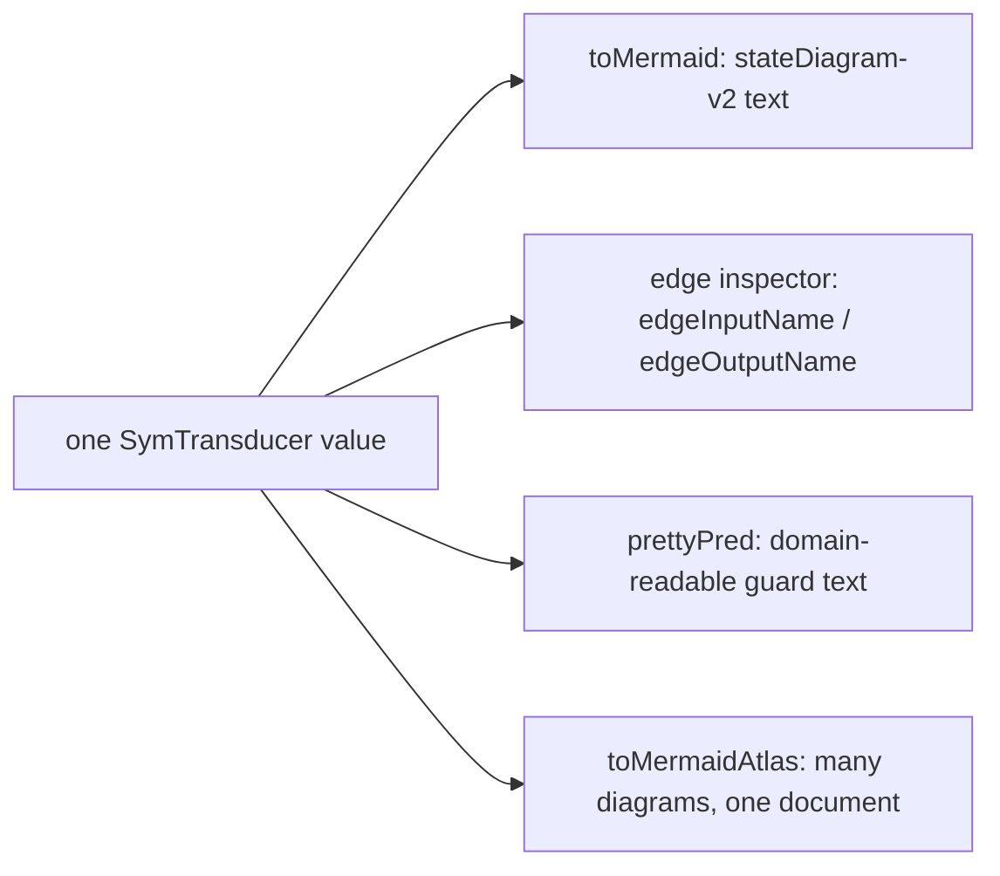
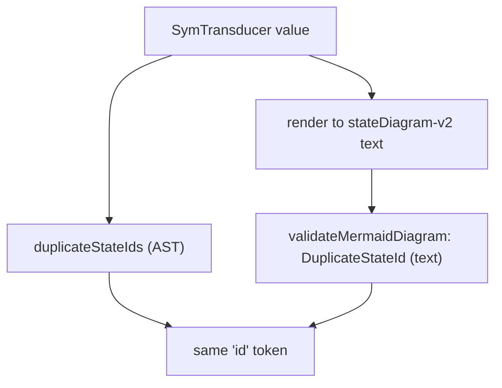

You write the [`SymTransducer`](/docs/keiki/explanation/the-symtransducer) once. From that one value,
keiki derives — **purely, with no separate annotation step** — its Mermaid topology diagram, an edge
inspector, a pretty-printed guard language, and a multi-diagram atlas. The diagram is not a hand-kept
companion that drifts from the code; it is a *function of the code*.



All four views walk the same data: `[minBound .. maxBound]` over the vertex type, `edgesOut` for the
transitions, `initial`/`isFinal` for the markers. There is no annotation file, no doc-comment DSL,
nothing to keep in sync. Change an edge and the diagram changes with the next render.

## The guard-free default is the point

`toMermaid` renders edges as `<input ctor> / <output ctor>` and **shows no guard at all**:

```haskell
toMermaid :: (Enum s, Bounded s, Show s)
          => SymTransducer (HsPred rs ci) rs s ci co -> Text
```

This is deliberate, and it is the load-bearing pedagogy of the renderer. The guard-free view is the
**one-way-door bug-spotting view**: it shows you the *shape* of the machine — which states reach
which, which inputs fire which outputs, which states are final — without the noise of guard
predicates. A whole class of structural bugs is visible at a glance in this view and *only* in this
view:

- a state with **no outgoing edges** that should not be a dead end;
- an input that **fires from a state it should not** (an edge that should not exist);
- a missing `[*] -->` initial marker, or a `--> [*]` final marker on the wrong state;
- two edges from the same state on the same input — a fan-out you did not intend.

Because the guard text is suppressed, these topology mistakes are not buried under
`(ConfirmAccount && ConfirmAccount.confirmCode == confirmCode)`. You see the skeleton first; you
check the skeleton; *then*, if you need the conditions, you opt into them.

<Callout type="info">
Opting in is additive. `toMermaidWith` takes `MermaidOptions`, and with `defaultMermaidOptions` it is
byte-identical to `toMermaid`. Turn on `showWrittenSlots` for the `[w: …]` segment, or set `guardMode`
to `MermaidGuardPretty` for the domain-readable guard (the same `prettyPred` rendering the edge
inspector uses) or `MermaidGuardStructuralSummary` for the constructor-tag walk. The default rendering
is never changed by adding options.
</Callout>

## The edge inspector and the guard language

Two pure projections pull the named pieces off an edge:

```haskell
edgeInputName  :: Edge (HsPred rs ci) rs ci co s -> Maybe Text
edgeOutputName :: Edge (HsPred rs ci) rs ci co s -> Maybe Text
```

`edgeInputName` walks the guard's `HsPred` AST for the leftmost `PInCtor` atom — every edge built via
`onCmd` wraps its guard as `PAnd (PInCtor ic) inner`, so the input name is always recoverable;
hand-written AST edges without a `PInCtor` yield `Nothing`, which `edgeLabel` renders as `?`.
`edgeOutputName` reads the output constructor name(s), rendering an ε-edge (empty output) as `ε`.

The guard language itself is `prettyPred` (from `Keiki.Render.Pretty`), the **domain-readable**
rendering of the same `HsPred` AST — the diagram's optional `MermaidGuardPretty` mode and the edge
inspector share it, so the guard text reads the same everywhere it appears.

## The atlas: many diagrams, one document

Transducers are heterogeneously typed — each has its own vertex, register, input, and output types —
so you cannot put a list of *transducers* in one document. `toMermaidAtlas` takes a list of
already-**rendered** diagrams instead, letting each caller pick the renderer matching its own
transducer:

```haskell
toMermaidAtlas :: [(Text, Text)] -> Text   -- [(sectionLabel, renderedDiagram)]
```

Each pair becomes a level-2 heading plus a fenced `mermaid` block, so the whole atlas renders inline
in GitHub, Notion, or any Markdown previewer. The richer `toMermaidAtlasWith` adds an optional title,
per-section kind labels (`AggregateDiagram`, `ProcessManagerDiagram`, `WorkflowDiagram`), and
in-place update markers — all additively, defaulting to the plain `toMermaidAtlas` output.

## AST and text agree on what an "id" is

There are two ways to ask "does this diagram have two states sharing one Mermaid identifier?", and
they are built to give the same answer.

The **AST-level** check runs over the `SymTransducer` value before rendering:

```haskell
duplicateStateIds :: (Bounded s, Enum s)
                  => MermaidStateLabels s
                  -> SymTransducer (HsPred rs ci) rs s ci co
                  -> [Text]
```

It maps `stateId` over every vertex and returns the ids that collide (empty means all unique). The
**text-level** check, [`validateMermaidDiagram`](/docs/keiki/reference/validate) in `Keiki.Render`,
scans rendered diagram *text* and reports the same collision as a `DuplicateStateId` warning.



The agreement is **by construction**, not by coincidence: both helpers key off the same id token —
the stable Mermaid identifier a vertex maps to. So you can run `duplicateStateIds` as a pre-render
guard and trust that a clean result means the rendered text will not trip `DuplicateStateId` either.
Rendering itself stays total: a collision never throws; it is something you *check for*, in whichever
of the two equivalent ways fits your pipeline.

See `Keiki.Render.MermaidSpec` for the renderer's tests, including the AST↔text agreement.

## See also

<Cards>
  <Card title="The SymTransducer" href="/docs/keiki/explanation/the-symtransducer" />
  <Card title="Render inspector reference" href="/docs/keiki/reference/render-inspector" />
  <Card title="Validate reference" href="/docs/keiki/reference/validate" />
</Cards>
