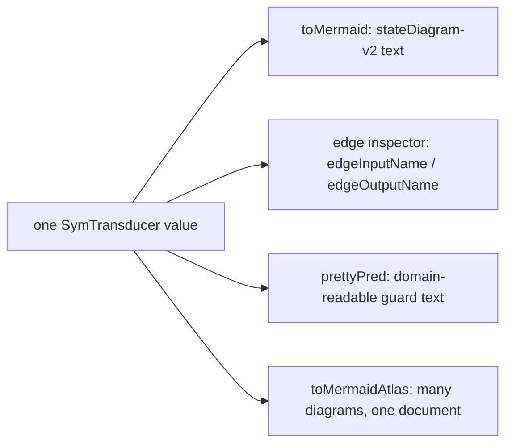
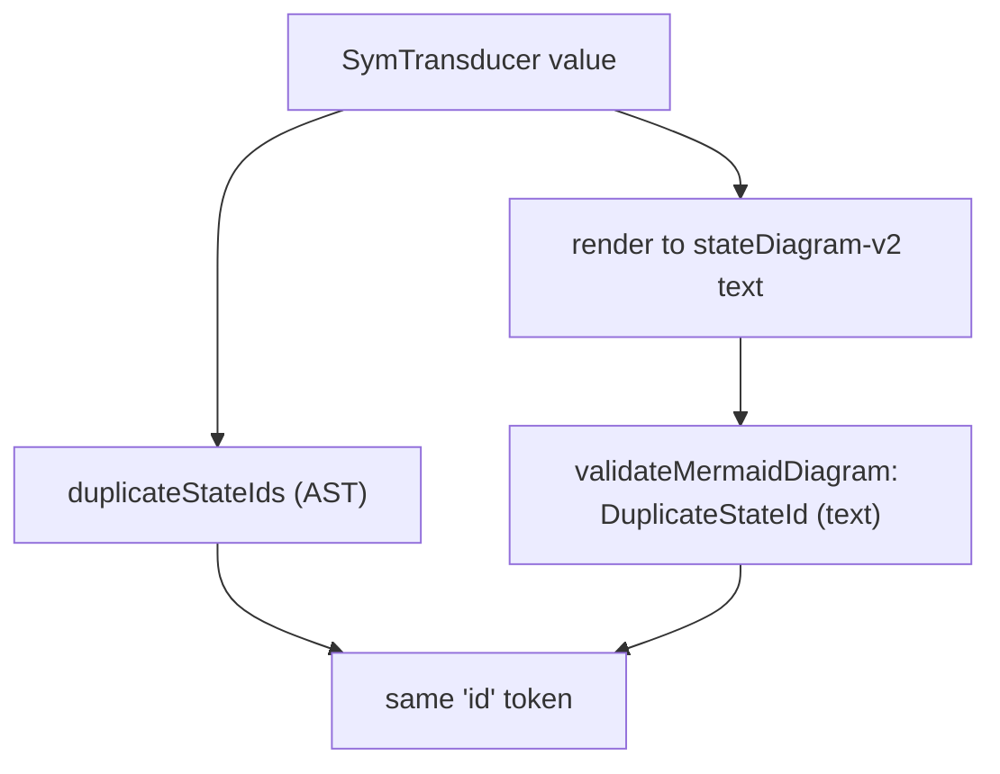

You write the [`SymTransducer`](/docs/keiki/explanation/the-symtransducer) once. From that one value,
keiki derives — **purely, with no separate annotation step** — its Mermaid topology diagram, an edge
inspector, a pretty-printed guard language, and a multi-diagram atlas. The diagram is not a hand-kept
companion that drifts from the code; it is a *function of the code*.


```mermaid
flowchart LR
  T["one SymTransducer value"] --> M["toMermaid: stateDiagram-v2 text"]
  T --> I["edge inspector: edgeInputName / edgeOutputName"]
  T --> G["prettyPred: domain-readable guard text"]
  T --> A["toMermaidAtlas: many diagrams, one document"]
```

All four views walk the same data: `[minBound .. maxBound]` over the vertex type, `edgesOut` for the
transitions, `initial`/`isFinal` for the markers. There is no annotation file, no doc-comment DSL,
nothing to keep in sync. Change an edge and the diagram changes with the next render.

## Readable business semantics are the primary contract

*(keiki 0.8.0.0, ADR-0006. Through keiki 0.7 the default was the opposite — see
[the reversal](#why-the-default-was-reversed) below.)*

`toMermaid` renders the complete behaviour of every edge: the command, the states, the event
constructors, the full guard, and the register right-hand expressions.

```haskell
toMermaid :: (Enum s, Bounded s, Show s)
          => SymTransducer (HsPred rs ci) rs s ci co -> Text
```

The argument for this is short. Keiki already *owns* the guard and update syntax trees — they are
the same values `evalPred` and `runUpdate` execute. A renderer that hides them proves only topology
and makes a reviewer reconstruct behaviour from source or a separate inspector dump. A renderer that
shows them makes the diagram sufficient for behavioural review, and it cannot drift, because the
text is derived from the executing value rather than from a comment.

The compact topology view is still one function call away, and it now has an honest name:

```haskell
toTopologyMermaid :: (Enum s, Bounded s, Show s)
                  => SymTransducer (HsPred rs ci) rs s ci co -> Text
```

That form is still the right tool for one specific job — the **one-way-door bug-spotting view**. It
shows the *shape* of the machine without the noise of predicates, and a whole class of structural
bug is visible at a glance in it:

- a state with **no outgoing edges** that should not be a dead end;
- an input that **fires from a state it should not** (an edge that should not exist);
- a missing `[*] -->` initial marker, or a `--> [*]` final marker on the wrong state;
- two edges from the same state on the same input — a fan-out you did not intend.

### Why the default was reversed

The old default rested on an accident, not a principle. Ordinary `Term` literals carried no `Show`
evidence, so *every* literal could only render as `<lit>` — a guard containing one was not readable
even if you asked for it. Once `lit` requires `Show`, guard text derives from the executable value
itself and the readable rendering is genuinely faithful, so hiding it stopped paying for itself.

Adding display evidence deliberately changed **nothing** about meaning. Execution, replay inversion,
pure overlap analysis, symbolic translation, and the domain of values keiki can model are all
untouched; no runtime or proof path forces `Show`. Values without a `Show` instance stay executable
through [`opaqueLit`](/docs/keiki/reference/core#readable-and-opaque-literals), and a partial,
expensive, or stylised `Show` can affect a picture but never a result. `Show` text is not canonical
serialization.

<Callout type="warn">
  **The cost is disclosure, and it is on you.** Readable rendering discloses ordinary `lit` values.
  Secrets, credentials, personal data, and deliberately redacted values must use `opaqueLit`, which
  renders `<lit>` while keeping the value fully executable and fully visible to the solver — or the
  whole diagram must be rendered under `topologyMermaidOptions`, which redacts all guard and update
  semantics at once.
</Callout>

<Callout type="info">
Both policies are explicit named values, and **every diagram shape has an options-aware route**:
`toMermaidWith defaultMermaidOptions` is byte-identical to `toMermaid`, and the composite, nested,
three-way, alternative, and feedback renderers all take `MermaidOptions` too. `guardMode` and
`updateMode` are the sole authorities on what is shown — see
[Render: Mermaid](/docs/keiki/reference/render-mermaid).
</Callout>

## The edge inspector and the guard language

Two pure projections pull the named pieces off an edge:

```haskell
edgeInputName  :: Edge (HsPred rs ci) rs ci co s -> Maybe Text
edgeOutputName :: Edge (HsPred rs ci) rs ci co s -> Maybe Text
```

`edgeInputName` walks the guard's `HsPred` AST for the leftmost `PInCtor` atom — every edge built via
`onCmd` wraps its guard as `PAnd (PInCtor ic) inner`, so the input name is always recoverable;
hand-written AST edges without a `PInCtor` yield `Nothing`, which `edgeLabel` renders as `?`.
`edgeOutputName` reads the output constructor name(s), rendering an ε-edge (empty output) as `ε`.

The guard language itself is `prettyPred` (from `Keiki.Render.Pretty`), the **domain-readable**
rendering of the same `HsPred` AST — the diagram's default `MermaidGuardPretty` mode and the edge
inspector share it, so the guard text reads the same everywhere it appears.

## The atlas: many diagrams, one document

Transducers are heterogeneously typed — each has its own vertex, register, input, and output types —
so you cannot put a list of *transducers* in one document. `toMermaidAtlas` takes a list of
already-**rendered** diagrams instead, letting each caller pick the renderer matching its own
transducer:

```haskell
toMermaidAtlas :: [(Text, Text)] -> Text   -- [(sectionLabel, renderedDiagram)]
```

Each pair becomes a level-2 heading plus a fenced `mermaid` block, so the whole atlas renders inline
in GitHub, Notion, or any Markdown previewer. The richer `toMermaidAtlasWith` adds an optional title,
per-section kind labels (`AggregateDiagram`, `ProcessManagerDiagram`, `WorkflowDiagram`), and
in-place update markers — all additively, defaulting to the plain `toMermaidAtlas` output.

## AST and text agree on what an "id" is

There are two ways to ask "does this diagram have two states sharing one Mermaid identifier?", and
they are built to give the same answer.

The **AST-level** check runs over the `SymTransducer` value before rendering:

```haskell
duplicateStateIds :: (Bounded s, Enum s)
                  => MermaidStateLabels s
                  -> SymTransducer (HsPred rs ci) rs s ci co
                  -> [Text]
```

It maps `stateId` over every vertex and returns the ids that collide (empty means all unique). The
**text-level** check, [`validateMermaidDiagram`](/docs/keiki/reference/validate) in `Keiki.Render`,
scans rendered diagram *text* and reports the same collision as a `DuplicateStateId` warning.


```mermaid
flowchart TD
  V["SymTransducer value"]
  V --> AST["duplicateStateIds (AST)"]
  V --> R["render to stateDiagram-v2 text"]
  R --> TXT["validateMermaidDiagram: DuplicateStateId (text)"]
  AST --> Q["same 'id' token"]
  TXT --> Q
```

The agreement is **by construction**, not by coincidence: both helpers key off the same id token —
the stable Mermaid identifier a vertex maps to. So you can run `duplicateStateIds` as a pre-render
guard and trust that a clean result means the rendered text will not trip `DuplicateStateId` either.
Rendering itself stays total: a collision never throws; it is something you *check for*, in whichever
of the two equivalent ways fits your pipeline.

See `Keiki.Render.MermaidSpec` for the renderer's tests, including the AST↔text agreement.

## See also

<Cards>
  <Card title="The SymTransducer" href="/docs/keiki/explanation/the-symtransducer" />
  <Card title="Render inspector reference" href="/docs/keiki/reference/render-inspector" />
  <Card title="Keep diagrams in sync" href="/docs/keiki/how-to/keep-diagrams-in-sync" />
  <Card title="Validate reference" href="/docs/keiki/reference/validate" />
</Cards>
