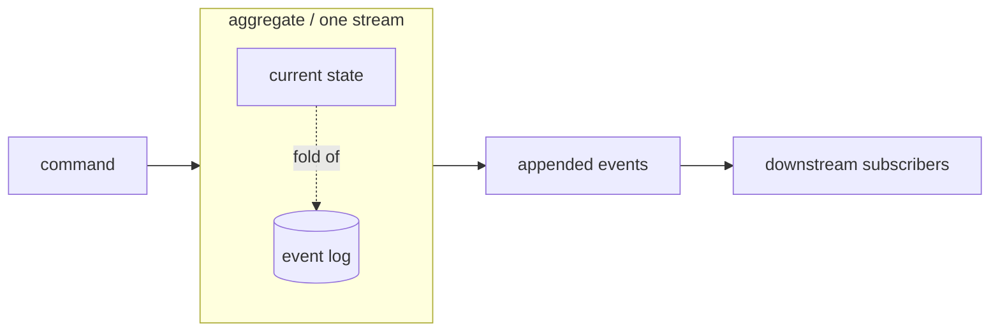
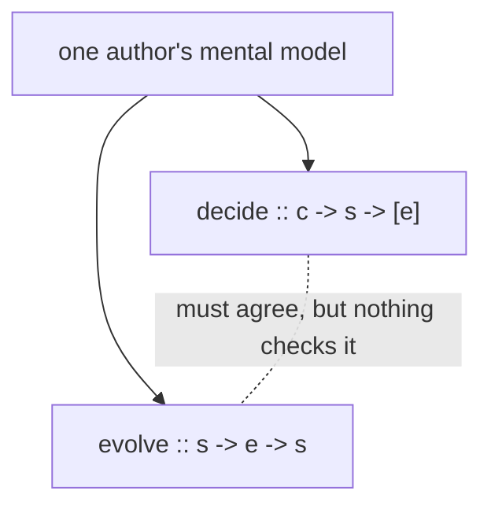

Before keiki (継起) can earn its formalism, it helps to see the shape of the problem it solves.
This page develops the conventional account of event-sourced aggregates — the **decider** pattern
from the prior art — and then surfaces the silent failure mode lurking inside it. The fix keiki
proposes (deriving everything from one declaration) is the subject of the pages that follow; here
we only motivate it.

<Callout type="info">
  This page goes deeper than the surrounding explanation pages. You can use keiki fully without
  reading it; read it to understand precisely what problem the formalism is built to remove.
</Callout>

## The log is the source of truth

Most systems store the **current state** of a thing. A user row holds the email, a confirmation
flag, a timestamp — the latest values, overwritten in place. An event-sourced system stores
something different: the **immutable log of events** that produced that state.

```text
events for user-42
─────────────────────────────────────
1.  RegistrationStarted    email="alice@x.io", code="Z9F4", at=t0
2.  ConfirmationEmailSent  email="alice@x.io"
3.  AccountConfirmed       email="alice@x.io", code="Z9F4", at=t1
```

Nothing in this log is ever mutated. New facts are appended; past facts stand. The current state
is not stored at all — it is a **derived view**, recovered by folding the events:

```haskell
replay :: s -> [e] -> s
replay initial events = foldl' evolve initial events
```

Read that as: start from the initial state, and for each event in order, advance the state by one
step with `evolve`. The state at step *n* is just `replay initial (take n events)`. The state
"now" is the fold over the whole log. Recovering state this way is also called **reconstituting**
the aggregate.

This buys real properties — a full audit trail by construction, time travel to any past state by
replaying a prefix, multiple independent read models built from the same log, and recovery of a
lost read database by rebuilding it from the store. The cost is also real: more moving parts,
harder schema evolution, and an obligation to think about idempotence. For systems that need
auditability or have many downstream consumers, the trade is usually worth it.

## The aggregate is a consistency boundary

An **aggregate** is the unit that owns one event stream. It is a *consistency boundary*: its state
changes only through its own commands, and only one command is applied at a time, as a single
transaction. A user is an aggregate; an order is an aggregate; a shipment is an aggregate.

Aggregates do not reach into each other. They emit events, and other aggregates — or process
managers, or external services — react to those events on their own streams. The boundary is what
makes "fold the log to get the state" sound: the only writer to a stream is the aggregate that
owns it.



## The decider pattern

The conventional way to write such an aggregate — the **decider** pattern, formalized by Jérémie
Chassaing and carried by libraries in the F# and Haskell ecosystems — decomposes it into two pure
functions plus an initial state:

```haskell
data Decider c e s = Decider
  { decide  :: c -> s -> [e]   -- handle a command, produce events
  , evolve  :: s -> e -> s     -- apply an event to advance state
  , initial :: s
  }
```

`decide` answers "given this command in this state, what happened?" — it returns the events to
append (possibly none, if the command is a no-op in the current state). `evolve` answers "given an
event, how does state advance?" — it is exactly the step function the fold above uses. Processing a
command is then a fixed dance:

<Steps>
<Step>
**Reconstitute.** Replay the past events to recover current state:
`s = foldl' evolve initial pastEvents`.
</Step>
<Step>
**Decide.** Run the command against that state: `newEvents = decide cmd s`.
</Step>
<Step>
**Append.** Write `newEvents` to the stream (the only mutation in the whole cycle).
</Step>
<Step>
**Advance.** Optionally compute the response state: `s' = foldl' evolve s newEvents`.
</Step>
</Steps>

Both functions are pure; state is never mutated, only derived. That is the entire pattern.

### Worked example: user registration

The running example throughout the keiki docs is a user-registration aggregate — the lifecycle
that moves an account from *registered* to *confirmed* (and eventually *deleted*). The full keiki
encoding lives in `jitsurei/src/Jitsurei/UserRegistration.hs`; here is its naive decider shape,
stripped to the two halves so the contract below is visible.

```haskell
data State = PotentialCustomer
           | RequiresConfirmation { email :: Email, code :: ConfirmationCode }
           | Confirmed            { email :: Email }
           | Deleted

data Cmd = StartRegistration  Email ConfirmationCode UTCTime
         | ConfirmAccount      ConfirmationCode UTCTime
         | FulfillGDPRRequest  UTCTime

data Event = RegistrationStarted   Email ConfirmationCode UTCTime
           | ConfirmationEmailSent Email
           | AccountConfirmed      Email ConfirmationCode UTCTime
           | AccountDeleted        Email UTCTime

decide :: Cmd -> State -> [Event]
decide (StartRegistration email code at) PotentialCustomer =
  [ RegistrationStarted email code at, ConfirmationEmailSent email ]
decide (ConfirmAccount code at) (RequiresConfirmation email expected)
  | code == expected = [ AccountConfirmed email code at ]
decide (FulfillGDPRRequest at) (Confirmed email) =
  [ AccountDeleted email at ]
decide _ _ = []   -- invalid command in this state: produce no events

evolve :: State -> Event -> State
evolve PotentialCustomer (RegistrationStarted email code _) =
  RequiresConfirmation email code
evolve s@(RequiresConfirmation _ _) (ConfirmationEmailSent _) = s
evolve (RequiresConfirmation email _) (AccountConfirmed _ _ _) =
  Confirmed email
evolve (Confirmed email) (AccountDeleted _ _) = Deleted
evolve s _ = s   -- "shouldn't happen" if decide is correct
```

Walking one command through the cycle:

```haskell
-- 1. reconstitute from the past events
state    = foldl' evolve PotentialCustomer pastEvents
--           => RequiresConfirmation "alice@x.io" "Z9F4"

-- 2. decide
newEvents = decide (ConfirmAccount "Z9F4" t1) state
--           => [ AccountConfirmed "alice@x.io" "Z9F4" t1 ]

-- 3. append newEvents to the stream

-- 4. advance for the response
state'    = foldl' evolve state newEvents
--           => Confirmed "alice@x.io"
```

## The hidden contract

`decide` and `evolve` are written as two separate functions, and **nothing in the type system
forces them to agree**. The compiler is satisfied as long as each typechecks on its own. Yet the
whole pattern silently assumes a law relating them — the **event-determinism contract**:

> For every reachable `(s, cmd)` pair such that `decide cmd s = [e₁, …, eₙ]`,
> the result of `foldl' evolve s [e₁, …, eₙ]` must equal the intended next state.

In words: the events `decide` chooses to emit, when folded back through `evolve`, must land on the
state the author meant. Notice the `evolve s _ = s` fallthrough in the example, with its telltale
comment `-- "shouldn't happen" if decide is correct`. That branch is precisely where a broken
contract hides: it makes `evolve` *total* by quietly ignoring any event it does not expect, so a
disagreement produces a wrong state instead of a crash.

Here is how it breaks. Suppose someone enriches `AccountConfirmed` with a new field that `evolve`
must read to compute the next state, updates `decide` to emit it — and forgets to teach `evolve`
about it. Everything still typechecks. Commands still produce events. Events still get appended.
But during replay, `evolve` falls through to `evolve s _ = s` and computes the *wrong* state. The
log and the folded state now disagree, and they will keep disagreeing on every future replay.
Days later a downstream subscriber reads corrupted data, far from the edit that caused it.



This contract is enforceable only by tests and code review. The classic decider pattern gives you
**no mechanical guarantee** that its two halves describe the same machine — they are two
hand-written witnesses to one intention, free to drift apart.

## What keiki does about it

This silent-disagreement risk is the motivation for keiki's whole design. Rather than ask you to
write `decide` and `evolve` separately and hope they stay in sync, keiki has you define the
aggregate **once** — as a richer object, a symbolic-register finite-state transducer
(`SymTransducer phi rs s ci co`) — and *derives* both halves from that single declaration. Because
there is exactly one source of truth, `decide` and `evolve` cannot disagree; an opt-in z3-backed
check can even discharge properties about it at build time.

The transducer itself (its `step`, `delta`, `omega`, and `reconstitute` surface) is keiki's
recommended way to author an aggregate — not a hand-written `Decider`. The decider you have seen
here is the prior art the formalism replaces. The next page introduces that formalism on its own
terms.

<Callout type="info">
  Next: [Finite automata and transducers](/docs/keiki/explanation/finite-automata-and-transducers)
  — the state-machine model keiki uses to make the event-determinism contract mechanical instead
  of conventional.
</Callout>
