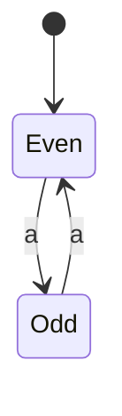
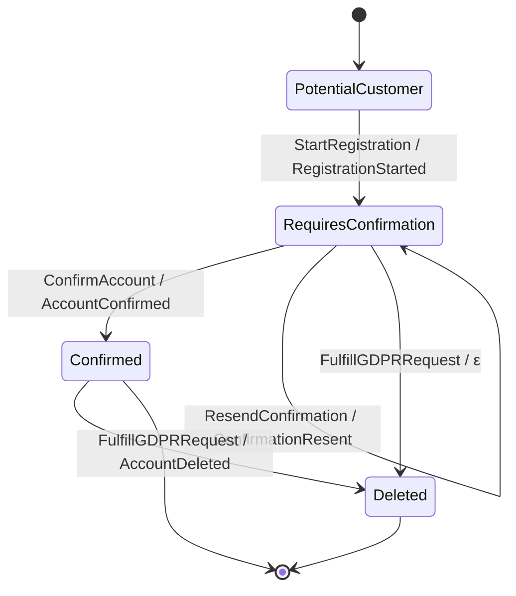

This is the central conceptual page of the foundations. We climb a short ladder of state
machines — **DFA → Mealy machine → finite-state transducer (FST)** — and at each rung we ask what
the new feature buys us when the machine is an *aggregate* rather than a textbook automaton. By the
top of the ladder the FST is not an analogy for an aggregate; it *is* one.

<Callout type="info">
  This page goes deeper than the surrounding explanation pages. You can use keiki (継起) fully
  without reading it; read it to understand precisely why aggregates are transducers and not merely
  state machines. If you have taken a CS theory course, skim for vocabulary — the mapping in the
  second half is the part that matters.
</Callout>

## Acceptor: the simplest state machine

A **deterministic finite automaton** (DFA), also called an **acceptor**, is the simplest useful
state machine. It reads a sequence of input symbols one at a time and ends up either in an
*accepting* state or a *non-accepting* state. Formally it is a five-tuple:

```text
DFA = ⟨S, Σ, δ, s₀, F⟩

S      = finite set of states
Σ      = finite set of input symbols (the alphabet)
δ      = S × Σ → S          transition function
s₀     = starting state
F ⊆ S  = accepting states
```

The DFA *accepts* an input sequence if, after reading every symbol, it is in an accepting state.
A DFA that accepts sequences with an even number of `a`s has two states, `Even` (the start state
and the only accepting state) and `Odd`, and a single symbol `a` that flips between them:



Reading `aa` walks `Even → Odd → Even` and accepts; reading `aaa` ends in `Odd` and rejects. The
**language** of a DFA is the set of all input strings it accepts. An acceptor *classifies* input
sequences as valid or invalid — and nothing more. It produces no output.

## Mealy machine: adding output

A **Mealy machine** is a DFA that also produces output. On every transition it emits an output
symbol, chosen by an output function `ω`:

```text
Mealy = ⟨S, Σ, Γ, δ, ω, s₀⟩

S   = states
Σ   = input alphabet
Γ   = output alphabet
δ   = S × Σ → S         transition function (next state)
ω   = S × Σ → Γ         output function     (emitted symbol)
s₀  = start state
```

Three properties define its character:

- **Total** — `δ` and `ω` are defined for *every* `(state, input)` pair. There is always a next
  state and always an emitted symbol.
- **Deterministic** — exactly one transition per `(state, input)`.
- **Real-time, no final states** — one input in, one output out, running until the input is
  exhausted. The machine has no notion of being *done*.

Mealy machines are perfect for "transform every character of an input into something else". They
are not enough for aggregates, because they are obligated to produce *something* on every input —
and as we are about to see, aggregates need to refuse, to fall silent, and to finish.

## Finite-state transducer: three generalisations

A **finite-state transducer** (FST) keeps the Mealy machine's shape but relaxes its totality in
three ways. Each relaxation, by itself small, is exactly a feature aggregates require:

```text
FST = ⟨S, Σ, Γ, δ, ω, s₀, F⟩

S      = states
Σ      = input alphabet
Γ      = output alphabet
δ      = S × Σ → Maybe S        transition (partial)
ω      = S × Σ → Maybe Γ        output (ε when Nothing on a valid transition)
s₀     = start state
F ⊆ S  = final states
```

1. **Partiality** — some `(state, input)` pairs have *no* transition; `δ` returns `Nothing` and the
   machine *rejects* the input rather than inventing a next state.
2. **ε-output** — a transition can change state while emitting *no* symbol (ε is the empty word); a
   real, internal move that records nothing.
3. **Final / accepting states** — some states are terminal; the machine has a notion of *done*.

Same skeleton as a Mealy machine, partial bones. The keiki formalism is a deterministic *letter*
FST of this shape, extended with typed registers (the `SymTransducer phi rs s ci co`, developed on
a later page). Here we stay at the classical level — registers are not yet in play.

## Why each generalisation is an aggregate feature

This is the load-bearing argument. An aggregate is not a Mealy machine; it needs every one of the
three FST relaxations, and each maps onto a familiar aggregate concept.

<Tabs items={["Partiality = invariants", "ε-output = silent step", "Final states = lifecycle end"]}>
  <Tab value="Partiality = invariants">
    *"You cannot confirm an account that has not registered."*

    A Mealy machine must emit *something* for `(PotentialCustomer, ConfirmAccount)`. There is no
    honest answer. Picking a no-op output means the aggregate silently accepts an invalid command —
    precisely the bug class we want to abolish. An FST instead has **no edge** there: a *missing
    edge*, `δ(s, c) = Nothing`. That `Nothing` IS the invariant. The command-handling layer sees it
    and rejects the command with an error. An undefined transition rejects a command.
  </Tab>
  <Tab value="ε-output = silent step">
    *"Fulfilling a GDPR delete on an unconfirmed account changes state but records no event — we
    promised never to store that person's data."*

    A Mealy machine always emits. An FST may take a transition with `ω(s, c) = Nothing`: the
    control state moves, but the step emits **no event** (a silent, ε-output transition). The move
    is internal yet entirely real.
  </Tab>
  <Tab value="Final states = lifecycle end">
    *"Once an account is deleted, no further events can occur on it."*

    Aggregates have terminal states — `Deleted`, `Closed`, `Archived`, `Cancelled`. A Mealy machine
    runs forever; it has no `F`. An FST's final states model **lifecycle termination** natively: a
    terminal vertex with no edges leaving it.
  </Tab>
</Tabs>

## A concrete machine: UserRegistration

Take a minimal user-registration lifecycle and write it as an FST. The control state `s` ranges
over a handful of finite lifecycle vertices — an initial vertex, a registered vertex, and a
confirmed terminal vertex — plus a deleted terminal vertex to exhibit ε-output and a second final
state:

```text
States  = { PotentialCustomer, RequiresConfirmation, Confirmed, Deleted }
Inputs  = { StartRegistration, ConfirmAccount, ResendConfirmation, FulfillGDPRRequest }
Outputs = { RegistrationStarted, AccountConfirmed, ConfirmationResent, AccountDeleted }
Initial = PotentialCustomer
Final   = { Confirmed, Deleted }

Transitions:
  (PotentialCustomer,    StartRegistration)   →  RegistrationStarted  →  RequiresConfirmation
  (RequiresConfirmation, ConfirmAccount)      →  AccountConfirmed     →  Confirmed
  (RequiresConfirmation, ResendConfirmation)  →  ConfirmationResent   →  RequiresConfirmation
  (RequiresConfirmation, FulfillGDPRRequest)  →  ε                    →  Deleted
  (Confirmed,            FulfillGDPRRequest)  →  AccountDeleted       →  Deleted

Anything not listed: δ returns Nothing — an invariant.
```

Drawn as a state machine, the three FST features are visible at a glance — the silent edge into
`Deleted` carries `ε`, and both `Confirmed` and `Deleted` are terminal vertices:



Read the diagram against the ladder:

- The edge `RequiresConfirmation → Deleted` is labelled `ε`: state changes, **no event emitted**.
  That is ε-output — the silent step.
- `Confirmed` and `Deleted` are **final**: terminal vertices, drawn with an edge to `[*]`. No
  business transition leaves `Deleted`. That is lifecycle termination.
- Every *missing* edge — for instance `(PotentialCustomer, ConfirmAccount)` — is an **invariant**.
  `δ` returns `Nothing`; the command is rejected. That is partiality.

In Haskell terms, the partial transition function has exactly the FST signature — the `Maybe`
encodes the partiality directly:

```haskell
transition :: State -> Command -> Maybe (Maybe Event, State)
transition RequiresConfirmation FulfillGDPRRequest = Just (Nothing, Deleted)
--                                                           ^^^^^^^ ε-output
transition Confirmed            FulfillGDPRRequest = Just (Just AccountDeleted, Deleted)
transition _                    _                  = Nothing
--                                                   ^^^^^^^ rejected: an invariant
```

This hand-written pair of total-looking functions is the classical **decider** shape — prior art,
shown here only to expose the FST signature underneath. It is **not** keiki's recommended API;
keiki replaces this with the symbolic-register transducer, where the same `Nothing`/`Just` choices
become first-class, inspectable structure rather than opaque function clauses.

## The model in one breath

The classical hierarchy collapses into a single sentence once you read each feature as an aggregate
need:

- **Acceptor / DFA** — accepts or rejects input sequences; no output.
- **Mealy machine** — total state machine with output; always exactly one output per input.
- **FST** — partial state machine with output, ε-transitions, and final states.
- **Partiality** — `δ(s, c)` may be `Nothing`; encodes **invariants** (a missing edge rejects a
  command).
- **ε-output** — a transition emitting nothing; encodes a **silent step** that records no event.
- **Final states** — terminal vertices; encode **lifecycle termination**.

An aggregate is a finite-state transducer whose control state `s` is a finite set of lifecycle
vertices, whose inputs are commands, and whose outputs are domain events. That single object has
the same business meaning as the two-function decider above, but as *one* inspectable thing.

<Callout type="info">
  Next: [Deriving event sourcing](/docs/keiki/explanation/deriving-event-sourcing) shows why
  packing the decision logic into one transducer — rather than a pair of decider functions — is
  what makes event sourcing, replay, and projection fall out for free.
</Callout>
