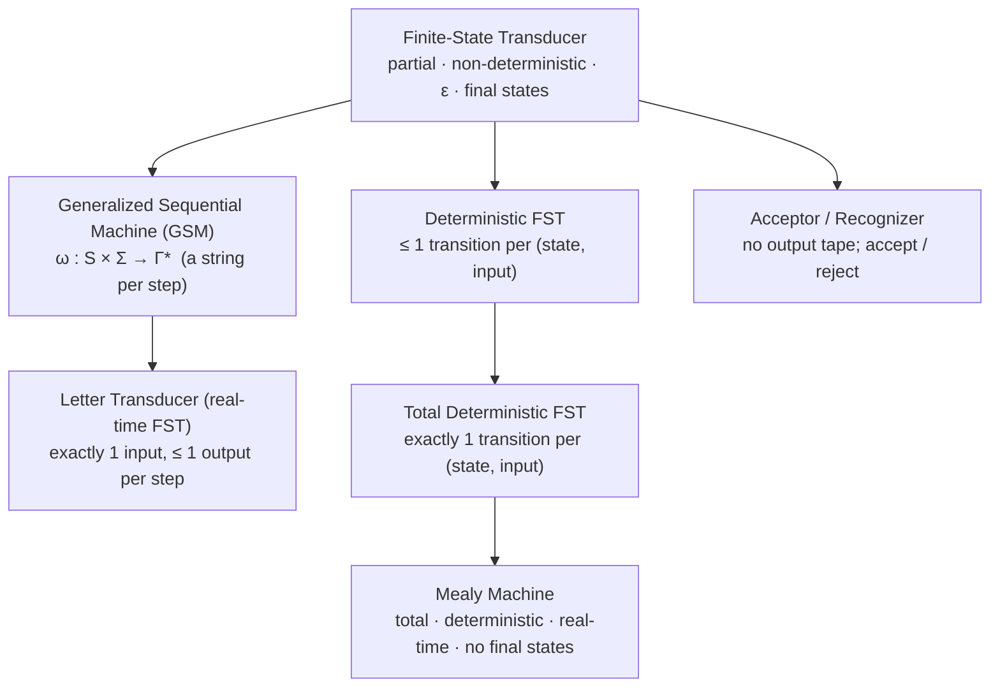

"Finite-state machine" is not one formalism but a family of them, stacked by how much
each member is allowed to do. The members differ on whether transitions are total or
partial, whether output is mandatory or optional, whether a step must consume input,
and whether some states are *final*. keiki (継起) is a pure, IO-free Haskell library
whose single object is the transducer `SymTransducer phi rs s ci co`; this page locates
that object precisely in the family tree and explains why it lands where it does — and
not on the Mealy machine that a first pass at "state machine for an aggregate" tends to
reach for.

<Callout type="info">
  This page goes deeper than the surrounding explanation pages. You can use keiki fully
  without reading it; read it to understand the model precisely, and to know exactly which
  formalism each design choice buys you.
</Callout>

## The hierarchy, top to bottom

The general object is the **finite-state transducer (FST)**: a finite control graph with
an input tape and an output tape. Written as a tuple,

```text
T = ⟨S, Σ, Γ, δ, S₀, F⟩

δ ⊆ S × (Σ ∪ {ε}) × (Γ ∪ {ε}) × S    -- transition relation
S₀ ⊆ S                                 -- initial states (possibly several)
F  ⊆ S                                 -- final (accepting) states
```

The FST is maximally permissive. A `(state, input)` pair may have zero, one, or many
outgoing transitions (**non-deterministic** and **partial**); a transition may consume no
input and/or emit no output (**ε-transitions**); and some states are **final**, so the
machine can accept or reject an input sequence rather than merely run until the tape ends.

Specializing the FST by switching off capabilities yields the rest of the family:



The **Mealy machine** is the most constrained useful specialization. Its transition
function `δ : S × Σ → S` and output function `ω : S × Σ → Γ` are both **total** (defined
for every `(state, input)`) and **deterministic** (exactly one result), it is **real-time**
(consumes one input and emits exactly one output per step), it has **no ε-transitions**,
and it has **no final states** — it simply runs until its input is exhausted. Every Mealy
machine is an FST; very few FSTs are Mealy machines.

For completeness, two relatives sit off to the side. A **Moore machine** is a Mealy machine
whose output depends on the state alone (`ω : S → Γ`); it is equivalent in power but a poor
fit for command handling, where the same command yields different events from different
states. And an **acceptor** drops the output tape entirely, keeping only the binary
accept/reject verdict — keiki recovers these for free (see [Acceptors and the event
language](/docs/keiki/explanation/why-smt) for where that leads).

## Where keiki sits: the placement sentence

keiki's `SymTransducer` is a **partial deterministic letter-FST with ε-output, final
states, symbolic guards, and a register file**. That sentence is the whole claim; the rest
of this section unpacks each adjective against the shipped type.

```haskell
data SymTransducer phi rs s ci co = SymTransducer
  { edgesOut    :: s -> [Edge phi rs ci co s]  -- the outgoing edges of each vertex
  , initial     :: s                           -- one initial state
  , initialRegs :: RegFile rs                  -- typed initial register file
  , isFinal     :: s -> Bool                   -- final states exist
  }

data Edge phi rs ci co s = Edge
  { guard  :: phi                              -- symbolic predicate on (regs, input)
  , update :: Update rs w ci                   -- register-file update
  , output :: [OutTerm rs ci co]               -- 0, 1, or many output terms
  , target :: s
  }
```

<Accordions>
  <Accordion title="partial — missing edges reject, and that IS the invariant">
    `delta` returns `Just` only when an outgoing edge's guard is satisfied; with no
    satisfied edge it returns `Nothing`. A Mealy machine must produce *something* for
    every input. An aggregate must be able to say "you cannot confirm an account that was
    never registered" — and partiality is exactly that ability. "No transition here" is
    not an error case bolted on; it is the formal encoding of the domain invariant.

    ```haskell
    -- delta t Confirmed regs StartRegistration  ⇒  Nothing
    -- (no outgoing edge of Confirmed accepts a StartRegistration command)
    ```
  </Accordion>
  <Accordion title="deterministic — at most one edge fires per input">
    `edgesOut` may list several edges out of a vertex, but at most one guard may be true
    for any given `(regs, input)`. keiki does not leave this to authoring discipline: the
    build-time **single-valuedness check** proves the guards out of each vertex are
    pairwise disjoint, so `delta` is a genuine partial *function*, never a relation. This
    is what makes the projection to an event-sourced `apply` well defined.
  </Accordion>
  <Accordion title="letter-FST — one input letter per step">
    Each step consumes exactly one input symbol (a *letter*), not a string. This is the
    real-time restriction on the input side and is what distinguishes a letter transducer
    from a general relational FST that could chew through `Σ*` per edge. keiki's control
    graph is a letter FST throughout.
  </Accordion>
  <Accordion title="ε-output — a step may emit no event">
    An edge whose `output` is the empty list `[]` advances state while producing nothing
    observable — the formal ε on the *output* tape. This models silent transitions such as
    a GDPR deletion of an unconfirmed account: state changes, no domain event is emitted.
    A Mealy machine cannot do this without smuggling a `Maybe`/`[]` into its output type
    and thereby conflating "no event" with "invalid".
  </Accordion>
  <Accordion title="final states — lifecycle termination">
    `isFinal :: s -> Bool` marks terminal vertices (`Deleted`, `Closed`, `Archived`).
    Aggregates have a notion of "done"; a Mealy machine, which runs until the tape ends,
    does not. Final states are part of the FST tuple (`F ⊆ S`) and part of keiki's record.
  </Accordion>
  <Accordion title="symbolic guards — predicate-labelled edges (the SFT idea)">
    `guard :: phi` labels each edge with a predicate over `(RegFile rs, ci)` drawn from a
    boolean algebra `BoolAlg phi`, rather than enumerating one concrete input symbol per
    edge. This is the **symbolic finite transducer (SFT)** move: a guard stands for a whole
    set of letters, so a finite graph ranges over an effectively infinite alphabet, and the
    guards are amenable to decidable analysis (satisfiability, disjointness).
  </Accordion>
  <Accordion title="register file — typed data memory (the SST idea)">
    `RegFile rs` is a typed working memory — counters, accumulated ids, deadlines — carried
    alongside the control vertex and evolved by each edge's `update`. This is the
    **streaming string / symbolic transducer with registers (SST)** extension: state is the
    control vertex *plus* the register file, which lets a finite graph make data-dependent
    decisions without exploding into a vertex per value.
  </Accordion>
</Accordions>

The symbolic-guard and register-file extensions are not part of the bare FST formalism, but
they compose cleanly on top of it: strip them and the underlying control graph is still a
partial deterministic letter FST with ε-output and final states. That is why keiki can
recover plain input/output acceptors from the same definition — the adornments ride along, the
skeleton stays an FST.

## Why not a Mealy machine

A Mealy machine is total, deterministic, real-time, and final-state-free. Three of those
properties are precisely what an event-sourced aggregate must violate:

| Need | Mealy machine | What keiki uses |
| --- | --- | --- |
| Reject invalid commands | total — must output for every input | partiality: `delta` returns `Nothing` |
| Reach a terminal state | no final states | `isFinal :: s -> Bool` |
| Make a silent transition | always emits exactly one output | ε-output: `output = []` |

A library can still reach Mealy-equivalent expressiveness — for example by pushing the
partiality into a type-level topology so the transition function is total over a *restricted*
domain (a total function on `A' ⊂ A` is information-equivalent to a partial function on `A`).
That is a legitimate encoding and is the route taken by prior-art **decider**-style and
topology-typed designs. keiki simply chooses the other encoding: keep the partiality in the
transition function, then recover build-time guarantees with an SMT-backed symbolic layer
rather than the type system. The trade-off is compile-time topology safety on one side versus
structural alphabets, register-file discipline, and decidable guard analysis on the other.

## Multi-event commands: shipped design vs. the research note

A single command can legitimately produce *several* events. In the FST family this is the
**generalized sequential machine (GSM)** capability — a transition emits a string of output
symbols rather than one.

<Callout type="warn">
  **Superseded design note.** An in-repo research note (and any docs that echo it) may still
  describe handling multi-event commands by *state refinement* — introducing internal
  vertices and chaining letter edges through them — driven end-to-end by a `toMultiDecider`
  helper with a `DriverConfig`. **That proposal is superseded by the shipped design.** Trust
  the shipped source, not the note.
</Callout>

The shipped `SymTransducer` (keiki `0.1.0.0`, commit `344c4ca`) takes the **output-widening**
route instead. An edge's `output` field is a *list*, `output :: [OutTerm rs ci co]`, so one
edge can emit zero, one, or many output terms directly — the GSM capability is first-class in
the AST, with no internal scaffolding vertices. The retired EP-20 façades (`toMultiDecider`
and `DriverConfig`) are gone; the projected decider returns the full list straight from
`omega`:

```haskell
data Decider c e s s_streaming = Decider
  { decide          :: c -> s -> [e]              -- = omega t s regs cmd (the whole list)
  , evolve          :: s -> e -> s                -- letter-only replay (output length 0 or 1)
  , evolveStreaming :: s_streaming -> e -> Maybe s_streaming
  , initialState    :: s
  , isTerminal      :: s -> Bool
  }
```

Replaying events one at a time across a length-2-or-more edge needs a mid-chain state — "I
have observed event 1 and expect event 2 next." The shipped design exposes this through the
`InFlight` wrapper and `applyEventStreaming`, surfaced as the `evolveStreaming` field:

```haskell
data InFlight s co
  = Settled !s
  | InFlight !s ![co]   -- at a vertex with a remaining event queue still to be matched
```

The two replay verbs agree on edges that emit zero or one event; they diverge only on the
multi-event edges, where the streaming path stays `InFlight` between events while the
letter-only `evolve` handles the length-0/1 case. The `Decider` record here is shown as
**prior-art shape** — the published decider vocabulary keiki can project *to* — not as the
library's recommended authoring surface, which remains the `SymTransducer` itself.

## Why it matters in practice

Locating keiki on a partial deterministic letter-FST (rather than a Mealy machine) is not a
taxonomy exercise — it is what makes the event-sourcing derivation mechanical. Because the
formalism *natively* has partiality, ε-output, and final states, the event-sourced
`exec`/`apply` decomposition is the transducer's **output projection**: `apply` is *computed
from* `delta` and `omega` rather than hand-written alongside them, so there is no second
definition to keep in sync. The same FST skeleton also yields input and output **acceptors**
for free, so you can validate command and event histories independently of execution.

Next: read [Why an SMT solver?](/docs/keiki/explanation/why-smt) to see how the symbolic-guard
layer turns the single-valuedness and unsatisfiable-guard checks into build-time proofs.
