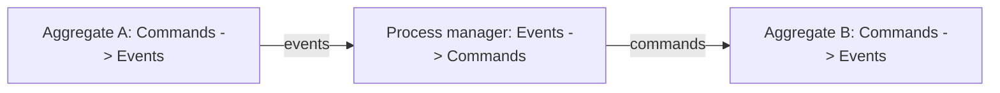

An aggregate is an object that turns `Commands` into `Events`. A **process manager** — the same
thing other vocabularies call an orchestrator, a policy, a reactor, or a saga — is the *same kind
of object*. It is a `SymTransducer` too. The only difference is that its input and output alphabets
are **flipped**: where an aggregate reads commands and writes events, a process manager reads
`Events` and writes `Commands`.

That symmetry is the whole idea. keiki ships **no separate process-manager type**. There is no
`ProcessManager` record, no `Saga` class, no `Policy` interface. You author a process manager with
the *exact same* `Keiki.Builder` DSL you use to author an aggregate — `from`, `onCmd`, `emit`,
`goto`, `requireEq`, register slots, control vertices, the lot. See
[The SymTransducer](/docs/keiki/explanation/the-symtransducer) for the shape both share.



Because a process manager is just a transducer, *coordinating* aggregates is just *composing*
transducers. The whole orchestration vocabulary collapses onto the three combinators in
`Keiki.Composition` (`compose`, `alternative`, `feedback1` — see the
[composition reference](/docs/keiki/reference/composition)). The rest of this page maps each
named pattern to its combinator chain, then walks the textbook process manager from `jitsurei`.

## The patterns, mapped to combinators

<Cards>
  <Card title="Choreography" href="/docs/keiki/reference/composition" />
  <Card title="Process manager" href="/docs/keiki/reference/composition" />
  <Card title="Saga / compensation" href="/docs/keiki/reference/composition" />
  <Card title="Policy / reactor" href="/docs/keiki/reference/composition" />
</Cards>

### Choreography = `compose t1 t2`

In choreography there is no central coordinator: aggregate A emits events and aggregate B reacts to
them directly. That *is* `compose t1 t2` — A's output alphabet (`mid`) is B's input alphabet, and the
composite consumes A's commands and produces B's events. The composition **is** the choreography.
There is nothing else to write.

### Process manager = a stateful `Events_A -> Commands_B`, wired with `compose`

A process manager keeps state across reactions: it remembers where each conversation has got to. As
a transducer that is a `SymTransducer` whose input alphabet is A's events and whose output alphabet
is B's commands, carrying registers and control vertices to track progress. The full system is

```haskell
compose A (compose pm B)
```

— A feeds its events to the process manager, the process manager feeds its commands to B. This is the
conceptual shape of a workflow pipeline. In 0.2, a replayable aggregate composition boundary must use
honest structural constructors: `lmapMaybeCi`/`rmapCo` boundaries carry poison provenance and checked
composition reports them. Keep filtering at the runtime router or author an explicit structural
adapter transducer.

### Saga / compensation = a transducer with failure -> compensation edges

A **saga** is a long-running transaction that *compensates* rather than rolls back: on failure it
emits undo-style commands (cancel, refund, release). In keiki a saga is **not a new primitive** — it
is a process manager whose builder has edges from a failure event to a compensating command. "Saga"
is the word we use when the process manager's job is compensation. A single-round compensation —
"on this failure event, emit exactly one undo command" — can be represented as an explicit process
manager edge. `feedback1` is only suitable when a finite two-copy cascade is actually intended.

### Policy / reactor = a one-vertex `Event -> Maybe Command`

A **policy** (or **reactor**) is the degenerate, *stateless* process manager: one control vertex, an
empty register file, and edges that map each event to at most one command. That is the usual shape of
the `f` argument to `feedback1`: a `SymTransducer` over one vertex whose `co` alphabet is the
aggregate command alphabet. `feedback1 t f` runs one copy of `t`, hands its event to `f`, and feeds
the command into an independent second copy of `t`.

### `feedback1` = a finite two-copy cascade

`feedback1 t f` is exactly one aggregate-policy-aggregate cascade: external command in, outer copy
steps, policy reacts, inner copy steps from its own state, final event out. It is not shared-state
feedback. Multi-round patterns are expressed by **nesting** —
`feedback1 (feedback1 t f) f` runs two rounds. An *unbounded* "iterate until quiescence" loop is
deliberately **not** a keiki concern: keiki's pure formalism has no iteration-until-fixpoint
construct (it could diverge). Unbounded reaction loops are a keiro runtime responsibility, driven
outside the pure core.

## The textbook process manager: `CoreBankingSync`

`jitsurei/src/Jitsurei/CoreBankingSync.hs` is the worked example. Read its alphabets first — they are
what make it a process manager rather than an aggregate.

<Steps>

<Step>
**Its input alphabet is EVENTS.** `SyncInput` has two constructors, both inbound events from other
bounded contexts:

```haskell
data SyncInput
  = LoanCreatedIn             LoanCreatedInData            -- the upstream Loan was created
  | LegacyCallbackReceivedIn  LegacyCallbackReceivedInData -- the legacy system replied
```

These are events the process manager *observes*, not commands it accepts. (The constructors are
suffixed `In` precisely so a later `compose` can distinguish the inbound alphabet from the outbound
one.)
</Step>

<Step>
**Its output alphabet is an audit record plus a command.** `SyncOutput` mixes the two things a
process manager emits:

```haskell
data SyncOutput
  = SyncToLegacyRequested      SyncToLegacyRequestedData     -- an audit signal
  | LegacyAssignmentCommanded  LegacyAssignmentCommandedData -- a wrapped LoanCmd'
```

`SyncToLegacyRequested` is an audit event the runtime adapter consumes to call the legacy
core-banking system; the pure layer never makes that call. `LegacyAssignmentCommanded` is a
single-field wrapper around an embedded `LoanCmd'` (`AssignLegacyLoanId`) — a *command* directed at
the downstream `Loan` aggregate. A runtime adapter unwraps it before dispatch. Using
`lmapMaybeCi` inside a composite would create a forward-only, poison-stamped boundary rather than a
replay-safe pipeline.
</Step>

<Step>
**It keeps progress state across vertices.** `SyncRegs` holds the pending sync's fields, and three
control vertices track where the conversation is:

```haskell
type SyncRegs =
  '[ '("syncPendingLoanId",       Text)
   , '("syncPendingApplicantId",  Text)
   , '("syncPendingPrincipal",    Int)
   ]

data SyncVertex = SyncIdle | SyncRequested | SyncSettled
```

On `LoanCreatedIn` from `SyncIdle`, it stashes the pending fields, emits `SyncToLegacyRequested`, and
`goto SyncRequested`. On `LegacyCallbackReceivedIn` from `SyncRequested`, it emits
`LegacyAssignmentCommanded` and `goto SyncSettled`.
</Step>

<Step>
**It is idempotent by construction.** Two mechanisms together make replays safe:

- `SyncSettled` is a **terminal** vertex with no outgoing edges. A duplicate
  `LegacyCallbackReceivedIn` for an already-settled loan finds the manager in `SyncSettled`, has no
  edge to take, and `delta` returns `Nothing`.
- The callback edge carries `requireEq d.loanId #syncPendingLoanId`. A callback whose `loanId`
  doesn't match the pending one fails this guard, and `delta` again returns `Nothing`.

So a redelivered or misrouted event is a no-op — exactly the property a process manager needs under
at-least-once delivery.
</Step>

</Steps>

## The catch: `compose` is lockstep, real flows are async

<Callout type="warn">
**The legacy mapped composite is topology-only, not a validated runtime engine.**

`Keiki.Composition.compose` is **lockstep**: every non-ε composite edge fires *both* legs in one
transition. There is no single command that drives the whole `loanWorkflow` chain in one composite
step, because real cross-context flows are **asynchronous** — the runtime observes
`ApplicationApproved`, *then later* (in a separate transactional step) issues a `LoanCreatedIn` on the
sync stream, *then later still* the legacy callback channel delivers `LegacyCallbackReceivedIn`. Given
the `Maybe` results of the adapter functions, the all-legs-aligned composite edges essentially never
fire.

The old `loanWorkflow` value illustrates the intended topology, but its `lmapMaybeCi` seams are
forward-only and poison-stamped. `composeChecked` reports those names; categorical wrapper composition
rejects them. You **run** an async process manager by driving the individual replayable aggregates
through the adapter functions — exactly what `jitsurei/test/Jitsurei/LoanWorkflowSpec.hs` does: it steps `loanApplication`,
adapts the event with `loanEventToSyncInput`, steps `coreBankingSync`, adapts with
`syncOutputToLoanCmd`, and steps `loan`, one transactional jump at a time. That test mirrors the
runtime's actual behaviour; the `loanWorkflow` composite is retained only for the topology it expresses.
</Callout>

<Cards>
  <Card title="The SymTransducer" href="/docs/keiki/explanation/the-symtransducer" />
  <Card title="The composition algebra" href="/docs/keiki/explanation/the-composition-algebra" />
  <Card title="Composition reference" href="/docs/keiki/reference/composition" />
  <Card title="What gets derived" href="/docs/keiki/explanation/what-gets-derived" />
</Cards>
