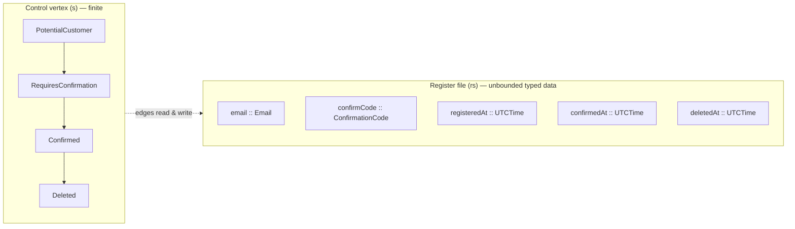

A keiki (継起) aggregate remembers two different kinds of thing, and keiki keeps them in
two different places on purpose. There is the **control vertex** — which lifecycle stage you
are in — and there is the **register file** — the actual data the aggregate has accumulated.
Conflating them is the classic modelling mistake; separating them is what lets the same
machine be both *finite enough to analyse* and *rich enough to be useful*. This page
explains the distinction and the machinery behind each half.

<Callout type="info">
  This page goes deeper than the surrounding explanation pages. You can use keiki fully
  without reading it; read it to understand why the model carries two memories rather than
  one.
</Callout>

## The two memories

In `SymTransducer phi rs s ci co` (see
[The SymTransducer](/docs/keiki/explanation/the-symtransducer)), two of the five type
parameters are the two memories:

- **`s` — the finite control.** A small `Bounded`/`Enum`/`Eq`/`Show` enum naming the
  lifecycle *stages*. In `EmailDelivery` it is `EmailPending | EmailSentVertex`; in
  `UserRegistration` it is `PotentialCustomer | RequiresConfirmation | Confirmed | Deleted`.
  Because it is finite, the build-time analyses can iterate `[minBound .. maxBound]` over it:
  reachability, single-valuedness, dead-edge detection all enumerate the control.
- **`rs :: [Slot]` — the register file.** Unbounded typed data memory carried alongside the
  control vertex and evolved by edge updates. `Slot = (Symbol, Type)`, so `rs` is a
  type-level list pairing each register's label with its value type. `UserRegRegs` carries
  `email`, `confirmCode`, `registeredAt`, `confirmedAt`, and `deletedAt`.

The rule of thumb: if the value is one of a *small fixed set of named situations*, it is the
control vertex `s`. If it is *data the aggregate accumulated* — an email, a timestamp, a
running total — it belongs in the register file `rs`.



## RegFile: a typed heterogeneous record

`RegFile` is a GADT indexed by the slot list. It has two constructors — the empty file and a
cons that pairs a slot's value onto the rest:

```haskell
data RegFile (rs :: [Slot]) where
    RNil :: RegFile '[]
    RCons ::
        (KnownSymbol s) =>
        Proxy s -> r -> RegFile rs -> RegFile ('(s, r) ': rs)
```

It is *heterogeneous*: each slot holds its own type, recovered statically from `rs`. Three
properties matter when you reason about it.

### The slot value is lazy on purpose

The value field of `RCons` is intentionally lazy. `emptyRegFile` seeds *every* slot with a
deferred `error "uninit: <slot>"` sentinel, so reading a register that has never been
written fails loudly with a targeted message instead of returning a silent bottom. The
worked examples lean on this:

```haskell
emptyRegs :: RegFile UserRegRegs
emptyRegs = emptyRegFile  -- every slot pre-bound to error "uninit: <slot>"
```

### Writes force; reads project

A *write* forces the new slot value to WHNF before threading it into the rebuilt `RCons`.
This is deliberate: without it, a long-running embedder would accumulate a tower of thunks at
each written slot on every `step`. Untouched slots keep whatever WHNF status they had, so the
`uninit:` sentinels survive for slots that have never been written.

A *read* is by typed index, either explicitly via `(!)`, or — far more commonly — via the
`#name` overloaded label:

```haskell
(!) :: RegFile rs -> Index rs r -> r
```

```haskell
data Index (rs :: [Slot]) (r :: Type) where
    ZIdx :: (KnownSymbol s) => Index ('(s, r) ': rs) r
    SIdx :: Index rs r -> Index ('(s', r') ': rs) r
```

`Index` is a type-safe pointer: `ZIdx` picks the head slot, `SIdx` skips one. Writing
`#email` resolves (through the `IsLabel`/`HasIndex` machinery) to the right `Index` — or
directly to a `Term` that reads that register — so call sites never spell out `ZIdx`/`SIdx`
by hand.

## The per-vertex B-view

The control and the registers are not fully independent: at any given vertex, only *some*
slots are meaningfully live. Before a `SendEmail` command nothing about the email is known;
after it, all three email slots are populated. keiki captures this with the per-vertex
**B-view** accessor — a derived presentation that exposes, at each vertex, only the slots
that are live there.

`Jitsurei.UserRegistration` (`jitsurei/src/Jitsurei/UserRegistration.hs`) declares the
live-slot map per vertex:

```haskell
-- ("PotentialCustomer",    [])
-- ("RequiresConfirmation", ["email", "confirmCode"])
-- ("Confirmed",            ["email", "confirmedAt"])
-- ("Deleted",              ["email", "deletedAt"])
```

`PotentialCustomer` exposes no slots (nothing is known yet); `Confirmed` exposes `email` and
`confirmedAt` but *not* `confirmCode` (which is no longer relevant). Pattern-matching the
view at `SConfirmed` yields a record whose selectors are exactly the live slots, and the type
system blocks asking `PotentialCustomer` for `confirmedAt`. The accessor is opt-in and
downstream of the transducer — nothing in the aggregate's transition logic depends on it.

<Callout type="warn">
  This B-view is only a typed presentation of current machine memory. It is unrelated to Keiro
  projections and read models, which fold events and never consume `RegFile`.
</Callout>

## Why the split matters

Keeping the finite control and the unbounded registers apart is what lets keiki have it both
ways: the control graph stays small enough for the build-time symbolic analyses to enumerate,
while the register file carries arbitrary typed data the analyses treat *symbolically*. If
you folded the data into the control — one vertex per possible email — the machine would have
infinitely many states and nothing would be analysable. The register file is precisely the
escape from that explosion.

For the larger picture of how this whole shape comes together, return to
[The SymTransducer](/docs/keiki/explanation/the-symtransducer).

<Cards>
  <Card title="Data-carrying alphabets" href="/docs/keiki/explanation/data-carrying-alphabets" />
  <Card title="The SymTransducer" href="/docs/keiki/explanation/the-symtransducer" />
  <Card title="All explanation pages" href="/docs/keiki/explanation" />
</Cards>
