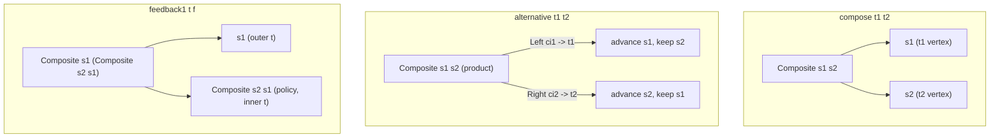

keiki composes transducers with exactly three combinators, all in `Keiki.Composition`:

- `compose` — sequential composition (A's output alphabet is B's input alphabet).
- `alternative` — disjoint-input dispatch (`Either ci1 ci2` routes to one of two arms).
- `feedback1` — one round of aggregate-policy feedback.

That is the entire public surface. This page explains why those three are the **minimal closed set**,
how `compose` quietly subsumes the older combinators it replaced, and why composition **preserves the
three guarantees** that make a single keiki transducer trustworthy. For the derivations themselves,
see [What gets derived](/docs/keiki/explanation/what-gets-derived) and the
[shape reference](/docs/keiki/reference/shape); this page asserts the preservation rather than
re-deriving it.

## The three combinators and their vertex shapes

Every combinator builds its composite vertex out of the same `Composite s1 s2` newtype (a strict pair
with hand-rolled `Bounded`/`Enum`). What differs is *how* the sub-vertices nest and route.

- **`compose`** pairs the two transducers' vertices: `Composite s1 s2`. The register file is
  `Append rs1 rs2`; a composite edge fires t1's edge and t2's edge in lockstep.
- **`alternative`** uses the *same product* vertex `Composite s1 s2`, but the two arms have
  **independent state**: a `Left` input advances only `s1`, a `Right` input advances only `s2`. The
  `Either` input alphabet keeps the arms apart. (An earlier sum-vertex design was tried and found
  degenerate — it could never leave the first arm — so the shipped form is the product vertex.)
- **`feedback1`** is literally `compose t (compose f t)`, so its vertex is the nested
  `Composite s1 (Composite s2 s1)` — outer `t`, then (policy, inner `t`). Even though the inner and
  outer `t` share a Haskell type, they occupy distinct dimensions of the tuple, so the symbolic
  per-vertex enumeration walks all `|s1| * |s2| * |s1|` combinations independently.

## Why this is the minimal closed set

The design space (catalogued from crem's `StateMachineT`) offered six combinators: `Sequential`,
`Parallel`, `Alternative`, `Feedback`, `Kleisli`, plus the profunctor hierarchy. keiki ships three.
The reasoning for *why those three and no more*:

<Accordions>

<Accordion title="compose subsumes both Sequential and Kleisli">
`Sequential` is plain categorical composition. `Kleisli` is the variant that lifts composition over a
*`Foldable` of inner events* — needed only when an edge can emit zero-or-many events. Originally
keiki edges emitted at most one event, so `Kleisli` collapsed to `Sequential`. Once `Edge.output`
became a list (`[OutTerm rs ci co]` — `[]` is the ε-edge, `[o]` a letter edge, `[o1..on]` a
multi-event edge), `compose`'s chain expansion (`PartialPath` + `expandPaths`) walks t2's state
through each of t1's mid-symbols and re-collapses the path into one composite edge. That expansion
*is* the `Kleisli` semantics. So a single `compose` now subsumes **both** crem's `Sequential` and
`Kleisli` — there is no capability a separate `Kleisli` would add.
</Accordion>

<Accordion title="alternative is its own idiom, not expressible via compose">
`alternative` dispatches on a disjoint input alphabet (`Either ci1 ci2`) to two arms with independent
state. That is structurally different from sequential threading and cannot be expressed as a
`compose` chain, so it earns its place. Its single-valuedness is automatic: the `Left`/`Right` arms'
guards are pairwise mutually exclusive, so no new cross-transducer mutual-exclusion check is needed.
</Accordion>

<Accordion title="feedback1 is the only pure feedback shape">
A general "iterate until quiescence" `feedback` needs an iteration model, and unbounded iteration can
diverge — which keiki's pure formalism deliberately excludes. The non-trivial *pure* form is
exactly one round, `feedback1 t f`, which is itself just two stacked `compose`s. Multi-round patterns
nest `feedback1`s; unbounded loops are pushed to the runtime boundary. (Note: the
`Disjoint (Names rs1) (Names (Append rs2 rs1))` constraint forces `rs1 = '[]`, so `feedback1`'s
aggregate must currently be stateless — a documented consequence of the two-stacked-`compose`
reduction.)
</Accordion>

<Accordion title="parallel and the profunctor hierarchy are out of scope">
`parallel` runs two machines on a strict `(ci1, ci2)` tuple in lock-step, but keiki's queue-driven
runtime delivers one command per tick — bounded-context inputs are *sum*-shaped (handled by
`alternative`), not paired. The `Profunctor`/`Strong`/`Choice` hierarchy is a separate concern that
builds *on top of* these combinators rather than competing with them.
</Accordion>

</Accordions>

The set is **closed** in the sense that every orchestration pattern keiki targets — choreography,
process managers, sagas, policies, feedback loops (see
[Process managers, sagas, and choreography as transducers](/docs/keiki/explanation/process-managers-sagas-choreography-as-transducers))
— reduces to a chain of these three, and each combinator's output is itself a `SymTransducer` that
the others accept as input.

## The three preserved guarantees

A single keiki transducer earns trust from three mechanical analyses. The point of the composition
algebra is that **all three survive composition**: a composite is trustworthy exactly when its parts
are. We assert preservation here; the analyses themselves are documented in
[What gets derived](/docs/keiki/explanation/what-gets-derived).

<TypeTable
  type={{
    "solveOutput (replay / output-solving)": {
      type: "preserved",
      description: "The composite's OPack carries t1's input constructor and OutFields that read ci1's fields directly (every t2-side TInpCtorField is substituted out against t1's edge output). solveOutput walks t2's wire form back through those structural reads and recovers the original ci1.",
    },
    "checkHiddenInputs": {
      type: "preserved",
      description: "Per-edge hidden-input warnings inherit through the substitution and lifters. The composite even catches the transitive case: a ci1 field t1 keeps in mid but t2 drops on the wire is flagged at the composite level, because it never reaches co.",
    },
    "single-valuedness (isSingleValuedSym)": {
      type: "preserved",
      description: "The composite is single-valued whenever its parts are. Substitution is a syntactic rewrite that preserves unsatisfiability of guard conjunctions; for alternative the Either arms make cross-arm guards vacuously exclusive; feedback1 inherits from its two stacked composes.",
    },
  }}
/>

In short: `solveOutput` still inverts events back to commands; `checkHiddenInputs` still flags any
input field that fails to reach the output; and `isSingleValuedSym` still proves at most one edge
fires per `(vertex, input)`. None of these become non-local checks under composition — each composite
guarantee reduces to the corresponding guarantees of its parts, which is the compositionality property
the algebra is designed to deliver.

## History and tests

The full design record — the six-combinator catalogue, the substitution algorithm, the
single-valuedness proof sketch, and the per-combinator deferral/admission decisions — lives in
keiki's `docs/research/composition-combinators-design.md`. The multi-event chaining that lets
`compose` subsume `Kleisli` is exercised in `test/Keiki/CompositionMultiEventSpec.hs`.

<Cards>
  <Card title="Process managers, sagas, and choreography as transducers" href="/docs/keiki/explanation/process-managers-sagas-choreography-as-transducers" />
  <Card title="What gets derived" href="/docs/keiki/explanation/what-gets-derived" />
  <Card title="Composition reference" href="/docs/keiki/reference/composition" />
  <Card title="Shape reference" href="/docs/keiki/reference/shape" />
</Cards>
