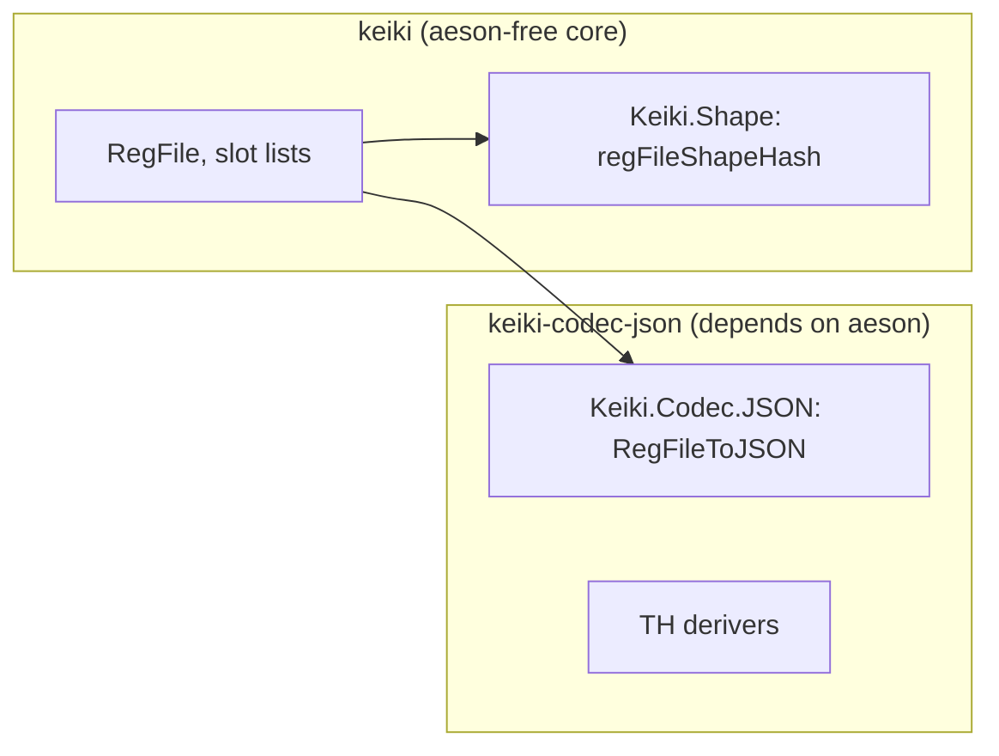
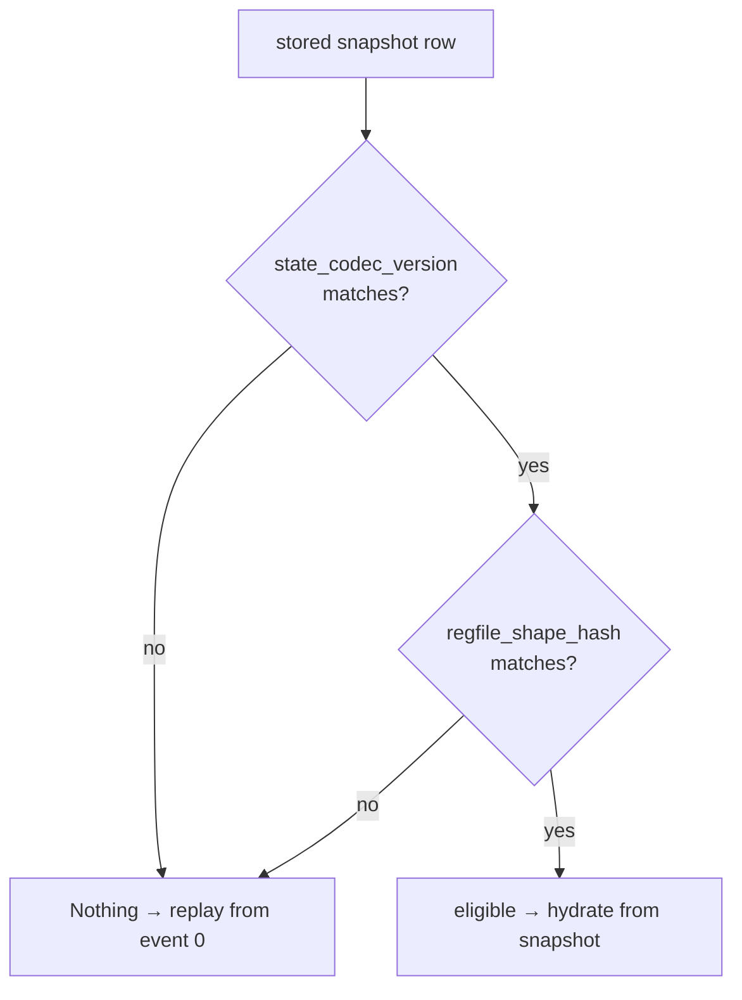

A snapshot is a serialised `(state, registers)` saved so that hydration can fast-forward instead of
replaying a stream from event 0. Two questions decide whether that saved bytes-on-disk is *safe to
load back*: is the wire format still the same, and is the structural shape still the same? keiki
answers the second; the consumer answers the first. This page explains how the codec and the shape
hash fit together, and why they live in two packages.

## Two packages, one aeson dependency

keiki **core** is aeson-free. `Keiki.Shape` and its `regFileShapeHash` carry **no aeson dependency**
at all — the shape hash is a structural fingerprint computed from the type-level slot list, not from
any serialisation library.

The JSON codec lives in the **separate** `keiki-codec-json` package, which depends on aeson. This
split is load-bearing: pulling aeson into keiki core would force the dependency on every keiki user,
including those who never serialise a register file. Both Template Haskell derivers
([`deriveRegFileCodec`, `deriveEventCodecSkeleton`](/docs/keiki/reference/codec-json)) live in
`keiki-codec-json` for the same reason — the code they generate references aeson.

The two are counterparts: the shape hash discriminates *which* snapshots are eligible to load; the
codec serialises and deserialises the eligible ones.

## The shape-hash stability contract

`regFileShapeHash` is a structural discriminator over the register file's ordered `(name, type)`
slot list. It changes for renamed, reordered, retyped, added, or removed slots. Keiki 0.2 pins the
common built-in names independently of GHC module paths; application types must pin their own
`CanonicalTypeName` when their defining module is not part of the persistence identity. See the
[shape hash reference](/docs/keiki/reference/shape) for the canonical pre-hash encoding and the
`CanonicalTypeName` escape hatch.

This stronger contract causes one deliberate upgrade effect: **every non-empty 0.1 shape hash misses
once under 0.2**. Keiro treats the old snapshot as a cache miss and replays the unchanged event log
from event 0, then may write a fresh 0.2 snapshot. The empty `regfile:0` shape is unchanged. Never
relabel old snapshot bytes with the new hash.

## Two discriminants for snapshot eligibility

A structural hash catches structural drift — but it cannot see a change that keeps the shape identical
yet changes the *bytes on the wire*. Swap a field's `ToJSON` instance for one that emits a different
date format, and the slot list is byte-for-byte the same type-level list: the shape hash is unchanged,
but old snapshots no longer decode the way new code expects.

So keiro carries **two** discriminants on each snapshot row:

<TypeTable
  type={{
    state_codec_version: { type: "consumer-managed integer", description: "Bumped by the consumer whenever a ToJSON/FromJSON change alters the wire format. Catches wire-breaking codec changes the structural hash cannot see." },
    regfile_shape_hash: { type: "keiki regFileShapeHash", description: "The structural fingerprint of the register file's slot list. Catches structural drift — added, removed, renamed, reordered, or retyped slots." },
  }}
/>

A snapshot is **eligible** for hydration iff **both** match the running binary. If **either**
differs, the hydrator returns `Nothing`, and hydration falls back to **replaying from event 0**. This
is always safe: the snapshot is an optimisation, never the source of truth — the event log is.

The two discriminants are complementary, not redundant: the codec version is the consumer's manual
lever for wire changes the type system cannot detect; the shape hash is the automatic structural
check the consumer never has to remember to bump. Together they make a stale snapshot a *fallback to
replay*, never a silent mis-decode.

## The streaming-vs-Value tradeoff

When you *do* serialise an eligible snapshot, the codec offers two encoder paths with the same
semantics and different cost:

- `regFileToJSON` builds an `Aeson.Value` — reach for it when you also inspect or rewrite the JSON
  tree.
- `regFileToEncoding` streams via `Aeson.pairs` with no intermediate `Value` — recommended for large
  snapshot payloads (multi-MB slot values) and hot paths, roughly 1.5× faster with about 33% less
  allocation.

The two paths are **not** byte-equal (the `Value` path orders keys alphabetically via aeson's
`KeyMap`; the `Encoding` path emits slot-list order), but each is deterministic and each round-trips.
See the [codec reference](/docs/keiki/reference/codec-json#two-encoder-paths) for the full detail, and
`Keiki.Codec.JSON.GoldenFileSpec` for the checked-in byte fixtures.

The snapshot codec intentionally accepts only one unambiguous shape. `DistinctNames (Names rs)`
rejects duplicate slot symbols at compile time, the encoder requires every slot to be initialized,
and the decoder rejects missing and extra keys. These constraints prevent a Value encoder from
silently losing one duplicate key or a streaming encoder from writing two indistinguishable keys.

## Events evolve differently from snapshots

A snapshot must match one exact shape, so its decoder is strict and a shape mismatch falls back to
full replay. A durable event log must remain readable across releases, so generated event envelopes
carry a stable wire `kind` and an in-band schema version. Additive fields may default on absence;
structural changes use a complete chain of one-envelope-to-one-envelope upcasters before kind
dispatch. Unknown event keys are tolerated for additive rolling deployments.

That asymmetry is deliberate: snapshots are disposable caches, while events are the source of truth.
The checked-in snapshot, shape, current-event, and historical-event goldens ensure both sides keep
their respective contracts.

## "Sensitivity" here means structural drift and no silent fallback

Two distinct senses of sensitivity govern this story, and neither is about hiding data:

<Callout type="warn">
**Sensitivity here is never PII or secret redaction.** `keiki-codec-json` has **no** redaction
feature — it does not mask, drop, or obscure field values. "Sensitive" means only:

1. **Structural-drift sensitivity** — `regFileShapeHash` changes when the slot list changes, so a
   structurally-drifted snapshot is rejected (returns `Nothing`).
2. **The no-silent-fallback property** — the event deriver never silently guesses a field's codec;
   an unhandled field is a compile-time decision (`FailAtCompileTime`) or a clearly-named TODO stub
   (`EmitTodoBindings`), never a quiet generic fallback.
</Callout>

The no-silent-fallback property is itself a form of drift protection: adding a field to a payload
record forces the author to choose its codec at compile time, so the wire format never changes behind
your back. `Keiki.Codec.JSON.SensitivitySpec` pins the structural cases;
`Keiki.Codec.JSON.THEventSpec` pins the no-silent-fallback contract.

## See also

<Cards>
  <Card title="Codec: JSON reference" href="/docs/keiki/reference/codec-json" />
  <Card title="Shape hash reference" href="/docs/keiki/reference/shape" />
  <Card title="What gets derived" href="/docs/keiki/explanation/what-gets-derived" />
</Cards>
