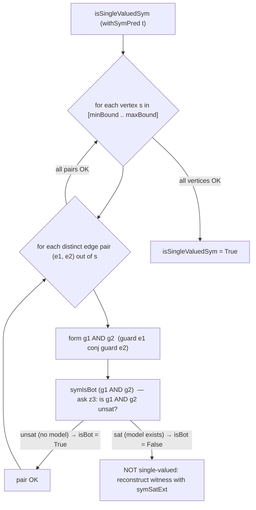

A keiki (継起) aggregate is a transducer: at each control vertex it has some number of
outgoing edges, and each edge carries a *guard* over the register file and the input command.
The **symbolic CI gate** is the build-time check that proves no two of those guards can ever
fire at once. This page explains what that property is, how `isSingleValuedSym` decides it with
z3, and what you get back when the proof fails.

<Callout type="info">
  This page is the mechanics of the check. For *why* an SMT solver is the right tool at all —
  what `sat`/`unsat`/`unknown` mean and why ordinary tests miss boundary overlaps — read
  [Why keiki uses an SMT solver](/docs/keiki/explanation/why-smt) first.
</Callout>

## What single-valuedness is

A transducer is **single-valued** when, at every reachable control vertex, *at most one*
outgoing edge's guard is satisfiable for any given input. That is the property that makes
`step` deterministic: stepping the machine on a command never finds two edges that both want to
fire, so there is never a choice to make about which update to apply, which output to emit, or
which target vertex to move to.

This matters because command execution, event replay, acceptor projections, and generated views all
consume the same transducer (see [What gets derived](/docs/keiki/reference)). If two edges at one
vertex could both fire on the same input, `stepEither` reports `AmbiguousEdges` instead of choosing
one, and replay may report `ReplayAmbiguousInversions`. Single-valuedness is the invariant that keeps
every projection in agreement. It is the keiki analogue
of an [effective Boolean algebra](/docs/keiki/explanation/the-symtransducer) over the edge
guards: distinct outgoing guards must be mutually exclusive.

<Callout type="info">
  *Reachable* vertex: `isSingleValuedSym` quantifies over `[minBound .. maxBound]` of the
  state type, so it checks every vertex the `Bounded`/`Enum` instance enumerates. It does not
  compute which register configurations are actually reachable at each vertex — that stronger
  analysis is out of scope here.
</Callout>

## The per-pair-per-vertex decomposition

`isSingleValuedSym` does not throw the whole transducer at the solver. It decomposes the
property into a flat sweep of tiny, independent emptiness questions:

> For every vertex `s`, for every distinct pair `(e1, e2)` of edges leaving `s`, is the
> conjunction of their two guards empty (`isBot`)?

The transducer is single-valued exactly when every one of those conjunctions is empty. The
actual code is a pair of `all`s over the obvious sets:

```haskell
isSingleValuedSym t = all vertexSV [minBound .. maxBound]
  where
    vertexSV s =
      let es    = edgesOut t s
          ies   = zip [0 ..] es
          pairs = [ (e1, e2) | (i, e1) <- ies, (j, e2) <- ies, i < j ]
       in all (\(e1, e2) -> isBot (guard e1 `conj` guard e2)) pairs
```

The function is `BoolAlg`-polymorphic: it is `isBot` that decides each pair, and *which*
`isBot` you get depends on the guard carrier. Lift the transducer's guards to the SBV-backed
`SymPred` carrier with `withSymPred`, and `isBot` routes through `symIsBot`, which hands the
conjunction to z3. (Run it on the raw `HsPred` carrier instead and you get the v1 *syntactic*
over-approximation — no solver, but it only catches overlaps it can prove by inspecting the AST.
See [Single-valuedness and soundness](/docs/keiki/explanation/single-valuedness-and-soundness)
for the precise contrast.)

`symIsBot` is the bridge to the solver. It translates the predicate to an SBV formula and asks
z3 whether *any* model exists; it returns `True` (the guard pair is empty, the edges are
mutually exclusive) only when the solver reports no model exists:

```haskell
symIsBot :: HsPred rs ci -> Bool
symIsBot p = unsafePerformIO $ do
    res <- SBV.sat $ do
        env <- mkSymEnv
        translatePred env p
    pure (not (SBV.modelExists res))
```

So one pair of edges becomes one `sat` call on `g1 AND g2`: `unsat` means the pair is fine,
`sat` means the pair overlaps. The decision loop is:



## Witnesses: the breaking input

When `symIsBot (g1 AND g2)` comes back `False`, the conjunction is satisfiable — there is a
concrete input that fires both edges. `isSingleValuedSym` itself only returns a `Bool`, but the
same predicate that failed can be handed to `symSatExt`, which re-runs the solver and
*reconstructs the model* into a concrete `(RegFile rs, ci)`:

```haskell
symSatExt ::
    (ExtractRegFile rs, KnownInCtors ci) =>
    HsPred rs ci -> Maybe (RegFile rs, ci)
```

On a satisfiable predicate this returns `Just (regs, cmd)` — the exact register file and command
that make both guards true. That is the breaking input, in your own domain types, ready to drop
into a failing test or a debugger. The reconstruction is faithful for every slot and input field
the guards actually read (`symSatExt` names each SBV variable after its slot, e.g.
`reg/<slot>` and `inp/<ctor>/<field>`, then reads those names back out of the model); the
witness satisfies `models p (regs, cmd)`, which is what the `jitsurei` specs assert with their
sat → witness → `evalPred` agrees round-trips.

<Callout type="warn">
  `symSatExt` needs two extra evidence constraints the bare `isSingleValuedSym` does not:
  `ExtractRegFile rs` (to rebuild the register file) and `KnownInCtors ci` (to rebuild the
  command). Those live on the `Sat (SymPred …)` instance, not on `BoolAlg`, so the witness-free
  gate keeps type-checking even on carriers that cannot reconstruct a witness.
</Callout>

## Soundness vs precision, in one paragraph

The symbolic gate is **sound**: it under-approximates the overlap relation, so it never raises a
false alarm about determinism that the concrete runtime would not actually hit. When a guard
type or term is outside the curated SBV registry — an opaque function lifted into a guard, a slot
type with no `Sym` instance — the translator falls back to a fresh free variable. That fallback
can make a genuinely-mutex pair *look* satisfiable (a false `False`, a spurious gate failure),
but it never makes an overlapping pair look empty in a way that matters for safety. A green gate
stays trustworthy. The full treatment — including the one place an opaque guard can silently
*under*-verify, and the `unknown`/timeout rule — is in
[Single-valuedness and soundness](/docs/keiki/explanation/single-valuedness-and-soundness).

## Build-time only — never the hot path

Every solver call here happens at **build/CI time**. z3 (via the `sbv` library) is invoked by
`symIsBot` and `symSatExt`, and those are reached only through `isSingleValuedSym`,
`checkTransitionDeterminismSym`, `checkDeadEdgesSym`, and `sat` — all of which you call from a
test or a CI step, never from `step`. keiki's runtime evaluation is *concrete*: `models`
delegates to `evalPred`, which evaluates the guard against real register values with no solver
in sight. You pay milliseconds in CI to retire a class of boundary bug; you pay nothing at
runtime, and z3 only has to be on `PATH` when the check is actually run.

```haskell
-- A one-line CI gate, exactly as the jitsurei User Registration spec asserts it:
isSingleValuedSym (withSymPred userReg) `shouldBe` True
```

That assertion is anchored in
`jitsurei/test/Jitsurei/UserRegistrationSymbolicSpec.hs`, which also exercises the
sat → witness → `evalPred` round-trip on the `ConfirmAccount` edge guard.

<Cards>
  <Card title="Why keiki uses an SMT solver" href="/docs/keiki/explanation/why-smt" />
  <Card title="Single-valuedness and soundness" href="/docs/keiki/explanation/single-valuedness-and-soundness" />
  <Card title="The SymTransducer" href="/docs/keiki/explanation/the-symtransducer" />
  <Card title="Symbolic reference" href="/docs/keiki/reference" />
</Cards>
