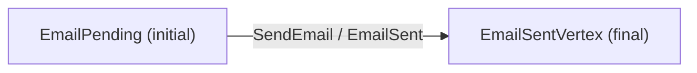

Every aggregate you author in keiki (継起) is, in the end, one value of one type:
`SymTransducer phi rs s ci co`. The builder DSL, the symbolic analyses, the diagram
renderers, the JSON codecs — all of them produce or consume this single record. If you
understand the `SymTransducer`, you understand the spine the whole library hangs on. This
page is the canonical description of that type; the rest of the explanation set links back
here.

<Callout type="info">
  A *transducer* is a state machine that, on each input, both moves to a next state *and*
  emits output. Stepping keiki's machine on a command therefore yields the next control
  vertex, the evolved register file, and the events to emit. If "transducer" is new, read
  [Finite automata and transducers](/docs/keiki/explanation/finite-automata-and-transducers)
  first.
</Callout>

## The four record fields

The type is a plain Haskell record with four fields:

```haskell
data SymTransducer phi rs s ci co = SymTransducer
    { edgesOut     :: s -> [Edge phi rs ci co s]
    , initial      :: s
    , initialRegs  :: RegFile rs
    , isFinal      :: s -> Bool
    }
```

- **`edgesOut :: s -> [Edge phi rs ci co s]`** — the transition graph, given as a function
  from each control vertex to its list of outgoing edges. An empty list means the vertex is
  a dead end (terminal or stuck).
- **`initial :: s`** — the control vertex the machine starts in before any command.
- **`initialRegs :: RegFile rs`** — the starting register file. In the worked examples this
  is `emptyRegFile`, which seeds every slot with a deferred `error "uninit: <slot>"`
  sentinel (see [Registers vs. state](/docs/keiki/explanation/registers-vs-state)).
- **`isFinal :: s -> Bool`** — which vertices are accepting / terminal. The
  `EmailDelivery` example writes `\case EmailSentVertex -> True; _ -> False`.

An `Edge` is itself a small record — a guard, a register update, a *list* of output terms,
and a target vertex:

```haskell
data Edge phi rs ci co s where
    Edge ::
        { guard  :: phi
        , update :: Update rs w ci
        , output :: [OutTerm rs ci co]
        , target :: s
        } ->
        Edge phi rs ci co s
```

## The five type parameters

The five parameters of `SymTransducer phi rs s ci co` are what make one type serve every
aggregate. Read them left to right:

<TypeTable
  type={{
    phi: { description: "The guard carrier — an effective Boolean algebra. Authoring uses HsPred rs ci, aliased Pred. This is what an edge's guard field holds.", type: "guard carrier" },
    rs: { description: "The register-file schema: a type-level list of (Symbol, Type) slots. Unbounded typed data memory carried alongside the control vertex.", type: "[Slot]" },
    s: { description: "The finite control vertex type — a small Bounded/Enum/Eq/Show enum naming the lifecycle stages.", type: "Type" },
    ci: { description: "The command / input sum — the alphabet the machine consumes.", type: "Type" },
    co: { description: "The event / output sum — the alphabet the machine emits.", type: "Type" },
  }}
/>

A few things worth dwelling on:

- **`phi` is a *carrier*, not a fixed type.** The class `BoolAlg phi a` abstracts the guard
  language so that the *same* `SymTransducer` shape can be evaluated concretely with the v1
  `HsPred` carrier or translated to SMT with the SBV-backed `SymPred` carrier in
  `Keiki.Symbolic`. For hand-authoring you always use `HsPred rs ci`, which has the readable
  alias `Pred rs ci`. See [Guards and emit](/docs/keiki/explanation/guards-and-emit).
- **`rs :: [Slot]` is a type-level list**, where `Slot = (Symbol, Type)` — each slot is a
  label paired with its value type. `EmailRegs` is
  `'[ '("emailRecipient", Email), '("emailSubject", Subject), '("emailSentAt", UTCTime) ]`.
- **`s` is your control enum**, small and finite — `data EmailVertex = EmailPending |
  EmailSentVertex`. It carries the `Bounded`/`Enum` instances the build-time analyses iterate
  over.

### The everyday alias

Spelling out `SymTransducer (HsPred rs ci) rs s ci co` repeats `rs` and `ci`. keiki gives
you a synonym that collapses it:

```haskell
type Guarded rs s ci co = SymTransducer (HsPred rs ci) rs s ci co
```

This is the signature you will actually write. The `EmailDelivery` example is typed
`Guarded EmailRegs EmailVertex EmailCmd EmailEvent`.

## Output widening: one command, several events

The single most important shape detail is that an edge's `output` is a **list** of output
terms, not a single one. This is the GSM-style *widening*: one transition can emit zero,
one, or many events.

- `output = []` is the **ε-edge** — the command is accepted but emits nothing observable (a
  silent state change).
- `output = [o]` is the **letter edge** — exactly one event.
- `output = [o1, o2, ...]` is the **multi-event edge** — N events in declaration order, all
  evaluated against the *same* pre-transition `(registers, command)` snapshot.

The `UserRegistration` aggregate uses this directly: its `StartRegistration` edge emits
*two* events (`RegistrationStarted` then `ConfirmationEmailSent`) in a single transition.

## A tiny transducer

The `EmailDelivery` aggregate
(`jitsurei/src/Jitsurei/EmailDelivery.hs`) is about the smallest interesting shape: one
idle vertex, one command, one event, one transition to a terminal vertex.



In code, that single edge (in AST form) reads:

```haskell
EmailPending ->
  [ Edge
      { guard  = isSendEmail
      , update =
          USet #emailRecipient (inpSendEmail #recipient)
            `combine` USet #emailSubject (inpSendEmail #subject)
            `combine` USet #emailSentAt  (inpSendEmail #at)
      , output =
          [ pack inCtorSendEmail wireEmailSent
              (inpSendEmail #recipient *: inpSendEmail #subject *: inpSendEmail #at *: oNil) ]
      , target = EmailSentVertex
      }
  ]
EmailSentVertex -> []
```

## Running it: the transducer surface

The recommended way to run a `SymTransducer` is the transducer surface. Everything is
**concrete** — no SMT solver runs at step time. The z3-backed reasoning is a *build-time*
check only (see [Why SMT?](/docs/keiki/explanation/why-smt)); `step` and its companions are
pure, total Haskell.

- `step` advances one full command. There is no `StepResult` type — a successful step is the
  bare triple `(s, RegFile rs, [co])`:

  ```haskell
  step ::
      (BoolAlg phi (RegFile rs, ci)) =>
      SymTransducer phi rs s ci co ->
      (s, RegFile rs) ->
      ci ->
      Maybe (s, RegFile rs, [co])
  ```

  `Nothing` means no outgoing edge from the current vertex had a satisfied guard.
- `stepEither` is the same step but returns a precise `StepFailure s` on the `Left` instead
  of collapsing every failure into `Nothing`; on the `Right` it returns exactly the triple
  `step` returns.
- `delta` and `omega` are the classical split: `delta` gives the next `(s, RegFile rs)`,
  `omega` gives the `[co]` emitted. `step` is just the two combined.
- `reconstituteEither` replays a `[co]` event log back into
  `Either (ReplayFailure s co) (s, RegFile rs)` and reports the failed event index, replay state,
  and exact reason. `reconstitute` remains a lossy `Maybe` compatibility wrapper. See
  [Deriving event sourcing](/docs/keiki/explanation/deriving-event-sourcing).

<Callout type="info">
  keiki 0.2 does not export a `Keiki.Decider` record. A fixed four-field Decider cannot represent
  `InFlight` multi-event replay or preserve structured hydration failures. Use `stepEither` for the
  command direction and `reconstituteEither`, `applyEventsEither`, or `replayEvents` for replay.
</Callout>

## Where to go next

- [Registers vs. state](/docs/keiki/explanation/registers-vs-state) — the difference between
  the finite control vertex `s` and the unbounded register file `rs`.
- [Guards and emit](/docs/keiki/explanation/guards-and-emit) — how `phi` guards and
  `OPack` outputs are built, and what "structural" vs "opaque" means.
- For the exact signatures of every type and function on this page, see the core reference
  at `/docs/keiki/reference/core`.

<Cards>
  <Card title="Your first aggregate" href="/docs/keiki/tutorials/your-first-aggregate" />
  <Card title="Finite automata and transducers" href="/docs/keiki/explanation/finite-automata-and-transducers" />
  <Card title="All explanation pages" href="/docs/keiki/explanation" />
</Cards>
