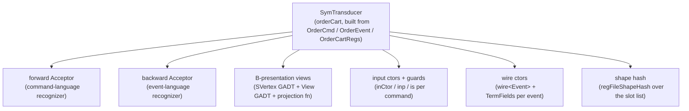

In keiki (継起) you author **one** thing — a `SymTransducer`, written with the builder. Everything
downstream is a *projection* of that single declaration. You never re-state your domain in five
different shapes; you derive them.

This page maps the fan-out: from the one source declaration to every artifact keiki and keiro (経路)
read off it, and explains the **zero-enumeration** story that keeps the derivation from turning into
a wall of boilerplate.

For the source model itself — what a `SymTransducer` *is* — see
[The SymTransducer](/docs/keiki/explanation/the-symtransducer).

## The one declaration

The root is the transducer value plus the three type-level declarations it stands on: the command
sum, the event sum, and the register-file slot list. In the worked order aggregate
(`jitsurei/src/Jitsurei/OrderCart.hs`) that is `OrderCmd`, `OrderEvent`, `OrderCartRegs`, and the
`orderCart` transducer built with `Keiki.Builder`.



Each leaf is a different *view* of the same machine; none of them is a separate source of truth.

## The artifacts

<Steps>

<Step>
### The two acceptors

Strip the output from the transducer's edges and you have a finite-state **acceptor** — a recognizer
of which input sequences the machine accepts. keiki derives two: a forward acceptor over the command
language and a backward acceptor over the event language. The output acceptor carries `InFlight`
state, so multi-event chains and truncated logs are classified the same way as Core replay.
</Step>

<Step>
### The B-presentation views

The register file is the complete memory (the *C-foundation*). A B-presentation view is a
vertex-indexed projection that exposes only the slots live at each control vertex. From the vertex
enum plus a per-vertex live-slot spec, `deriveView` emits a singletons GADT, a per-vertex `View`
GADT, and the projection function. See [B-presentation
views](/docs/keiki/explanation/b-presentation-views).
</Step>

<Step>
### The input constructors, guards, and wire constructors

For each command constructor keiki derives an `InCtor` value (`inCtor<Ctor>`), a field-projection
helper (`inp<Ctor>`), and a guard atom (`is<Ctor>`) the SBV-backed `BoolAlg` recognizes
symbolically. For each event constructor it derives a `wire<Event>` value plus its `<Event>TermFields`
record. These are what the builder's `onCmd` and `emit` refer to by name.
</Step>

<Step>
### The shape hash

The register-file slot list yields `regFileShapeHash` — the GHC-upgrade-safe discriminator a
snapshot persister keys on. See [Shape](/docs/keiki/reference/shape).
</Step>

</Steps>

## The zero-enumeration story

The thing that makes the fan-out cheap is that **you do not name each constructor**. The derivation
walks the `Generic` representation of your command and event sums and the type-level slot list, and
emits one helper per constructor automatically.

In the order aggregate, the entire command-side and event-side derivation is a single fused splice:

```haskell
$(deriveAggregate ''OrderCmd ''OrderCartRegs ''OrderEvent)
```

`deriveAggregate` is itself just `deriveAggregateCtorsAll` (every command constructor) followed by
`deriveWireCtorsAll` (every event constructor):

```haskell
deriveAggregate ::
    Name ->  -- command sum type,  e.g. ''OrderCmd
    Name ->  -- register-file slot list, e.g. ''OrderCartRegs
    Name ->  -- event sum type, e.g. ''OrderEvent
    Q [Dec]
deriveAggregate cmdName regsName evtName = do
    cmdDecs <- deriveAggregateCtorsAll cmdName regsName
    evtDecs <- deriveWireCtorsAll evtName
    pure (cmdDecs ++ evtDecs)
```

The `*All` variants enumerate every constructor of the sum, each using its own name as the
short-name suffix — so a ten-constructor command sum gets ten `inCtor`/`inp`/`is` triples without a
ten-line spec. Add an eleventh command constructor and its helpers appear the next time the module
compiles; remove one and its helpers disappear. There is no list to keep in sync.

<Callout type="info">
When you *want* an abbreviated short name that differs from the constructor name — `inCtorStart` for
`StartRegistration` rather than `inCtorStartRegistration` — reach for the spec-taking
`deriveAggregateCtors` (and `deriveWireCtors`) instead of the `*All` form, as the user-registration
aggregate does. That is the only reason to enumerate constructors by hand: to rename their helpers,
never to *register* them.
</Callout>

The single fused `deriveAggregate` splice for the order aggregate is in
`jitsurei/src/Jitsurei/OrderCart.hs` (around the `$(deriveAggregate …)` line). Everything else on
this page is read off the same three type declarations it stands on.

<Cards>
  <Card title="The SymTransducer" href="/docs/keiki/explanation/the-symtransducer" />
  <Card title="B-presentation views" href="/docs/keiki/explanation/b-presentation-views" />
  <Card title="Shape hash reference" href="/docs/keiki/reference/shape" />
</Cards>
