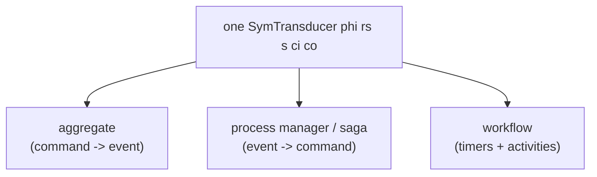

Long-running business systems keep reaching for the same three capabilities, and they almost
always reach for three *different* runtimes to get them. keiki's wager is that those three are
facets of one underlying object — a state machine that consumes inputs and emits outputs — and
that modelling them as that one object removes the seams where these systems usually hurt.

<Callout type="info">
  This page goes deeper than the surrounding explanation pages. You can use keiki fully without
  reading it; read it to understand *why* the library has the shape it does — one formalism instead
  of three.
</Callout>

## Three problems, three runtimes

These three needs show up over and over in systems that run for hours, days, or months:

- **Event sourcing.** Instead of storing the current state of a thing (an order, an account, a
  shipment), store the immutable log of events that produced it, and replay the log to recover the
  state. Tools: EventStoreDB, Marten on Postgres, home-rolled logs on Postgres or Kafka,
  decider-pattern libraries.
- **Workflow engines.** Coordinate long-running, multi-step processes that span hours, days, or
  months: order fulfillment, employee onboarding, multi-step approvals. Tools: Temporal, its
  predecessor Cadence, AWS Step Functions, Camunda.
- **Durable execution.** When a process is mid-workflow and the server crashes, it should resume
  on recovery exactly where it left off — no data loss, no double work. Tools: Temporal again,
  Restate, Azure Durable Functions.

Each of these tools works. If you only ever need one of the three, pick the specialized tool and
stop reading. The trouble starts when a single system needs more than one of them at once.

## The four seams

Once a system needs more than one of the three, the boundaries between the runtimes start to cost
you. There are four recurring seams.

**1. No single formal model spans them.** An event-sourced aggregate is "a thing with `decide`
and `evolve`." A workflow is "a function that calls activities and yields." A saga is "a sequence
of steps with compensating actions." Three vocabularies, three runtimes, three testing strategies.
The mental cost of mapping between them is paid constantly.

**2. No mechanical derivation between deciding and replaying.** In the standard event-sourcing
decider pattern, you write command-handling and event-replay as two separate functions. The
legacy shape looks like this:

```haskell
-- prior-art / legacy shape — NOT keiki's recommended API
decide :: Cmd -> State -> [Event]
evolve :: State -> Event -> State
```

Nothing checks that these two agree. If `decide` says command `C` produces event `E`, but
`evolve` interprets `E` differently than `decide` intended, replay silently reconstructs the wrong
state. There is no compile error and no test failure — unless you happened to write the test that
would have caught it.

**3. Workflows are opaque.** A Temporal-style workflow is imperative code. You cannot ask "can
this workflow deadlock?" or "are these two workflow versions equivalent?" without running it. The
only way to check a path is to exercise it — often in production.

**4. Composition is ad hoc.** Aggregates compose into sagas via subscription glue. Sagas compose
into larger workflows via more glue. Each integration is hand-wired and hand-tested; there is no
algebra of composition that the pieces obey by construction.

## The keiki bet

keiki lifts all three onto **finite-state transducers**, an automata formalism from the 1960s. A
finite-state transducer is a state machine that takes inputs and produces outputs: it has a
transition function (which state am I in next?) and an output function (what do I emit?). With a
handful of additions — partiality, ε-output, final states, and register tracking — that one object
covers all three problems:

- an **aggregate** (commands in, events out, state evolved by events);
- a **process manager / saga** (events from one context in, commands to other contexts out);
- a **workflow** (a long-running process with timers and external activities).

keiki's concrete realization of this idea is the symbolic-register finite-state transducer,
`SymTransducer phi rs s ci co` — a hybrid of two refinements of the classical FST. From a Symbolic
Finite Transducer it takes *symbolic* edges: transitions are labelled by predicates over the input
(via the predicate carrier `phi`), not by enumerating every concrete symbol. From a Streaming
String Transducer it takes a typed *register file* (`rs`), the machine's working memory, carried
alongside the finite control state `s`. The remaining two parameters are the command input `ci`
and the event output `co`.



Because all three are the *same kind* of object, they get the same definition style, the same
testing approach, the same analysis tools, and the same composition rules. And the seams close:

- **One formalism.** Aggregate, saga, and workflow are all one type. Composition combinators apply
  uniformly rather than being hand-wired per integration.
- **Mechanical derivation.** You declare the transducer once; keiki derives the decider, the
  acceptors, the per-vertex views, and more from that single source. The deciding half and the
  replaying half cannot disagree, because they were generated from the same declaration — closing
  seam 2 by construction.
- **Analyzability.** "Can this deadlock?" and "is this refactor equivalent to the old version?"
  become questions you can ask at build time. keiki even offers an opt-in single-valuedness check
  backed by SBV and z3 — closing seam 3.
- **Pure semantics, pure value.** keiki is a pure, dependency-free, IO-free Haskell library you
  import. The transducer is a value, not a framework or an SDK. The infrastructure — the event
  store, the queue, the subscriptions — lives in a separate, swappable layer.

That last point is the family boundary. keiki (継起) is the decision core: pure semantics, the one
formalism. kiroku (記録) is the PostgreSQL event store, shibuya is the worker substrate, and keiro
(経路) is the framework that composes all three. This essay is about keiki — the one object that the
rest of the stack is built to persist, drive, and subscribe to.

## What the bet costs

One formalism is not free, and it is worth naming the costs honestly:

- **Vocabulary.** You need a small amount of automata theory. These essays cover it.
- **Encoding effort up front.** Writing a transducer is more deliberate than scripting the happy
  path of an imperative workflow. You are stating the model precisely, not just programming.
- **Some questions are not decidable.** When transitions carry arbitrary data payloads — and real
  workflows always do — some analytical questions become semi-decidable or undecidable. keiki is
  explicit about where that line falls rather than pretending it does not exist.

## Where this goes

The rest of keiki's theory thread builds the bet up from the ground:

<Cards>
  <Card
    title="Event sourcing and the decider"
    href="/docs/keiki/explanation/event-sourcing-and-the-decider"
    description="The decider pattern the library is built on top of — and why its two halves want to be derived, not hand-written."
  />
  <Card
    title="Finite automata and transducers"
    href="/docs/keiki/explanation/finite-automata-and-transducers"
    description="The automata-theory backbone: from finite-state machines to the symbolic, register-carrying transducer keiki actually uses."
  />
</Cards>

If you already understand event sourcing well, skim the decider essay for vocabulary and move on to
the transducers essay, where the one formalism is developed in full.
