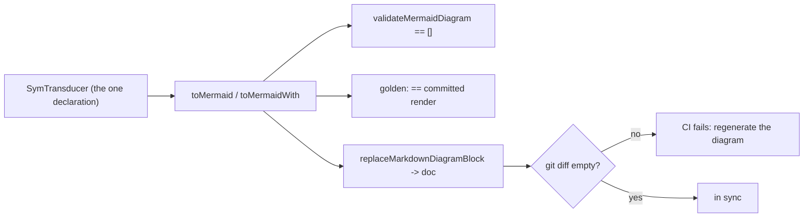

A diagram you paste into a doc is a **copy**. The moment the transducer changes, that copy is stale —
and a stale state diagram is worse than none, because readers trust it. keiki's renderers are pure
and deterministic precisely so a committed diagram can be treated as a build artifact: re-rendered on
demand and checked against the source. This guide wires the three habits that keep them honest.

<Callout type="info">
Assumes you can already [render a single diagram](/docs/keiki/how-to/render-a-mermaid-diagram) and,
for multi-diagram documents, [build an atlas](/docs/keiki/how-to/build-a-diagram-atlas). This guide
is about the *discipline* around those renderers, not the renderers themselves.
</Callout>

## The two kinds of drift

"In sync" means two different things; keep them separate:

- **Diagram drift** — the committed Mermaid *text* no longer matches `toMermaid t` because the
  transducer's topology or guards changed. This is what the rest of this guide is about. It is caught
  with a golden test and fixed by regenerating in place.
- **Shape drift** — the register file's *shape* (slot names, types, order) changed, which is a
  *runtime* concern: it invalidates persisted snapshots via the [shape
  hash](/docs/keiki/reference/shape). It is unrelated to diagrams, but people conflate the two
  because both are "the machine changed". If you are chasing a snapshot-eligibility problem, you want
  `regFileShapeHash`, not the renderers — see [shape hash and
  snapshots](/docs/keiki/walkthrough/rendering-and-codecs/09-shape-hash-and-snapshots).

## 1. Pin the render with a golden test

The renderers take no IO and produce byte-stable output, so the cheapest sync check is a golden test:
assert that re-rendering equals the committed string. When someone changes the transducer, the test
fails, and the diff *is* the review of the topology change.

```haskell
-- the committed golden — keep it next to the test, or read it from the doc file
expectedLoanDiagram :: Text
expectedLoanDiagram = T.unlines
  [ "stateDiagram-v2"
  , "    [*] --> Intake"
  -- … the rest of the pinned block …
  ]

spec :: Spec
spec = describe "loan application diagram" $
  it "matches the committed render" $
    toMermaid loanApplication `shouldBe` expectedLoanDiagram
```

This is exactly how keiki pins its own examples: `toMermaid loanApplication` is fixed verbatim in
`Jitsurei.Render.MermaidLoanSpec`, and the atlas shape in `Keiki.Render.MermaidSpec`. Because
`toMermaidWith defaultMermaidOptions t` is byte-identical to `toMermaid t`, you can pin the annotated
form the same way once you settle on a `MermaidOptions` value.

<Callout type="info">
Pin the **render call you actually publish**. If your doc shows guards
(`guardMode = MermaidGuardPretty`) or written slots (`showWrittenSlots = True`), pin
`toMermaidWith opts t` with that same `opts` — not the bare `toMermaid t` — or the golden and the doc
will disagree.
</Callout>

## 2. Regenerate the committed block in place

When the golden test fails because the change was intended, regenerate rather than hand-edit. If the
diagram lives in a Markdown doc wrapped in atlas markers, `replaceMarkdownDiagramBlock` rewrites
exactly the marked block and preserves every byte of prose around it — and it is **idempotent**, so
re-running it on an already-current document is a no-op:

```haskell
import Keiki.Render.Markdown (MarkdownDiagramBlock (..), replaceMarkdownDiagramBlock)
import Keiki.Render.Mermaid (toMermaid)

regenerate :: Text -> Either MarkdownDiagramError Text
regenerate doc =
  replaceMarkdownDiagramBlock
    MarkdownDiagramBlock
      { blockNamespace = T.pack "keiki"
      , blockId        = T.pack "loan-application"   -- the marker id you wrapped with
      , blockLanguage  = T.pack "mermaid"
      , blockContent   = toMermaid loanApplication   -- freshly rendered, no fences
      }
    doc
```

Wire that into a small regenerator executable (one `replaceMarkdownDiagramBlock` call per marked
block, threading the document) and you have a `just diagrams` target. The CI check then becomes:
**run the regenerator and fail if `git diff` is non-empty.** That single check subsumes the golden
test for doc-embedded diagrams — drift can only mean someone changed the transducer without
regenerating.

<Callout type="warn">
The marker check is strict: exactly one begin and one end marker per id. A stale, missing, or
duplicated marker returns `MissingBeginMarker` / `MissingEndMarker` / `DuplicateMarker` rather than
silently mangling the document. Treat a `Left` as a build failure. See the [Markdown atlas
reference](/docs/keiki/reference/render-markdown).
</Callout>

## 3. Validate the rendered text

A diagram can be *current* and still be *broken Mermaid* — an overlong label, an unescaped `"` or
`|`, a duplicate state id. `Keiki.Render.Validate` scans rendered text for those cheap-to-detect
mistakes so they never reach a PR:

```haskell
import Keiki.Render.Validate (validateMermaidDiagram, defaultMermaidValidationOptions)

it "renders clean Mermaid" $
  validateMermaidDiagram defaultMermaidValidationOptions (toMermaid loanApplication)
    `shouldBe` []
```

Use `validateMermaidAtlas` for a whole multi-block document. The defaults flag labels over 80
characters and the curated denylist `{ " < > | { } }` (the literal `<br/>` keiki emits for multiline
labels is always exempt); tune `MermaidValidationOptions` to your house rules. An empty list means
*no problem detected*, not *guaranteed-valid Mermaid* — it is a lint, not a parser. Full surface in
the [Markdown atlas reference](/docs/keiki/reference/render-markdown#text-level-diagram-validators).

## The workflow, end to end

Put together, one source declaration drives everything and CI guarantees the docs cannot rot:



## Verify it worked

Run your regenerator twice and diff: the second run produces no change (idempotence). Then make a
trivial topology change to the transducer, re-run the golden/validator suite, and confirm it fails —
proving the check actually guards the diagram.

## Related

- [Render a Mermaid diagram](/docs/keiki/how-to/render-a-mermaid-diagram) — the render calls to pin.
- [Build a diagram atlas](/docs/keiki/how-to/build-a-diagram-atlas) — wrap blocks in markers for in-place regeneration.
- [Markdown atlas reference](/docs/keiki/reference/render-markdown) — `replaceMarkdownDiagramBlock` and the validators.
- [Diagrams from one declaration](/docs/keiki/explanation/diagrams-from-one-declaration) — why the transducer is the single source of truth.
