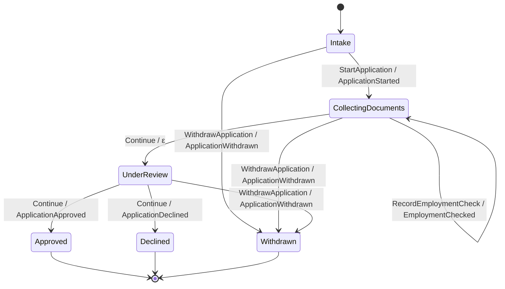

You have a `SymTransducer` and want a topology diagram you can paste into a PR, a Markdown doc, or
a Notion page. keiki's `Keiki.Render.Mermaid` walks the transducer and emits a `stateDiagram-v2`
block as plain `Text` — no IO, no layout engine, deterministic output you can pin in a golden test.

<Callout type="info">
  Assumes you can already author a single aggregate and read its types. If not, start with
  [Derive aggregate constructors](/docs/keiki/how-to/derive-aggregate-constructors).
</Callout>

## Goal

Turn a `SymTransducer` whose vertex type derives `Enum`, `Bounded`, and `Show` into a Mermaid
diagram string — first the bare topology, then a composite, then with domain-readable guard
annotations.

## Render a single transducer

`toMermaid` is the one-argument entry point. The vertex type drives the enumeration
(`[minBound .. maxBound]`) and the node labels (`show`):

```haskell
import Keiki.Render.Mermaid (toMermaid)
import Jitsurei.LoanApplication (loanApplication)

loanApplicationDiagram :: Text
loanApplicationDiagram = toMermaid loanApplication
```

The output begins with the `stateDiagram-v2` header, an initial-state line, one line per outgoing
edge, and a final-state line for every vertex where `isFinal` fires. Edge labels read
`<input ctor> / <output ctor>`; an ε-edge (no output) renders its output half as `ε`. This is the
exact render pinned by `Jitsurei.Render.MermaidLoanSpec`:



## Render a composite

A `compose` result has the cross-product vertex type `Composite s1 s2`, which the default `Show`
prints as `Composite a b` — not a legal Mermaid identifier. Use the composite renderers, which join
the components with an underscore instead:

<Tabs items={["Flat", "Nested"]}>

<Tab value="Flat">

`toMermaidComposite` emits the **flat cross-product**: each composite vertex becomes one
`<show s1>_<show s2>` identifier under the header.

```haskell
import Keiki.Render.Mermaid (toMermaidComposite)

pipelineDiagram :: Text
pipelineDiagram = toMermaidComposite pipeline
```

</Tab>

<Tab value="Nested">

`toMermaidCompositeNested` wraps each outer `s1` vertex in a `state <s1> { … }` block listing the
inner identifiers, which reads better once the cross-product gets wide. Cross-cutting transitions
stay at the top level using the same flat identifiers, so the renderer never relies on Mermaid's
dotted cross-block reference syntax.

```haskell
import Keiki.Render.Mermaid (toMermaidCompositeNested)

pipelineDiagram :: Text
pipelineDiagram = toMermaidCompositeNested pipeline
```

</Tab>

</Tabs>

<Callout type="info">
  For a right-associative 3-deep `compose` (vertex `Composite s1 (Composite s2 s3)`), use
  `toMermaidCompose3` or `toMermaidCompose3Nested`; for an `alternative`-shaped pair use
  `toMermaidAlternative` / `toMermaidAlternativeWith`, and for a `feedback1` cascade use
  `toMermaidFeedback1`.
</Callout>

## Turn on readable guards

The default render hides edge guards. To annotate each edge with a domain-readable predicate, pass
`MermaidOptions` to `toMermaidWith` with `guardMode = MermaidGuardPretty`:

```haskell
import Keiki.Render.Mermaid
  ( toMermaidWith
  , defaultMermaidOptions
  , MermaidOptions (..)
  , MermaidGuardMode (..)
  )

annotatedDiagram :: Text
annotatedDiagram =
  toMermaidWith
    defaultMermaidOptions
      { guardMode       = MermaidGuardPretty
      , showWrittenSlots = True
      }
    loanApplication
```

Each edge label gains a bracketed suffix. `MermaidGuardPretty` renders the guard through
`Keiki.Render.Pretty.prettyPred` (e.g. `(ConfirmAccount && ConfirmAccount.confirmCode == confirmCode)`);
`showWrittenSlots = True` appends the update's written-slot names as `w: …`. So an annotated edge
reads like:

```mermaid
stateDiagram-v2
    Intake --> CollectingDocuments : StartApplication / ApplicationStarted [w: applicantName; g: StartApplication]
```



<Callout type="info">
  `showGuardSummary = True` is the legacy spelling of `guardMode = MermaidGuardStructuralSummary`
  — it prints the structural constructor tags (e.g. `g: PAnd PInCtor PEq`) rather than the
  domain-readable form. An explicit `guardMode` always wins; `showGuardSummary` is honoured only
  when `guardMode` is left at its `MermaidGuardHidden` default.
</Callout>

## Verify it worked

`toMermaid loanApplication` is pinned verbatim in `Jitsurei.Render.MermaidLoanSpec`, so the byte
string is a stable golden. Paste any of the `mermaid` blocks above into GitHub or a Notion page and
it renders inline. With `defaultMermaidOptions`, `toMermaidWith defaultMermaidOptions t` is
byte-identical to `toMermaid t` — the annotations are strictly additive.

## Related

- [Build a diagram atlas](/docs/keiki/how-to/build-a-diagram-atlas) — assemble several diagrams into
  one document and keep them in sync in place.
- [Keep diagrams in sync](/docs/keiki/how-to/keep-diagrams-in-sync) — pin the render in a golden test,
  regenerate in place, and validate the output so a committed diagram never goes stale.
- The render reference (`Keiki.Render.Mermaid`, `Keiki.Render.Pretty`) under
  [the keiki reference](/docs/keiki/reference).
