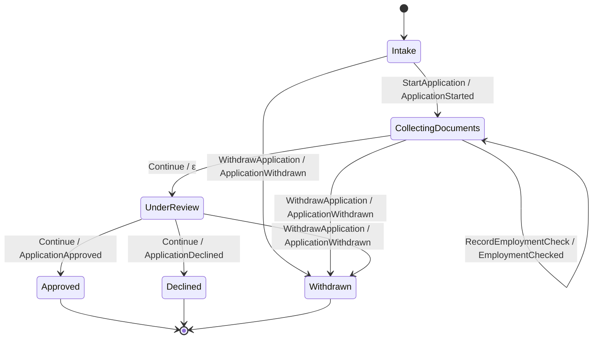
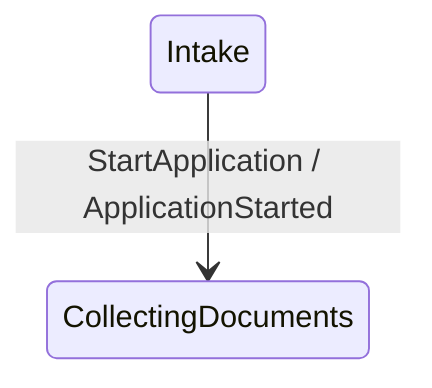

You have a `SymTransducer` and want a topology diagram you can paste into a PR, a Markdown doc, or
a Notion page. keiki's `Keiki.Render.Mermaid` walks the transducer and emits a `stateDiagram-v2`
block as plain `Text` — no IO, no layout engine, deterministic output you can pin in a golden test.

<Callout type="info">
  Assumes you can already author a single aggregate and read its types. If not, start with
  [Derive aggregate constructors](/docs/keiki/how-to/derive-aggregate-constructors).
</Callout>

## Goal

Turn a `SymTransducer` whose vertex type derives `Enum`, `Bounded`, and `Show` into a Mermaid
diagram string — first a single transducer, then a composite, then how to render *less* than the
readable default when you want only the topology.

## Render a single transducer

`toMermaid` is the one-argument entry point. The vertex type drives the enumeration
(`[minBound .. maxBound]`) and the node labels (`show`):

```haskell
import Keiki.Render.Mermaid (toMermaid)
import Jitsurei.LoanApplication (loanApplication)

loanApplicationDiagram :: Text
loanApplicationDiagram = toMermaid loanApplication
```

The output begins with the `stateDiagram-v2` header, an initial-state line, one line per outgoing
edge, and a final-state line for every vertex where `isFinal` fires. Each edge label's **base** is
`<input ctor> / <output ctor>`; an ε-edge (no output) renders its output half as `ε`. Since keiki
0.8.0.0 the base is followed by `<br/>`-separated `u:` and `g:` segments carrying the complete
register update and guard.

Here is the **topology skeleton** — `toTopologyMermaid loanApplication`, which is the render pinned
verbatim by `Jitsurei.Render.MermaidLoanSpec`. Read it as the base of each label; `toMermaid` emits
these same transitions with the semantics appended:


```mermaid
stateDiagram-v2
    [*] --> Intake
    Intake --> CollectingDocuments : StartApplication / ApplicationStarted
    Intake --> Withdrawn : WithdrawApplication / ApplicationWithdrawn
    CollectingDocuments --> CollectingDocuments : SubmitIncomeDocument / IncomeDocumentReceived
    CollectingDocuments --> CollectingDocuments : SubmitIdDocument / IdDocumentReceived
    CollectingDocuments --> CollectingDocuments : RecordCreditScore / CreditScoreRecorded
    CollectingDocuments --> CollectingDocuments : RecordEmploymentCheck / EmploymentChecked
    CollectingDocuments --> Withdrawn : WithdrawApplication / ApplicationWithdrawn
    CollectingDocuments --> UnderReview : Continue / ε
    UnderReview --> Approved : Continue / ApplicationApproved
    UnderReview --> Declined : Continue / ApplicationDeclined
    UnderReview --> Withdrawn : WithdrawApplication / ApplicationWithdrawn
    Approved --> [*]
    Declined --> [*]
    Withdrawn --> [*]
```

## Render a composite

A `compose` result has the cross-product vertex type `Composite s1 s2`, which the default `Show`
prints as `Composite a b` — not a legal Mermaid identifier. Use the composite renderers, which join
the components with an underscore instead:

<Tabs items={["Flat", "Nested"]}>

<Tab value="Flat">

`toMermaidComposite` emits the **flat cross-product**: each composite vertex becomes one
`<show s1>_<show s2>` identifier under the header.

```haskell
import Keiki.Render.Mermaid (toMermaidComposite)

pipelineDiagram :: Text
pipelineDiagram = toMermaidComposite pipeline
```

</Tab>

<Tab value="Nested">

`toMermaidCompositeNested` wraps each outer `s1` vertex in a `state <s1> { … }` block listing the
inner identifiers, which reads better once the cross-product gets wide. Cross-cutting transitions
stay at the top level using the same flat identifiers, so the renderer never relies on Mermaid's
dotted cross-block reference syntax.

```haskell
import Keiki.Render.Mermaid (toMermaidCompositeNested)

pipelineDiagram :: Text
pipelineDiagram = toMermaidCompositeNested pipeline
```

</Tab>

</Tabs>

<Callout type="info">
  For a right-associative 3-deep `compose` (vertex `Composite s1 (Composite s2 s3)`), use
  `toMermaidCompose3` or `toMermaidCompose3Nested`; for an `alternative`-shaped pair use
  `toMermaidAlternative` / `toMermaidAlternativeWith`, and for a `feedback1` cascade use
  `toMermaidFeedback1`.
</Callout>

## Turn the guards back off

Since keiki 0.8.0.0 you get readable guards and complete register assignments **without asking** —
`toMermaid` renders them, and so does every composite renderer. The decision this how-to leaves you
is the opposite one: when to render *less*.

Reach for the compact topology form when you are scanning for a structural mistake (a missing edge,
an unintended fan-out, a wrong final state) and the predicates are noise, or when the guards contain
values that must not appear in a published document:

```haskell
import Keiki.Render.Mermaid (toTopologyMermaid)

topologyDiagram :: Text
topologyDiagram = toTopologyMermaid loanApplication
```


```mermaid
stateDiagram-v2
    Intake --> CollectingDocuments : StartApplication / ApplicationStarted
```

For anything between the two extremes, pass an explicit policy. `guardMode` and `updateMode` are the
only two authorities:

```haskell
import Keiki.Render.Mermaid
  ( toMermaidWith
  , defaultMermaidOptions
  , MermaidOptions (..)
  , MermaidGuardMode (..)
  , MermaidUpdateMode (..)
  )

slotsOnlyDiagram :: Text
slotsOnlyDiagram =
  toMermaidWith
    defaultMermaidOptions
      { guardMode  = MermaidGuardStructuralSummary
      , updateMode = MermaidUpdateWrittenSlots
      }
    loanApplication
```

`MermaidGuardStructuralSummary` prints the structural constructor tags (`g: PAnd PInCtor PEq`)
instead of the domain-readable `prettyPred` form; `MermaidUpdateWrittenSlots` lists written slot
names without their right-hand terms.

<Callout type="warn">
  **If you are upgrading from keiki 0.7**, `showWrittenSlots` and `showGuardSummary` no longer
  exist and a record update mentioning either will not compile. Replace
  `showWrittenSlots = True` with `updateMode = MermaidUpdateWrittenSlots`, and
  `showGuardSummary = True` with `guardMode = MermaidGuardStructuralSummary`. Any golden test
  pinning `toMermaid` bytes needs either a regenerated expectation or a switch to
  `toTopologyMermaid`.
</Callout>

<Callout type="warn">
  Before publishing a readable diagram, check what your `lit` values are. They are now visible in
  the rendered guard and update text. A value that must stay secret belongs in
  [`opaqueLit`](/docs/keiki/reference/core#readable-and-opaque-literals), which renders `<lit>`
  while staying fully executable.
</Callout>

## Verify it worked

`toTopologyMermaid loanApplication` is pinned verbatim in `Jitsurei.Render.MermaidLoanSpec`, so the
topology byte string is a stable golden; the readable `toMermaid` render is checked there by a
`hasReadableSemantics` property rather than a byte comparison. Paste any of the `mermaid` blocks
above into GitHub or a Notion page and it renders inline. `toMermaidWith defaultMermaidOptions t` is
byte-identical to `toMermaid t`, so pinning either of those gives the same bytes.

## Related

- [Build a diagram atlas](/docs/keiki/how-to/build-a-diagram-atlas) — assemble several diagrams into
  one document and keep them in sync in place.
- [Keep diagrams in sync](/docs/keiki/how-to/keep-diagrams-in-sync) — pin the render in a golden test,
  regenerate in place, and validate the output so a committed diagram never goes stale.
- The render reference (`Keiki.Render.Mermaid`, `Keiki.Render.Pretty`) under
  [the keiki reference](/docs/keiki/reference).
