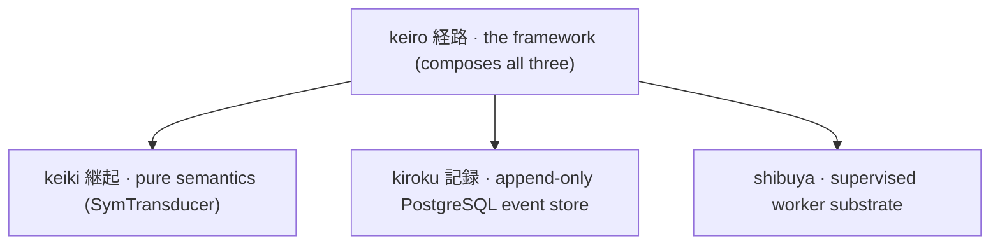

keiki (継起, "successive occurrence") is a **pure, dependency-free, IO-free Haskell library you
import** — not a server, not a runtime. Its one formalism, the **symbolic-register finite-state
transducer** written `SymTransducer phi rs s ci co`, models event sourcing, workflow engines, and
durable execution as a **single mathematical object**. keiki is a hybrid of two classical ideas: a
**Symbolic Finite Transducer** (edges labelled by *predicates* over an infinite input domain, not
one edge per enumerated symbol) and a **Streaming String Transducer** (a typed **register file**
carried alongside the finite control state).

The load-bearing property: from **one** `SymTransducer` declaration keiki derives command stepping,
event inversion/replay, input/output acceptors, per-vertex views, composition, and optional
**SBV + z3** checks — so forward decision and replay cannot silently drift into separate
implementations. Runtime evaluation (`stepEither`, `replayEvents`, `reconstituteEither`) is concrete
and solver-free; z3 runs only as a build-time check.

## Where keiki sits in the keiro family

keiki is the **pure-semantics foundation**. It is distinct from its siblings, and the framework
that composes them:



keiro's `EventStream` literally marries a keiki `SymTransducer` to a codec, an initial state, and a
snapshot policy. JSON is provided by the sibling package **`keiki-codec-json`**.

<Callout type="info">
  These docs review `keiki 0.2.0.0` and `keiki-codec-json 0.2.0.0`. The 0.2 line removes the old
  `Keiki.Decider` facade and uses `SymTransducer` directly. See [compatibility and
  upgrades](/docs/getting-started/compatibility-and-upgrades) before updating a 0.1 application.
</Callout>

## A taste

The smallest useful aggregate — a two-vertex `EmailDelivery` state machine — authored with the
`Keiki.Builder` DSL:

```haskell
emailDelivery :: Guarded EmailRegs EmailVertex EmailCmd EmailEvent
emailDelivery = B.buildTransducer EmailPending emptyEmailRegs
                  (\case EmailSentVertex -> True; _ -> False) do
  B.from EmailPending do
    B.onCmd inCtorSendEmail $ \d -> B.do
      B.slot @"emailRecipient" .= d.recipient
      B.slot @"emailSubject"   .= d.subject
      B.slot @"emailSentAt"    .= d.at
      B.emit wireEmailSent EmailSentTermFields
        { recipient = d.recipient
        , subject   = d.subject
        , at        = d.at
        }
      B.goto EmailSentVertex
```

The acceptors, structured replay, and per-vertex view are all **derived from this one declaration**.
The [Your first aggregate](/docs/keiki/tutorials/your-first-aggregate) tutorial builds it end to end
and watches `reconstituteEither` recover state with no hand-written `evolve`.

## Find your way around

<Cards>
  <Card title="Tutorials" href="/docs/keiki/tutorials" description="Learn by building. Start with your first aggregate." />
  <Card title="How-To Guides" href="/docs/keiki/how-to" description="Focused recipes for specific authoring and analysis tasks." />
  <Card title="Reference" href="/docs/keiki/reference" description="Exact Haskell signatures, module by module." />
  <Card title="Explanation" href="/docs/keiki/explanation" description="The theory thread — automata, projections, predicates, registers, and why SMT." />
  <Card title="Cookbook" href="/docs/keiki/cookbook" description="Model your own domain: collections, lifecycles, sagas, schema evolution." />
  <Card title="Code Walkthrough" href="/docs/keiki/walkthrough" description="Ordered source tours through keiki's real implementation." />
</Cards>
