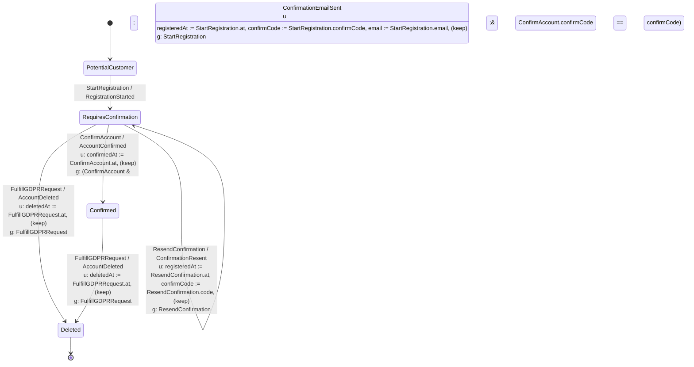
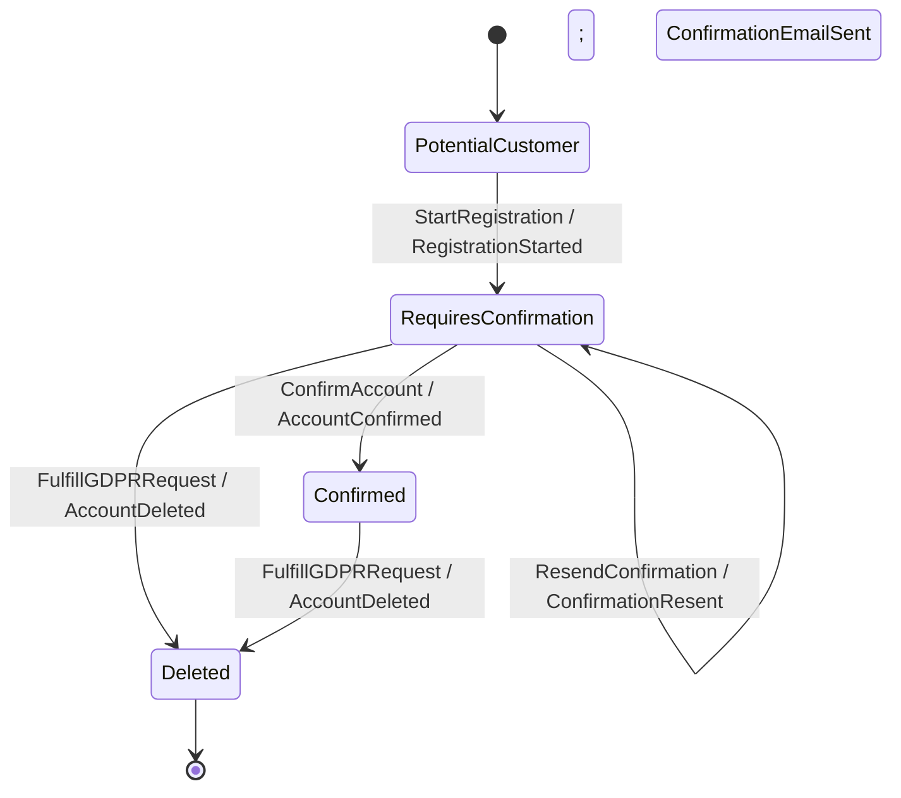

The functions and types on this page live in `Keiki.Render.Mermaid`. They turn a
[`SymTransducer`](/docs/keiki/reference/core) whose vertex type is enumerable into a Mermaid
`stateDiagram-v2` block (as `Data.Text.Text`) that GitHub, Notion, and Markdown previewers render
inline. The control skeleton you see is the one you reason about — see
[The SymTransducer](/docs/keiki/explanation/the-symtransducer).

<Callout type="info">
`Keiki.Render.Validate` checks rendered Mermaid **text** (`validateMermaidDiagram` /
`validateMermaidAtlas`, documented on [Render: Markdown atlas](/docs/keiki/reference/render-markdown)).
It is **not** the transducer validator `validateTransducer` in `Keiki.Core`, which checks a
`SymTransducer` value — see [Validate](/docs/keiki/reference/validate). The two operate on different
inputs (diagram text vs. AST) and share no code.
</Callout>

## The default is readable

<Callout type="warn">
  **Breaking in keiki 0.8.0.0 — the default flipped.** Through keiki 0.7 `toMermaid` emitted a
  guard-free control skeleton. It now emits **readable business semantics**: complete guards,
  complete register assignments, multiline labels, and no semantic truncation. Every no-options
  shape renderer changed with it. If you need the old bytes — a golden test, a topology-only
  review view — call [`toTopologyMermaid`](#totopologymermaid) or pass
  [`topologyMermaidOptions`](#the-two-named-policies) explicitly. See ADR-0006 and
  [Diagrams from one declaration](/docs/keiki/explanation/diagrams-from-one-declaration) for the
  rationale.
</Callout>

A diagram that shows only source, target, command, and event constructors proves *topology* but
hides why an edge fires and how it changes state. Keiki already owns the guard and update syntax
trees, so the primary renderer now shows them; a reviewer reads behaviour off the diagram instead of
reconstructing it from source.

Every `toMermaid` block has the same shape:

- the `stateDiagram-v2` header;
- a start line `[*] --> <initial>`;
- one `<src> --> <tgt> : <edgeLabel>` line per outgoing edge of every vertex; and
- a `<vertex> --> [*]` line for every vertex where `isFinal` returns `True`.

The edge label's **base** is `<input ctor> / <output ctor>`: a missing input constructor (no
`PInCtor` in the guard) renders `?`, and an ε-edge (empty output) renders `ε`. Under the default
policy the base is followed by a `<br/>`-separated `u: …` update segment and `g: …` guard segment.
See [Edge label primitives](#edge-label-primitives) for the exact format.

<Callout type="warn">
  **Readable rendering discloses literal values.** A `lit` value now appears in the rendered guard
  or update. Build secrets, credentials, personal data, and deliberately redacted values with
  [`opaqueLit`](/docs/keiki/reference/core#readable-and-opaque-literals) — which renders `<lit>` —
  or render the whole diagram under `topologyMermaidOptions`, which redacts all guard and update
  semantics.
</Callout>

## Single-transducer renderers

### `toMermaid`

The single-transducer entry point. The vertex type `s` must derive `Enum`, `Bounded`, and `Show`;
the enumeration walks `[minBound .. maxBound]` and vertex labels come from `show`.

```haskell
toMermaid ::
  (Enum s, Bounded s, Show s) =>
  SymTransducer (HsPred rs ci) rs s ci co ->
  Text
```

### `toTopologyMermaid`

*(keiki 0.8.0.0.)* The explicit compact policy: guards and updates hidden, inline layout. It
reproduces keiki 0.7's topology-only bytes. It is a separate named function rather than an implicit
default so that losing the business semantics is always a visible choice at the call site.

```haskell
toTopologyMermaid ::
  (Enum s, Bounded s, Show s) =>
  SymTransducer (HsPred rs ci) rs s ci co ->
  Text

toTopologyMermaid = toMermaidWith topologyMermaidOptions
```

### `toMermaidWith`

Like `toMermaid`, but takes the complete edge-semantics and layout policy
([`MermaidOptions`](#mermaidoptions)) explicitly. `toMermaidWith defaultMermaidOptions` is
byte-identical to `toMermaid`.

```haskell
toMermaidWith ::
  (Enum s, Bounded s, Show s) =>
  MermaidOptions ->
  SymTransducer (HsPred rs ci) rs s ci co ->
  Text
```

<Callout type="info">
  **Every diagram shape now has an options-aware route** *(keiki 0.8.0.0)*. Before 0.8 only the
  single-transducer path could be annotated and the composite renderers were permanently
  guard-free. Composite, nested, three-way, alternative, and feedback diagrams all take
  `MermaidOptions` now — see [Composite renderers](#composite-renderers).
</Callout>

### `toMermaidWithLabels`

Like `toMermaidWith`, but the caller supplies separate stable identifiers and friendly display
labels via [`MermaidStateLabels`](#mermaidstatelabels) instead of deriving both from `Show` (the
`Show s` constraint is dropped). The `stableId` is emitted **verbatim and not sanitised** — it is
the caller's job to return a legal Mermaid identifier (`[A-Za-z_][A-Za-z0-9_]*`). A
`state "<display>" as <id>` declaration line is emitted **only** when a vertex's display differs
from its id; feeding identical functions reproduces `toMermaidWith` byte-for-byte.

```haskell
toMermaidWithLabels ::
  (Bounded s, Enum s) =>
  MermaidOptions ->
  MermaidStateLabels s ->
  SymTransducer (HsPred rs ci) rs s ci co ->
  Text
```

### `duplicateStateIds`

A pure AST-level collision check: the ASCII ids produced by `stateId` for two or more distinct
vertices, in first-occurrence order. An empty result (`[]`) means every vertex maps to a unique id.
Rendering itself stays total and never throws on a collision; this is the check you run before
trusting a labeled diagram. It keys off the same id token the
[text-level `DuplicateStateId` warning](/docs/keiki/reference/render-markdown) uses, so the AST and
text checks agree on what an id is by construction.

```haskell
duplicateStateIds ::
  (Bounded s, Enum s) =>
  MermaidStateLabels s ->
  SymTransducer (HsPred rs ci) rs s ci co ->
  [Text]
```

## A worked example

`toMermaid` over the `userReg` aggregate (pinned by `Keiki.Render.MermaidSpec`) produces:


```mermaid
stateDiagram-v2
    [*] --> PotentialCustomer
    PotentialCustomer --> RequiresConfirmation : StartRegistration / RegistrationStarted; ConfirmationEmailSent<br/>u: registeredAt := StartRegistration.at, confirmCode := StartRegistration.confirmCode, email := StartRegistration.email, (keep)<br/>g: StartRegistration
    RequiresConfirmation --> Confirmed : ConfirmAccount / AccountConfirmed<br/>u: confirmedAt := ConfirmAccount.at, (keep)<br/>g: (ConfirmAccount &amp;&amp; ConfirmAccount.confirmCode == confirmCode)
    RequiresConfirmation --> RequiresConfirmation : ResendConfirmation / ConfirmationResent<br/>u: registeredAt := ResendConfirmation.at, confirmCode := ResendConfirmation.code, (keep)<br/>g: ResendConfirmation
    RequiresConfirmation --> Deleted : FulfillGDPRRequest / AccountDeleted<br/>u: deletedAt := FulfillGDPRRequest.at, (keep)<br/>g: FulfillGDPRRequest
    Confirmed --> Deleted : FulfillGDPRRequest / AccountDeleted<br/>u: deletedAt := FulfillGDPRRequest.at, (keep)<br/>g: FulfillGDPRRequest
    Deleted --> [*]
```

Three things to read off it. The two-event output uses the `; ` separator
(`RegistrationStarted; ConfirmationEmailSent`) — that is the default length-2 convention. The `u:`
segment lists the **complete** assignments, right-hand terms included, ending in `(keep)` for the
slots the update leaves alone. And `&amp;&amp;` in the `ConfirmAccount` guard is the escaped `&&`
— see [Escaping](#escaping-at-the-parser-boundary).

The same aggregate under `toTopologyMermaid` is the compact keiki 0.7 form:


```mermaid
stateDiagram-v2
    [*] --> PotentialCustomer
    PotentialCustomer --> RequiresConfirmation : StartRegistration / RegistrationStarted; ConfirmationEmailSent
    RequiresConfirmation --> Confirmed : ConfirmAccount / AccountConfirmed
    RequiresConfirmation --> RequiresConfirmation : ResendConfirmation / ConfirmationResent
    RequiresConfirmation --> Deleted : FulfillGDPRRequest / AccountDeleted
    Confirmed --> Deleted : FulfillGDPRRequest / AccountDeleted
    Deleted --> [*]
```

## Composite renderers

These render composites built with the [composition algebra](/docs/keiki/reference/composition).
Each composite state id joins its components with an underscore (`<a>_<b>`), because the default
`Show` for `Composite` emits `"Composite a b"` with spaces and parentheses — not a legal Mermaid
identifier.

<TypeTable
  type={{
    "toMermaidComposite": { type: "SymTransducer … (Composite s1 s2) … -> Text", description: "Flat cross-product: each Composite a b becomes <show a>_<show b>. Same emission rules as toMermaid." },
    "toMermaidCompositeNested": { type: "SymTransducer … (Composite s1 s2) … -> Text", description: "Nested-subgraph (Shape B): each outer s1 hosts a state block listing its inner ids; cross-cutting transitions stay flat at top level." },
    "toMermaidCompose3": { type: "SymTransducer … (Composite s1 (Composite s2 s3)) … -> Text", description: "Flat cross-product for a right-associative 3-deep compose; ids join as <s1>_<s2>_<s3>." },
    "toMermaidCompose3Nested": { type: "SymTransducer … (Composite s1 (Composite s2 s3)) … -> Text", description: "One-level nested-subgraph for a 3-deep compose; groups by the outer s1 aggregate." },
    "toMermaidAlternative": { type: "SymTransducer … s1 … -> SymTransducer … s2 … -> Text", description: "Renders an alternative-shaped composite as two parallel arms (default names LeftArm / RightArm)." },
    "toMermaidAlternativeWith": { type: "Text -> Text -> SymTransducer … s1 … -> SymTransducer … s2 … -> Text", description: "Arm-name-overridable variant of toMermaidAlternative; the two Text args name the arm blocks." },
    "toMermaidFeedback1": { type: "SymTransducer … s1 … -> SymTransducer … s2 … -> Text", description: "Renders a feedback1 composite (vertex Composite s1 (Composite s2 s1)) as a flat 3-deep cross-product." },
  }}
/>

Each one has an options-aware companion taking `MermaidOptions` as its **first** argument
*(keiki 0.8.0.0)*. The no-options names are those companions applied to `defaultMermaidOptions`, so
every composite shape is readable by default and every shape can be rendered topology-only:

<TypeTable
  type={{
    "toMermaidCompositeWith": { type: "MermaidOptions -> …", description: "Options-aware toMermaidComposite." },
    "toMermaidCompositeNestedWith": { type: "MermaidOptions -> …", description: "Options-aware toMermaidCompositeNested." },
    "toMermaidCompose3With": { type: "MermaidOptions -> …", description: "Options-aware toMermaidCompose3." },
    "toMermaidCompose3NestedWith": { type: "MermaidOptions -> …", description: "Options-aware toMermaidCompose3Nested." },
    "toMermaidAlternativeWithOptions": { type: "MermaidOptions -> Text -> Text -> …", description: "Options-aware toMermaidAlternativeWith. Note the distinct name — toMermaidAlternativeWith already meant \"with arm names\"." },
    "toMermaidFeedback1With": { type: "MermaidOptions -> …", description: "Options-aware toMermaidFeedback1." },
  }}
/>

Full signatures of the no-options forms (transcribed verbatim):

```haskell
toMermaidComposite ::
  (Enum s1, Bounded s1, Show s1, Enum s2, Bounded s2, Show s2) =>
  SymTransducer (HsPred rs ci) rs (Composite s1 s2) ci co ->
  Text

toMermaidCompositeNested ::
  forall rs s1 s2 ci co.
  (Enum s1, Bounded s1, Show s1, Enum s2, Bounded s2, Show s2) =>
  SymTransducer (HsPred rs ci) rs (Composite s1 s2) ci co ->
  Text

toMermaidCompose3 ::
  forall rs s1 s2 s3 ci co.
  ( Enum s1, Bounded s1, Show s1
  , Enum s2, Bounded s2, Show s2
  , Enum s3, Bounded s3, Show s3
  ) =>
  SymTransducer (HsPred rs ci) rs (Composite s1 (Composite s2 s3)) ci co ->
  Text

toMermaidCompose3Nested ::
  forall rs s1 s2 s3 ci co.
  ( Enum s1, Bounded s1, Show s1
  , Enum s2, Bounded s2, Show s2
  , Enum s3, Bounded s3, Show s3
  ) =>
  SymTransducer (HsPred rs ci) rs (Composite s1 (Composite s2 s3)) ci co ->
  Text

toMermaidAlternative ::
  (Enum s1, Bounded s1, Show s1, Enum s2, Bounded s2, Show s2) =>
  SymTransducer (HsPred rs1 ci1) rs1 s1 ci1 co1 ->
  SymTransducer (HsPred rs2 ci2) rs2 s2 ci2 co2 ->
  Text

toMermaidAlternativeWith ::
  forall rs1 rs2 s1 s2 ci1 ci2 co1 co2.
  (Enum s1, Bounded s1, Show s1, Enum s2, Bounded s2, Show s2) =>
  Text ->                                                 -- left arm's block name
  Text ->                                                 -- right arm's block name
  SymTransducer (HsPred rs1 ci1) rs1 s1 ci1 co1 ->
  SymTransducer (HsPred rs2 ci2) rs2 s2 ci2 co2 ->
  Text

toMermaidFeedback1 ::
  ( Enum s1, Bounded s1, Show s1, Enum s2, Bounded s2, Show s2
  , WeakenR rs1, WeakenR rs2
  , Disjoint (Names rs2) (Names rs1)
  , Disjoint (Names rs1) (Names (Append rs2 rs1))
  ) =>
  SymTransducer (HsPred rs1 ci) rs1 s1 ci co ->
  SymTransducer (HsPred rs2 co) rs2 s2 co ci ->
  Text
```

<Callout type="info">
Pick the shape that reads best: use the flat renderers (`toMermaidComposite`, `toMermaidCompose3`)
for small composites where a single line per vertex is scannable, and the nested variants
(`toMermaidCompositeNested`, `toMermaidCompose3Nested`) when the cross-product is too large to scan
flat. Both shapes coexist; the nested renderers never rely on Mermaid's dotted cross-block reference
syntax.
</Callout>

## Atlas: many diagrams in one document

An **atlas** stitches several already-rendered diagrams into one Markdown document, each under a
labelled section. Transducers are heterogeneously typed, so a single list of transducers would not
type-check — the atlas takes already-rendered `Text` and lets each caller pick the matching renderer.

```haskell
toMermaidAtlas :: [(Text, Text)] -> Text

toMermaidAtlasWith :: MermaidAtlasOptions -> [MermaidSection] -> Text

defaultMermaidAtlasOptions :: MermaidAtlasOptions
```

`toMermaidAtlas` takes `(sectionLabel, renderedDiagram)` pairs: each label becomes a Markdown
level-2 heading and each diagram is wrapped in a fenced `mermaid` block. An empty list yields empty
`Text`. `toMermaidAtlasWith` is the typed, option-aware form; with `defaultMermaidAtlasOptions` over
sections built from `(title, diagram)` pairs it is byte-identical to `toMermaidAtlas`.

## Edge label primitives

These are exported so callers can build custom rendering pipelines on the same primitives that
`toMermaid` uses.

<TypeTable
  type={{
    "vertexLabel": { type: "Show s => s -> Text", description: "The Mermaid id for a vertex: T.pack . show." },
    "compositeLabel": { type: "(Show s1, Show s2) => Composite s1 s2 -> Text", description: "<show a>_<show b> — underscore-joined so it matches the identifier regex." },
    "compose3Label": { type: "(Show s1, Show s2, Show s3) => Composite s1 (Composite s2 s3) -> Text", description: "<show s1>_<show s2>_<show s3> for a 3-deep compose vertex." },
    "edgeInputName": { type: "Edge (HsPred rs ci) rs ci co s -> Maybe Text", description: "The leftmost PInCtor name walked out of the guard AST; Nothing if the guard has none." },
    "edgeOutputName": { type: "Edge (HsPred rs ci) rs ci co s -> Maybe Text", description: "The output constructor name(s); Nothing for an ε-edge (empty output)." },
    "edgeLabel": { type: "Edge (HsPred rs ci) rs ci co s -> Text", description: "<input ctor> / <output ctor>: missing input → ?, ε-edge → ε." },
  }}
/>

`edgeOutputName` uses a length-based switchover for multi-event edges: `e1` for one, `e1; e2` for
exactly two, and `e1<br/>e2<br/>…<br/>eN` for three or more.

## Option and section types

### `MermaidGuardMode`

How an edge's guard predicate renders into the `g: …` segment.

<TypeTable
  type={{
    "MermaidGuardHidden": { type: "constructor", description: "No guard segment at all." },
    "MermaidGuardStructuralSummary": { type: "constructor", description: "The structural constructor-tag walk produced by guardSummary, e.g. PAnd PInCtor PEq — the compact structural alternative to readable guards." },
    "MermaidGuardPretty": { type: "constructor", description: "The domain-readable rendering from Keiki.Render.Pretty.prettyPred, e.g. (ConfirmAccount && ConfirmAccount.confirmCode == confirmCode). The default." },
  }}
/>

### `MermaidUpdateMode`

*(keiki 0.8.0.0.)* How an edge's register update renders.

<TypeTable
  type={{
    "MermaidUpdateHidden": { type: "constructor", description: "No update segment at all." },
    "MermaidUpdateWrittenSlots": { type: "constructor", description: "Only the names of written slots — the compact form retained for compatibility." },
    "MermaidUpdatePretty": { type: "constructor", description: "The complete update from Keiki.Render.Pretty.prettyUpdate, right-hand terms included. The default." },
  }}
/>

### `MermaidLabelLayout`

How dense edge labels are laid out: `MermaidLabelInline` (the single-line `[seg; seg]` form) or
`MermaidLabelMultiline` (base on line one, each further segment on its own `<br/>`-separated line —
the default).

### `MermaidOutputLayout`

How a multi-event edge renders its output names.

<TypeTable
  type={{
    "MermaidOutputSemicolon": { type: "constructor", description: "Length-based default: ; for exactly two events, <br/> for three or more." },
    "MermaidOutputMultiline": { type: "constructor", description: "Always one event per line (<br/>-joined)." },
    "MermaidOutputCounted": { type: "constructor", description: "A compact N events count for two or more; a single event stays its name, an ε-edge stays ε." },
  }}
/>

### `MermaidOptions`

The complete edge-semantics and layout policy.

<Callout type="warn">
  **Breaking in keiki 0.8.0.0.** `MermaidOptions` **removed** the two boolean fields
  `showWrittenSlots` and `showGuardSummary`. A record update mentioning either no longer compiles.
  Replace them:

  - `showWrittenSlots = True` → `updateMode = MermaidUpdateWrittenSlots`
  - `showGuardSummary = True` → `guardMode = MermaidGuardStructuralSummary`

  There is no longer a legacy-versus-explicit precedence rule to reason about: `guardMode` and
  `updateMode` are the sole authorities.
</Callout>

<TypeTable
  type={{
    guardMode: { type: "MermaidGuardMode", description: "How the guard segment is rendered.", default: "MermaidGuardPretty" },
    updateMode: { type: "MermaidUpdateMode", description: "How the register-update segment is rendered.", default: "MermaidUpdatePretty" },
    labelLayout: { type: "MermaidLabelLayout", description: "Inline bracketed segments or multiline <br/> layout.", default: "MermaidLabelMultiline" },
    maxInlineWrittenSlots: { type: "Maybe Int", description: "When Just k and an edge writes n > k slots, show the first k then a single +{n-k} more token. Nothing disables truncation.", default: "Nothing" },
    maxInlineGuardWidth: { type: "Maybe Int", description: "When Just w and the guard segment text exceeds w characters, take w characters then append the ellipsis …. Nothing disables truncation.", default: "Nothing" },
    outputLayout: { type: "MermaidOutputLayout", description: "How a multi-event edge renders its output names.", default: "MermaidOutputSemicolon" },
  }}
/>

#### The two named policies

```haskell
defaultMermaidOptions :: MermaidOptions
defaultMermaidOptions =
    MermaidOptions
        { guardMode = MermaidGuardPretty
        , updateMode = MermaidUpdatePretty
        , labelLayout = MermaidLabelMultiline
        , maxInlineWrittenSlots = Nothing
        , maxInlineGuardWidth = Nothing
        , outputLayout = MermaidOutputSemicolon
        }

topologyMermaidOptions :: MermaidOptions
topologyMermaidOptions =
    MermaidOptions
        { guardMode = MermaidGuardHidden
        , updateMode = MermaidUpdateHidden
        , labelLayout = MermaidLabelInline
        , maxInlineWrittenSlots = Nothing
        , maxInlineGuardWidth = Nothing
        , outputLayout = MermaidOutputSemicolon
        }
```

`defaultMermaidOptions` is the readable primary policy used by every no-options renderer.
`topologyMermaidOptions` *(keiki 0.8.0.0)* is the explicit compact compatibility policy and
reproduces keiki 0.7's topology-only bytes.

## Escaping at the parser boundary

*(keiki 0.8.0.0.)* Rendering guard and update text crosses a parser boundary: this documentation
site's `beautiful-mermaid` backend decodes XML entities **before** it recognises break tags and
literal `\n`, so naive entity escaping would let data turn into layout. Edge semantics are therefore
escaped **before** the renderer's own `<br/>` joins, on three tiers:

- **Safe punctuation** — XML entities (`&amp;`, `&quot;`, `&apos;`, `&#124;`, `&#123;`, `&#125;`).
- **Parser-active characters** — angle brackets and backslashes become **visible full-width forms**
  (`＜`, `＞`, `＼`), so `<br>` typed inside a guard renders as the visible text `＜br＞` rather than
  becoming a line break.
- **Raw CR/LF** — visible control pictures (`␍`, `␊`).

The known `<lit>` marker is entity-encoded and stays visually exact.

<Callout type="info">
  A full-width character in a rendered diagram is a **deliberate signal**: it means semantic input
  was neutralised at the Mermaid boundary rather than silently interpreted as structure. It is not a
  rendering bug.
</Callout>

The behaviour is pinned end to end — the test suite checks source line and transition counts,
heuristic warnings, recovered SVG text, and the checked-in documentation backend.

### `MermaidStateLabels`

A pair of per-vertex label functions for `toMermaidWithLabels`.

<TypeTable
  type={{
    stateId: { type: "s -> Text", description: "The stable ASCII Mermaid identifier — emitted verbatim, never sanitised. The caller must return a legal identifier ([A-Za-z_][A-Za-z0-9_]*)." },
    stateDisplayLabel: { type: "s -> Text", description: "The friendly visible label, which may contain spaces. A declaration is emitted only when it differs from the id." },
  }}
/>

### `MermaidSection`

One section of a diagram atlas. `sectionDiagram` is already-rendered Mermaid `Text`, so the atlas is
independent of the transducer's vertex/register/input/output types.

<TypeTable
  type={{
    sectionId: { type: "Text", description: "Stable token suitable as a Markdown replacement-marker id." },
    sectionTitle: { type: "Text", description: "The section heading text." },
    sectionKind: { type: "MermaidSectionKind", description: "What kind of transducer the diagram depicts." },
    sectionDiagram: { type: "Text", description: "Already-rendered Mermaid block (produced by any renderer on this page)." },
  }}
/>

### `MermaidSectionKind`

<TypeTable
  type={{
    "AggregateDiagram": { type: "constructor", description: "An aggregate state diagram." },
    "ProcessManagerDiagram": { type: "constructor", description: "A process-manager diagram." },
    "WorkflowDiagram": { type: "constructor", description: "A workflow diagram." },
    "CustomDiagram Text": { type: "constructor", description: "A caller-chosen label for anything outside the three named kinds." },
  }}
/>

### `AtlasKindDisplay`

How (or whether) to surface a section's kind in the rendered atlas.

<TypeTable
  type={{
    "KindHidden": { type: "constructor", description: "Do not render the kind at all (default)." },
    "KindAsLabel": { type: "constructor", description: "Render the kind as a visible italic line under the heading." },
    "KindAsComment": { type: "constructor", description: "Render the kind as an HTML comment (invisible in previews)." },
  }}
/>

### `MermaidAtlasOptions`

Options for `toMermaidAtlasWith`. Every field defaults (in `defaultMermaidAtlasOptions`) to a value
that reproduces the legacy `toMermaidAtlas` output byte-for-byte.

<TypeTable
  type={{
    atlasTitle: { type: "Maybe Text", description: "Optional top-level heading prepended above all sections.", default: "Nothing" },
    atlasSectionHeadingLevel: { type: "Int", description: "Markdown heading level for each section heading.", default: "2" },
    atlasShowSectionKind: { type: "AtlasKindDisplay", description: "Whether/how to show each section's kind.", default: "KindHidden" },
    atlasWrapMarkers: { type: "Maybe Text", description: "When Just ns, wrap each fenced block in begin/end markers keyed by sectionId, so replaceMarkdownDiagramBlock can update it in place.", default: "Nothing" },
    atlasFenceLanguage: { type: "Text", description: "Fenced-block language tag.", default: "\"mermaid\"" },
  }}
/>

## Verified by

- `Keiki.Render.MermaidSpec` — pins the canonical single, composite, atlas, and labeled blocks
  (including the `userReg` golden shown above).
- `Jitsurei.Render.MermaidLoanSpec` — the loan capstone: a 54-vertex flat `toMermaidCompose3`
  block and a 6-outer × 9-inner nested `toMermaidCompose3Nested` block.
