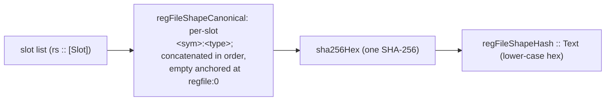

The types and functions on this page live in `Keiki.Shape`. A register file's *shape* is its
type-level slot list — the ordered list of `(name, type)` pairs. The **shape hash** is a compact,
deterministic discriminator over that slot list: a single SHA-256 of a canonical rendering of every
slot's name and type, in order.

A snapshot persister keys on it. keiro (経路) carries a `StateCodec (s, RegFile rs)`; before it can
fast-forward hydration from a stored snapshot it must know that the snapshot was written against the
*same* register-file shape this binary expects. The shape hash is that check.

<Callout type="info">
The shape hash exists to be a GHC-upgrade-safe discriminator. It is **sensitive to structural
change** — renaming, adding, removing, reordering a slot, or changing a slot's type all flip the
hash — and **insensitive to incidental change** — a GHC patch or minor bump, a different cabal
dependency tree, a different machine, or a change to a slot type's typeclass instances all leave it
byte-for-byte identical. That combination is what makes it safe to persist alongside a snapshot and
compare on the way back in.
</Callout>

## The model

`regFileShapeHash` is **one** SHA-256 over **one** canonical pre-hash string. The string is built
slot by slot, in slot-list order. Each slot contributes:

```text
<slotSymbol> ":" <renderStableTypeRep tr> ";"
```

and the **empty** slot list is anchored at the literal `regfile:0`. So a slot list of length *n*
produces one concatenated canonical string and exactly one SHA-256 — not one hash per slot, and not
*n* chained hashes.

Worked from `test/Keiki/ShapeSpec.hs`: the one-slot list `'[ '("retryCount", Int) ]` has canonical
form

```text
retryCount:GHC.Types.Int;regfile:0
```

and its hash is the SHA-256 of those UTF-8 bytes,
`e2c8839d9ae8e89baebbc1adf6dfd5a35608712d9bf994c7cef4ea774e739700`. The empty list `'[]` has
canonical form `regfile:0` and hash
`0b262a9e301796f7a5b36bb6ea874e9ffccf7d1b4aff78a8d4b5436bd23914a6`.



Because the canonical string is concatenated end-to-end before hashing, **slot order is identity**:
reversing two slots produces a different string and therefore a different hash. `ShapeSpec` pins this
(`differs when slot order is reversed`).

## `KnownRegFileShape`

The class governing slot-lists that carry a shape hash. The inductive method
`regFileShapeCanonical` assembles the pre-hash canonical encoding; `regFileShapeHash` (top-level,
below) wraps it in SHA-256.

```haskell
class KnownRegFileShape (rs :: [Slot]) where
  -- | The full canonical pre-hash encoding of the slot list.
  regFileShapeCanonical :: Proxy rs -> Text
```

The two instances are the empty list and the cons:

```haskell
instance KnownRegFileShape '[] where
  regFileShapeCanonical _ = T.pack "regfile:0"

instance
  ( KnownSymbol s
  , CanonicalTypeName t
  , KnownRegFileShape rs
  )
  => KnownRegFileShape ('(s, t) ': rs)
  where
  regFileShapeCanonical _ =
    T.concat
      [ T.pack (symbolVal (Proxy @s))
      , T.pack ":"
      , canonicalTypeName (Proxy @t)
      , T.pack ";"
      , regFileShapeCanonical (Proxy @rs)
      ]
```

`regFileShapeCanonical` is exposed so consumers can attach their own hash algorithm or read the
canonical form for debugging.

## `regFileShapeHash`

The shape hash itself: lower-case hexadecimal SHA-256 over the UTF-8 bytes of
`regFileShapeCanonical`. Pure, no `IO`.

```haskell
regFileShapeHash :: forall rs. KnownRegFileShape rs => Proxy rs -> Text
regFileShapeHash p = sha256Hex (regFileShapeCanonical p)
```

## `renderStableTypeRep`

Render a `SomeTypeRep` as a stable, application-tree-shaped string. Each `TyCon` contributes
`<tyConModule>.<tyConName>`; applied type arguments are rendered recursively, parenthesised, and
comma-separated.

```haskell
renderStableTypeRep :: SomeTypeRep -> Text
```

Examples (the exact module names depend on the GHC base layout; the shape is what is guaranteed, and
these are the values `ShapeSpec` pins for GHC 9.12.*):

```haskell
renderStableTypeRep (someTypeRep (Proxy @Int))         == "GHC.Types.Int"
renderStableTypeRep (someTypeRep (Proxy @(Maybe Int))) == "GHC.Internal.Maybe.Maybe(GHC.Types.Int)"
renderStableTypeRep (someTypeRep (Proxy @UTCTime))     == "Data.Time.Clock.Internal.UTCTime.UTCTime"
```

The implementation uses **only** `tyConModule`, `tyConName`, and `splitApps`. It never touches
`tyConPackage` (which varies with cabal version pins), never calls `Show` on a `TypeRep` (whose
output is not contractually stable), and never reads the raw `Fingerprint`. That restriction is
*why* the hash is byte-stable across GHC patch and minor releases and across machines: it depends
only on module-and-constructor names, which move rarely and visibly.

## `sha256Hex`

SHA-256 over the UTF-8 encoding of the input, rendered as lower-case hexadecimal.

```haskell
sha256Hex :: Text -> Text
```

## `CanonicalTypeName` — the per-type escape hatch

A stable, human-readable name for a slot type. The default implementation runs `renderStableTypeRep`
on the type's `Typeable` runtime representation, via `DefaultSignatures`:

```haskell
class CanonicalTypeName a where
  canonicalTypeName :: Proxy a -> Text
  default canonicalTypeName :: Typeable a => Proxy a -> Text
  canonicalTypeName p = renderStableTypeRep (someTypeRep p)
```

This is the per-type override point. If a slot type's defining module is renamed — say a refactor
moves `MyDomain.Types.Email` to `MyDomain.Email` — the default `renderStableTypeRep` output changes
and the shape hash flips, even though nothing structural about your register file changed. Pin the
name explicitly to keep the old hash stable across the incidental rename:

```haskell
instance CanonicalTypeName Email where
  canonicalTypeName _ = "Email"
```

### Built-in instances

keiki ships `CanonicalTypeName` for the common scalar and primitive container types a typical
register file carries. Each built-in is empty-bodied and picks up the `Typeable` default:

<TypeTable
  type={{
    Scalars: { type: "()  Bool  Char  Integer  Double  Float  Text", description: "Unit, the basic primitives, and Text" },
    Ints: { type: "Int  Int8  Int16  Int32  Int64", description: "Machine and sized signed integers" },
    Words: { type: "Word  Word8  Word16  Word32  Word64", description: "Machine and sized unsigned integers" },
    Time: { type: "UTCTime  Day", description: "The two time types from the time library" },
    Containers: { type: "Maybe a  [a]  Either a b  (a, b)  (a, b, c)", description: "Typeable-bounded containers and small tuples" },
  }}
/>

A slot type not in this list needs either a `CanonicalTypeName` instance of its own or — for the
common case of a derivable `Typeable` — the empty `instance CanonicalTypeName MyType` that inherits
the default.

## The snapshot story

The shape hash is the keiki-side half of snapshot persistence. The other half — how an eligible
register file is serialized to JSON — lives in the sibling `keiki-codec-json` package, documented at
`/docs/keiki/reference/regfile-json-codec`. Together they form the two-discriminant
snapshot-eligibility rule: a stored snapshot is eligible to fast-forward hydration **iff both** its
`state_codec_version` and its `regfile_shape_hash` match what the running binary expects. The shape
hash catches the structural drift the codec version does not; the codec version catches encoding
drift the shape hash does not.

The golden-value tests for this module are in `test/Keiki/ShapeSpec.hs`; they pin the canonical
strings and hashes for GHC 9.12.* so a future GHC that moves a base type out of its current module
fails loudly rather than silently invalidating every persisted snapshot.

<Cards>
  <Card title="Core: RegFile and slots" href="/docs/keiki/reference/core" />
  <Card title="Registers vs state" href="/docs/keiki/explanation/registers-vs-state" />
  <Card title="What gets derived" href="/docs/keiki/explanation/what-gets-derived" />
</Cards>
