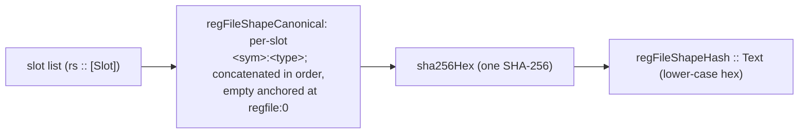

The types and functions on this page live in `Keiki.Shape`. A register file's *shape* is its
type-level slot list — the ordered list of `(name, type)` pairs. The **shape hash** is a compact,
deterministic discriminator over that slot list: a single SHA-256 of a canonical rendering of every
slot's name and type, in order.

A snapshot persister keys on it. keiro (経路) carries a `StateCodec (s, RegFile rs)`; before it can
fast-forward hydration from a stored snapshot it must know that the snapshot was written against the
*same* register-file shape this binary expects. The shape hash is that check.

<Callout type="info">
The shape hash is **sensitive to structural change** — renaming, adding, removing, reordering a slot,
or changing a slot's type all flip the hash. In 0.2, built-in scalar and container names are pinned to
module-independent Haskell spellings, so GHC module moves no longer churn the common case. A
user-defined type that accepts the `CanonicalTypeName` default still includes its defining module;
override the name when that module path is not part of your persistence identity.
</Callout>

## The model

`regFileShapeHash` is **one** SHA-256 over **one** canonical pre-hash string. The string is built
slot by slot, in slot-list order. Each slot contributes:

```text
<slotSymbol> ":" <canonicalTypeName> ";"
```

and the **empty** slot list is anchored at the literal `regfile:0`. So a slot list of length *n*
produces one concatenated canonical string and exactly one SHA-256 — not one hash per slot, and not
*n* chained hashes.

Worked from `test/Keiki/ShapeSpec.hs`: the one-slot list `'[ '("retryCount", Int) ]` has canonical
form

```text
retryCount:Int;regfile:0
```

and its hash is the SHA-256 of those UTF-8 bytes,
`de03289268ae222f84d8a1b9af8f4f78bc9d23a747c97c12f4974e2504485978`. The empty list `'[]` has
canonical form `regfile:0` and hash
`0b262a9e301796f7a5b36bb6ea874e9ffccf7d1b4aff78a8d4b5436bd23914a6`.



Because the canonical string is concatenated end-to-end before hashing, **slot order is identity**:
reversing two slots produces a different string and therefore a different hash. `ShapeSpec` pins this
(`differs when slot order is reversed`).

## `KnownRegFileShape`

The class governing slot-lists that carry a shape hash. The inductive method
`regFileShapeCanonical` assembles the pre-hash canonical encoding; `regFileShapeHash` (top-level,
below) wraps it in SHA-256.

```haskell
class KnownRegFileShape (rs :: [Slot]) where
  -- | The full canonical pre-hash encoding of the slot list.
  regFileShapeCanonical :: Proxy rs -> Text
```

The two instances are the empty list and the cons:

```haskell
instance KnownRegFileShape '[] where
  regFileShapeCanonical _ = T.pack "regfile:0"

instance
  ( KnownSymbol s
  , CanonicalTypeName t
  , KnownRegFileShape rs
  )
  => KnownRegFileShape ('(s, t) ': rs)
  where
  regFileShapeCanonical _ =
    T.concat
      [ T.pack (symbolVal (Proxy @s))
      , T.pack ":"
      , canonicalTypeName (Proxy @t)
      , T.pack ";"
      , regFileShapeCanonical (Proxy @rs)
      ]
```

`regFileShapeCanonical` is exposed so consumers can attach their own hash algorithm or read the
canonical form for debugging.

## `regFileShapeHash`

The shape hash itself: lower-case hexadecimal SHA-256 over the UTF-8 bytes of
`regFileShapeCanonical`. Pure, no `IO`.

```haskell
regFileShapeHash :: forall rs. KnownRegFileShape rs => Proxy rs -> Text
regFileShapeHash p = sha256Hex (regFileShapeCanonical p)
```

## `renderStableTypeRep`

Render a `SomeTypeRep` as a stable, application-tree-shaped string. Each `TyCon` contributes
`<tyConModule>.<tyConName>`; applied type arguments are rendered recursively, parenthesised, and
comma-separated.

```haskell
renderStableTypeRep :: SomeTypeRep -> Text
```

Examples (the exact module names depend on the GHC base layout; the shape is what is guaranteed, and
these are the values `ShapeSpec` pins for GHC 9.12.*):

```haskell
renderStableTypeRep (someTypeRep (Proxy @Int))         == "GHC.Types.Int"
renderStableTypeRep (someTypeRep (Proxy @(Maybe Int))) == "GHC.Internal.Maybe.Maybe(GHC.Types.Int)"
renderStableTypeRep (someTypeRep (Proxy @UTCTime))     == "Data.Time.Clock.Internal.UTCTime.UTCTime"
```

The implementation uses **only** `tyConModule`, `tyConName`, and `splitApps`. It never touches
`tyConPackage`, calls `Show` on a `TypeRep`, or reads the raw `Fingerprint`. This renderer is the
default for **user-defined** `CanonicalTypeName` instances. Built-ins do not use it in 0.2: their
instances return pinned names such as `Int`, `Text`, and `Maybe(Int)`.

## `sha256Hex`

SHA-256 over the UTF-8 encoding of the input, rendered as lower-case hexadecimal.

```haskell
sha256Hex :: Text -> Text
```

## `CanonicalTypeName` — the per-type escape hatch

A stable, human-readable name for a slot type. The default implementation runs `renderStableTypeRep`
on the type's `Typeable` runtime representation, via `DefaultSignatures`:

```haskell
class CanonicalTypeName a where
  canonicalTypeName :: Proxy a -> Text
  default canonicalTypeName :: Typeable a => Proxy a -> Text
  canonicalTypeName p = renderStableTypeRep (someTypeRep p)
```

This is the per-type override point. If a slot type's defining module is renamed — say a refactor
moves `MyDomain.Types.Email` to `MyDomain.Email` — the default `renderStableTypeRep` output changes
and the shape hash flips. Pin an application-owned name to keep the persistence identity stable:

```haskell
instance CanonicalTypeName Email where
  canonicalTypeName _ = "Email"
```

### Built-in instances

keiki ships explicit, module-independent `CanonicalTypeName` instances for the common scalar and
primitive container types a register file carries:

<TypeTable
  type={{
    Scalars: { type: "()  Bool  Char  Integer  Double  Float  Text", description: "Unit, the basic primitives, and Text" },
    Ints: { type: "Int  Int8  Int16  Int32  Int64", description: "Machine and sized signed integers" },
    Words: { type: "Word  Word8  Word16  Word32  Word64", description: "Machine and sized unsigned integers" },
    Time: { type: "UTCTime  Day", description: "The two time types from the time library" },
    Containers: { type: "Maybe a  [a]  Either a b  (a, b)  (a, b, c)", description: "Containers recurse through CanonicalTypeName for every argument" },
  }}
/>

A slot type not in this list needs its own `CanonicalTypeName` instance. An empty instance inherits
the module-qualified `Typeable` default; an explicit body pins an application-owned identity.

## The 0.2 one-time migration

Keiki 0.1 used module-qualified defaults for built-ins. Keiki 0.2 pins those names, so **every
non-empty register-file shape hash changes once** on upgrade; the empty shape remains the hash of
`regfile:0`. Snapshot stores should treat the old non-empty hash as an ordinary cache miss: ignore
that snapshot and replay the durable event log from the beginning. Do not rewrite old snapshot
metadata to the new hash because the stored bytes were not produced under the new identity.

After the first successful replay, the runtime may write a fresh snapshot with the 0.2 hash. This is
a snapshot-cache migration, not an event migration: the event log remains the source of truth.

## The snapshot story

The shape hash is the keiki-side half of snapshot persistence. The other half — how an eligible
register file is serialized to JSON — lives in the sibling `keiki-codec-json` package, documented at
[`Codec: JSON`](/docs/keiki/reference/codec-json). Together they form the two-discriminant
snapshot-eligibility rule: a stored snapshot is eligible to fast-forward hydration **iff both** its
`state_codec_version` and its `regfile_shape_hash` match what the running binary expects. The shape
hash catches the structural drift the codec version does not; the codec version catches encoding
drift the shape hash does not.

`test/Keiki/ShapeSpec.hs` pins the canonical strings and hashes for the built-in names.
`keiki-codec-json/test/golden/exemplar-shape.json` additionally freezes a representative snapshot
shape (`retryCount:Int;cooldownUntil:UTCTime;correlationId:Text;regfile:0`) and its exact hash.

<Cards>
  <Card title="Core: RegFile and slots" href="/docs/keiki/reference/core" />
  <Card title="Registers vs state" href="/docs/keiki/explanation/registers-vs-state" />
  <Card title="What gets derived" href="/docs/keiki/explanation/what-gets-derived" />
</Cards>
