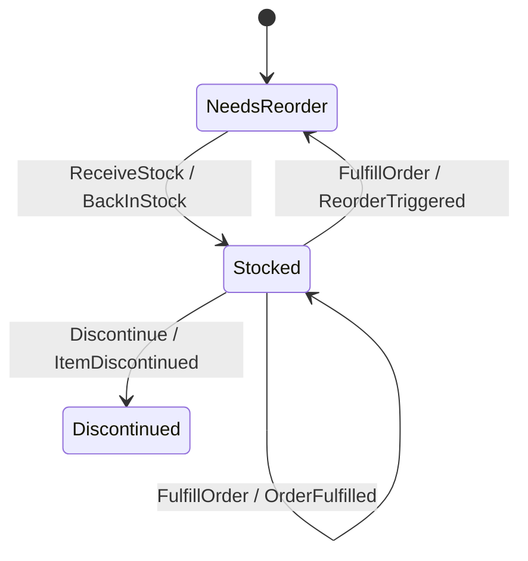
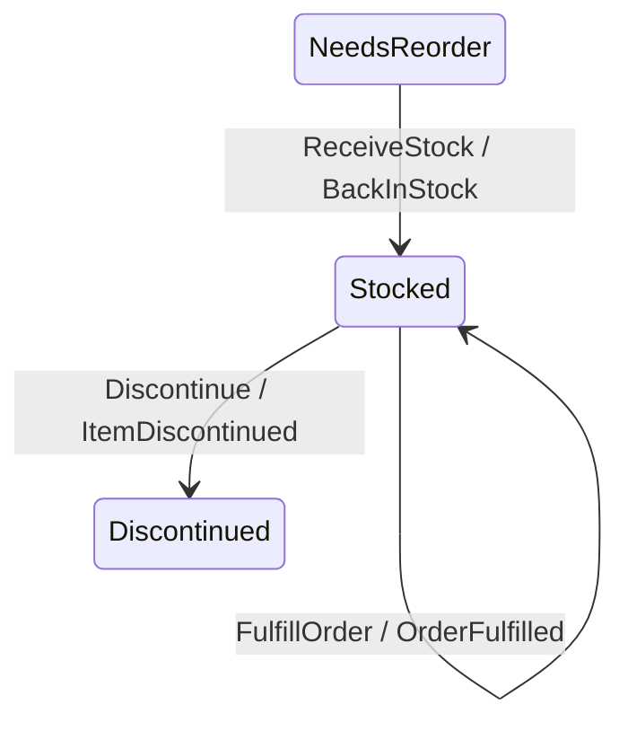

You will model a warehouse stock item whose **status flips both ways** as its
on-hand count crosses a reorder point: `Stocked` when there is enough stock,
`NeedsReorder` when there is not. Along the way you will hit — and fix — the
**bidirectional-threshold trap**: the surprisingly common bug where a *single*
threshold cannot cleanly drive a transition in both directions, and the status
flaps or sticks.

This is a smaller, sharper lesson than the
[loan-application process manager](/docs/keiki/tutorials/a-loan-application-process-manager).
It is also a good companion to that tutorial's approve/decline branch, which used
the `g` / `pnot g` complement shape; here you will see precisely when that shape
is *not* what you want.

<Callout type="info">
  This is a tutorial: a guided lesson. Follow every step in order. It assumes you
  have authored a keiki (継起) aggregate before. By the end you will understand why
  one threshold cannot drive two directions and will have the two-guard fix.
</Callout>

## What you will build

A two-status lifecycle (plus a terminal `Discontinued`) where `onHand` rises on
`ReceiveStock` and falls on `FulfillOrder`, and the *vertex* is the lifecycle
fact:



The two edges out of `Stocked` on `FulfillOrder` are the heart of it: one stays,
one demotes, and they are distinguished by a guard the diagram deliberately does
not show.

## Before you begin

You need GHC 9.12, `cabal`, and the `keiki` package, with the usual authoring
extensions (`BlockArguments`, `QualifiedDo`, `TemplateHaskell`, and friends). The
register file is two `Int` slots so the threshold guard is solver-visible:

```haskell
data Vertex = NeedsReorder | Stocked | Discontinued
  deriving (Eq, Show, Enum, Bounded)
-- initial = NeedsReorder ; isFinal Discontinued = True ; isFinal _ = False

type StockRegs =
  '[ '("onHand",       Int)   -- units physically present
   , '("reorderPoint", Int)   -- the threshold; seeded at onboarding
   ]
```

## Steps

<Steps>
<Step>

### See the trap: a one-way door

The "up" path is the one you reach for first — it has the celebratory
`BackInStock` event — so you wire the promote and ship. The demote gets wired
later, or by someone else, or never. The status then has a one-way door: it can
be entered but not left. Nothing throws; the aggregate just reports a status its
own registers contradict.

This is invisible in scattered handler code but **glaring** as a topology.
Rendered with `Keiki.Render.Mermaid` (which labels edges `Command / Event` and
omits the guard), the bug is the missing arrow — `Stocked` has no edge back to
`NeedsReorder`:



</Step>
<Step>

### Understand why one threshold flaps

The naive instinct, having spotted the missing arrow, is to reuse the *same
threshold expression* for both directions and hope a single comparison sorts it
out. It cannot. A single threshold like `onHand >= reorderPoint` evaluated at one
point gives one answer; it does not encode a *direction*. If you try to drive both
the promote and the demote from the same comparison without distinguishing the
two cases, the status flaps at the boundary — every command at exactly
`onHand == reorderPoint` can be read either way — or sticks, because the edge you
wrote only ever fires one way.

The single threshold is not wrong; it is *under-specified*. A bidirectional flip
needs two decisions: "did this change cross *down* below the point?" and "did this
change cross *up* to/above it?" Those are two guards over the **prospective**
post-mutation value, one per direction.

<Callout type="warn">
  This is the bidirectional-threshold trap: one threshold value is fine, but you
  need **two guards** — one keyed to each direction's mutating command, each
  testing the value the register *will hold after* the mutation. Reusing a single
  comparison for both directions is what makes the status flap or get stuck.
</Callout>

</Step>
<Step>

### Fix it: split the demote off the mutating command

The robust fix makes the threshold crossing part of the command that changes the
tally. From `Stocked`, a `FulfillOrder` becomes **two** edges keyed on the same
input constructor, disambiguated by the *prospective* post-decrement value
(`#onHand .- d.quantity`, a structural `tsub` the solver can read):

```haskell
B.from Stocked do
  -- Decrement that stays at/above the reorder point: remain Stocked.
  B.onCmd inCtorFulfillOrder $ \d -> B.do
    B.requireGuard ((#onHand .- d.quantity) .>= #reorderPoint)
    B.slot @"onHand" .= #onHand .- d.quantity
    B.emit wireOrderFulfilled OrderFulfilledTermFields
      { quantity = d.quantity, at = d.at }
    B.goto Stocked

  -- Decrement that crosses below: demote. The arrow you must not omit.
  B.onCmd inCtorFulfillOrder $ \d -> B.do
    B.requireLe (#onHand .- d.quantity) #reorderPoint
    B.slot @"onHand" .= #onHand .- d.quantity
    B.emit wireReorderTriggered ReorderTriggeredTermFields
      { onHand = #onHand .- d.quantity, at = d.at }
    B.goto NeedsReorder
```

The promote direction is the mirror image out of `NeedsReorder` on
`ReceiveStock`, splitting on whether the *prospective increment* reaches the
point:

```haskell
B.from NeedsReorder do
  -- Increment that reaches/exceeds the point: promote to Stocked.
  B.onCmd inCtorReceiveStock $ \d -> B.do
    B.requireGt (#onHand .+ d.quantity) #reorderPoint
    B.slot @"onHand" .= #onHand .+ d.quantity
    B.emit wireBackInStock BackInStockTermFields
      { onHand = #onHand .+ d.quantity, at = d.at }
    B.goto Stocked

  -- Increment that still falls short: stay NeedsReorder.
  B.onCmd inCtorReceiveStock $ \d -> B.do
    B.requireLe (#onHand .+ d.quantity) #reorderPoint
    B.slot @"onHand" .= #onHand .+ d.quantity
    B.emit wireStockReceived StockReceivedTermFields
      { quantity = d.quantity, at = d.at }
    B.goto NeedsReorder
```

</Step>
<Step>

### Author the two guards as independent comparisons

Each vertex now has two `FulfillOrder` (or `ReceiveStock`) edges sharing one input
constructor, so the single-valuedness gate must prove their guards never co-fire.
For the demote vertex:

```text
g_stay = (onHand - quantity) >= reorderPoint
g_drop = (onHand - quantity) <= reorderPoint   -- intentionally overlaps at ==
```

This is exactly where you want **two independent comparisons**, not `g` and
`pnot g`. Written as independent comparisons, z3 will tell you whether they can
co-fire — and the overlap at `onHand - quantity == reorderPoint` above is a real
co-firing the gate will flag. That is the boundary mistake (`>=` vs `>`, `<` vs
`<=`) the solver catches and a property test usually misses. Tighten the demote
to a strict `requireLt` so the partition is clean:

```haskell
g_stay = (onHand - quantity) >= reorderPoint
g_drop = (onHand - quantity) <  reorderPoint   -- clean partition; no overlap
```

<Callout type="warn">
  Do **not** write the second guard as `pnot g_stay`. The literal-negation form is
  correct by construction and the gate passes trivially — so you lose the boundary
  check that is the whole reason to put it under the solver. The whole value of
  two independent comparisons is that z3 verifies the `<`/`<=` boundary for you.
  (Contrast the loan tutorial's approve/decline branch, where `pnot approvalGuard`
  *is* the right call because that branch is a deliberate total partition.)
</Callout>

</Step>
<Step>

### Compile and assert the return edge exists

From the keiki repository (inside `nix develop`):

```bash
cabal build jitsurei
```

A cheap guard against the one-way-door bug regressing is a reachability assertion
— "is `NeedsReorder` reachable from `Stocked`?" — which is a finite walk over
`edgesOut`, no solver needed. It fails the moment someone deletes the demote edge.
It does **not** prove the edge ever fires at runtime, but combined with the
solver-checked boundary above, it pins the topology in place.

</Step>
</Steps>

## What you built

A revocable `NeedsReorder` reorder-`Stocked` lifecycle driven by a stock tally,
and the understanding that a single threshold cannot encode a direction: a
bidirectional flip needs **two guards over the prospective post-mutation value**,
one per direction, authored as independent comparisons so the single-valuedness
gate verifies the boundary. For the full menu of ways to wire a derived
lifecycle — including a DRY `feedback1` re-check and when an external re-check is
honest — read the deriving-lifecycle-transitions guide alongside this page, and
revisit [the loan-application process manager](/docs/keiki/tutorials/a-loan-application-process-manager)
to see the complementary `pnot`-partition shape in context.
