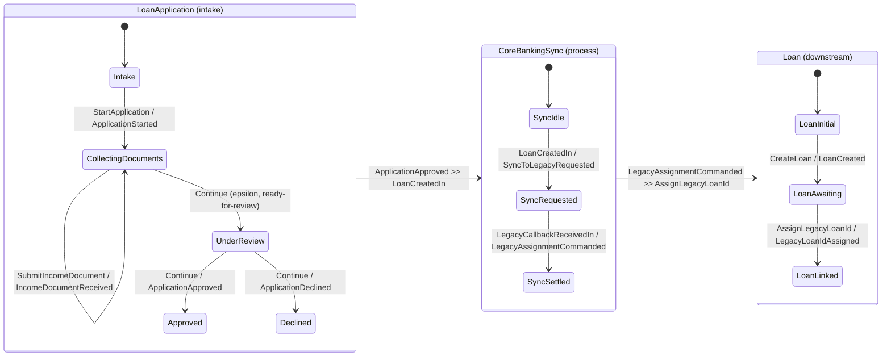

You will build the most complete keiki (継起) domain story in the worked-example
set: a long-lived **loan-application intake** aggregate that accumulates evidence
and decides on a multi-field threshold; a small **downstream loan** aggregate
created once the application is approved; and a **process** that bridges the two
bounded contexts, turning events from one stream into commands on another.
Finally you will wire all three together with `compose` and the `lmapMaybeCi`
profunctor adapter into a single `loanWorkflow` value.

This tutorial is the top rung of a ladder. Climb the earlier rungs first if you
have not: [Your first aggregate](/docs/keiki/tutorials/your-first-aggregate)
builds the smallest two-vertex machine and shows replay with no hand-written
`evolve`, and [A multi-command lifecycle](/docs/keiki/tutorials/a-multi-command-lifecycle)
adds several commands and vertices to one aggregate. Here we go cross-context.

<Callout type="info">
  This is a tutorial: a guided lesson. Follow every step in order. It assumes you
  have built at least one keiki aggregate before. By the end you will have three
  cooperating transducers and one composed `loanWorkflow`, and you will
  understand why composition is a design-time wiring tool, not the runtime.
</Callout>

## What you will build

Three aggregates and one composition:



Every snippet matches the keiki repository's `jitsurei` modules
(`Jitsurei.LoanApplication`, `Jitsurei.Loan`, `Jitsurei.CoreBankingSync`,
`Jitsurei.LoanWorkflow`), so you can read the finished modules alongside this
page.

## Before you begin

You need GHC 9.12, `cabal`, and the `keiki` package as a dependency; in the keiki
repository `nix develop` provides the exact toolchain. The same authoring
extensions from the earlier tutorials apply (`BlockArguments`, `DeriveGeneric`,
`GADTs`, `PolyKinds`, `QualifiedDo`, `TemplateHaskell`). The composition step
also pulls from `Keiki.Composition` and `Keiki.Profunctor`.

## Steps

<Steps>
<Step>

### Model the intake aggregate's register file and vertices

The intake aggregate, `LoanApplication`, is a long-lived machine that gathers
evidence before deciding. Its register file uses an `app` **prefix on every
slot** — this is the single most important modeling decision in the whole
tutorial, because composition requires the three aggregates' slot names to be
disjoint (`Disjoint (Names rs1) (Names rs2)` at the type level). Pick the prefix
now or pay for it at the `compose` call later.

```haskell
type LoanAppRegs =
  '[ '("appApplicantId",        Text)
   , '("appRequestedAmount",    Money)
   , '("appPurpose",            Text)
   , '("appIncomeDocCount",     Int)
   , '("appIdDocCount",         Int)
   , '("appCreditScore",        Int)
   , '("appEmploymentVerified", Bool)
   , '("appDecidedAt",          UTCTime)
   , '("appWithdrawnAt",        UTCTime)
   , '("appDeclineReason",      Text)
   ]

data LoanAppVertex
  = Intake
  | CollectingDocuments
  | UnderReview
  | Approved
  | Declined
  | Withdrawn
  deriving (Eq, Show, Enum, Bounded)
```

Note the two **document-count tallies** (`appIncomeDocCount`, `appIdDocCount`).
Rather than store a collection of documents, the aggregate folds each submission
into a scalar count — the guard that decides "ready for review" reads those
counts, and an `Int` count is solver-visible while a list is not.

</Step>
<Step>

### Tally evidence on self-loops

`StartApplication` initialises the four counter and decision slots to sentinels
(counts at `0`, score at `0`, employment `False`) so later guards can read them
without forcing the deferred `emptyRegFile` error. Each evidence command is a
**self-loop on `CollectingDocuments`** that bumps a tally:

```haskell
B.from CollectingDocuments do
  B.onCmd inCtorSubmitIncome $ \d -> B.do
    B.slot @"appIncomeDocCount" .= TApp1 (+ 1) #appIncomeDocCount
    B.emit wireIncomeDocumentReceived IncomeDocumentReceivedTermFields
      { docRef = d.docRef
      , at     = d.at
      }
    B.goto CollectingDocuments

  B.onCmd inCtorSubmitId $ \d -> B.do
    B.slot @"appIdDocCount" .= TApp1 (+ 1) #appIdDocCount
    B.emit wireIdDocumentReceived IdDocumentReceivedTermFields
      { docRef = d.docRef
      , at     = d.at
      }
    B.goto CollectingDocuments
```

`RecordCreditScore` and `RecordEmploymentCheck` are the same shape, each writing
its decision slot and looping back to `CollectingDocuments`.

</Step>
<Step>

### Author the epsilon-edge "ready for review"

When enough evidence has accumulated, the application should silently advance
from `CollectingDocuments` to `UnderReview` with **no public event**. keiki
models this as an epsilon-edge. Rather than `onEpsilon`, the aggregate keys it on
the driver's payload-free `Continue` command so the symbolic single-valuedness
check can disambiguate it from the five evidence edges out of the same vertex:
the edge combines `onCmd inCtorContinue` with `requireGuard` and `noEmit`.

```haskell
B.onCmd inCtorContinue $ \_d -> B.do
  B.requireGuard readyForReviewGuard
  B.noEmit
  B.goto UnderReview
```

The guard is a conjunction over the tally and decision slots — note it reads only
registers, so a payload-free `Continue` is enough to drive it:

```haskell
readyForReviewGuard :: Pred LoanAppRegs LoanCmd
readyForReviewGuard =
       reg @"appIncomeDocCount"     .>= lit minimumIncomeDocs
  .&&  reg @"appIdDocCount"         .>= lit minimumIdDocs
  .&&  reg @"appCreditScore"        .>= lit 1
  .&&  reg @"appEmploymentVerified" .== lit True
```

</Step>
<Step>

### Author the multi-field threshold `approvalGuard`

The approval decision is the multi-field threshold this tutorial exists to show.
It is a structural conjunction: a credit-score floor, an employment check, and a
requested-amount ceiling that is itself **derived from another register** by
structural arithmetic (`.*`, i.e. `tmul`). Because every comparison and the
derived cap are structural (`.>=`, `.<=`, `.==`, `.*` alias `PCmp`/`PEq`/`tmul`),
the whole guard is visible to the SBV translator and the single-valuedness gate
can prove it:

```haskell
approvalGuard :: Pred LoanAppRegs LoanCmd
approvalGuard =
       reg @"appCreditScore"        .>= lit approvalThresholdScore
  .&&  reg @"appEmploymentVerified" .== lit True
  .&&  reg @"appRequestedAmount"    .<= reg @"appCreditScore" .* lit 1000
```

</Step>
<Step>

### Branch approve vs. decline on the guard and its negation

From `UnderReview`, two edges share the `Continue` input constructor and are
separated only by `approvalGuard` against `pnot approvalGuard`. The approve edge
records the decision and emits `ApplicationApproved`:

```haskell
B.from UnderReview do
  -- Approval branch.
  B.onCmd inCtorContinue $ \d -> B.do
    B.requireGuard approvalGuard
    B.slot @"appDecidedAt" .= continueAt d
    B.emit wireApplicationApproved ApplicationApprovedTermFields
      { applicantId     = #appApplicantId
      , requestedAmount = #appRequestedAmount
      , creditScore     = #appCreditScore
      , at              = continueAt d
      }
    B.goto Approved

  -- Decline branch -- the negation of 'approvalGuard'.
  B.onCmd inCtorContinue $ \d -> B.do
    B.requireGuard (pnot approvalGuard)
    B.slot @"appDecidedAt"     .= continueAt d
    B.slot @"appDeclineReason" .= lit "Below threshold"
    B.emit wireApplicationDeclined ApplicationDeclinedTermFields
      { applicantId = #appApplicantId
      , reason      = #appDeclineReason
      , at          = continueAt d
      }
    B.goto Declined
```

<Callout type="info">
  Authoring the decline branch as `pnot approvalGuard` makes it correct by
  construction — the two edges are exact complements, so the single-valuedness
  gate passes trivially. That is fine here because the branch is a true
  partition. When you want the gate to *catch a boundary mistake*, write the two
  guards as independent comparisons instead; that is the trade-off the next
  tutorial, [A derived lifecycle transition](/docs/keiki/tutorials/a-derived-lifecycle-transition),
  is about.
</Callout>

</Step>
<Step>

### Allow `Withdraw` from every non-terminal vertex

A real intake can be abandoned at any point. The aggregate therefore has a
`WithdrawApplication` edge out of `Intake`, `CollectingDocuments`, **and**
`UnderReview`, each writing `appWithdrawnAt` and emitting `ApplicationWithdrawn`
before landing in the terminal `Withdrawn` vertex:

```haskell
B.onCmd inCtorWithdraw $ \d -> B.do
  B.slot @"appWithdrawnAt" .= d.at
  B.emit wireApplicationWithdrawn ApplicationWithdrawnTermFields
    { applicantId = #appApplicantId
    , reason      = d.reason
    , at          = d.at
    }
  B.goto Withdrawn
```

</Step>
<Step>

### Give each vertex a focused View

keiki derives a per-vertex **B-presentation view** that exposes only the slots
live in each vertex. `Intake` knows just the applicant's identity;
`CollectingDocuments` adds the request details and counters; `UnderReview`
switches focus to the decision inputs; the three terminal vertices present
summary slots. This is variance in the machine-state view: a consumer reading an
`Intake` view cannot accidentally depend on a credit score that has not been
recorded yet.

```haskell
$(deriveView ''LoanAppVertex ''LoanAppRegs
    "SLoanAppVertex" "LoanAppView" "loanAppView"
    [ ("Intake",            ["appApplicantId"])
    , ("CollectingDocuments",
         [ "appApplicantId", "appRequestedAmount", "appPurpose"
         , "appIncomeDocCount", "appIdDocCount" ])
    , ("UnderReview",
         [ "appApplicantId", "appRequestedAmount", "appPurpose"
         , "appCreditScore", "appEmploymentVerified" ])
    , ("Approved",
         [ "appApplicantId", "appRequestedAmount"
         , "appCreditScore", "appDecidedAt" ])
    , ("Declined",
         [ "appApplicantId", "appDeclineReason", "appDecidedAt" ])
    , ("Withdrawn",
         [ "appApplicantId", "appWithdrawnAt" ])
    ])
```

</Step>
<Step>

### Model the downstream `Loan` aggregate with a correlation guard

Once an application is approved, a separate `Loan` aggregate is created on its own
stream. It is intentionally tiny — three vertices, two transitions — with a
`loan` prefix on its slots (again, for composition). The interesting part is the
second edge's **correlation guard**: `AssignLegacyLoanId` must carry a `loanId`
that matches the one this loan was created with, which `requireEq` enforces by
comparing the command field against the stored slot.

```haskell
loan :: Guarded LoanRegs LoanVertex LoanCmd' LoanEvent'
loan = B.buildTransducer LoanInitial emptyLoanRegs
         (\case LoanLinked -> True; _ -> False) do

  B.from LoanInitial do
    B.onCmd inCtorCreateLoan $ \d -> B.do
      B.slot @"loanLoanId"      .= d.loanId
      B.slot @"loanApplicantId" .= d.applicantId
      B.slot @"loanPrincipal"   .= d.principal
      B.emit wireLoanCreated LoanCreatedTermFields
        { loanId      = d.loanId
        , applicantId = d.applicantId
        , principal   = d.principal
        }
      B.goto LoanAwaiting

  B.from LoanAwaiting do
    B.onCmd inCtorAssignLegacyLoanId $ \d -> B.do
      B.requireEq d.loanId #loanLoanId
      B.slot @"loanLegacyLoanId" .= d.legacyLoanId
      B.emit wireLegacyLoanIdAssigned LegacyLoanIdAssignedTermFields
        { loanId       = d.loanId
        , legacyLoanId = d.legacyLoanId
        }
      B.goto LoanLinked
```

The correlation guard is what makes a callback for *some other* loan a no-op:
`requireEq` fails, `delta` returns `Nothing`, and nothing happens.

</Step>
<Step>

### Model `CoreBankingSync` as a process: events in, commands out

A **process** in the keiki sense is a transducer whose *input* alphabet is events
from one bounded context and whose *output* alphabet is commands to another. (For
the theory of why process managers, sagas, and choreography are all just
transducers, see
[Process managers, sagas, choreography](/docs/keiki/explanation/process-managers-sagas-choreography-as-transducers).)
`CoreBankingSync` takes a `LoanCreatedIn` inbound event, records the pending
fields, and emits an audit signal; then on a matching `LegacyCallbackReceivedIn`
it emits a `LegacyAssignmentCommanded` carrying the `AssignLegacyLoanId` command:

```haskell
coreBankingSync :: Guarded SyncRegs SyncVertex SyncInput SyncOutput
coreBankingSync = B.buildTransducer SyncIdle emptySyncRegs
                    (\case SyncSettled -> True; _ -> False) do

  B.from SyncIdle do
    B.onCmd inCtorLoanCreatedIn $ \d -> B.do
      B.slot @"syncPendingLoanId"      .= d.loanId
      B.slot @"syncPendingApplicantId" .= d.applicantId
      B.slot @"syncPendingPrincipal"   .= d.principal
      B.emit wireSyncToLegacyRequested SyncToLegacyRequestedTermFields
        { loanId      = d.loanId
        , applicantId = d.applicantId
        , principal   = d.principal
        }
      B.goto SyncRequested

  B.from SyncRequested do
    B.onCmd inCtorLegacyCallbackReceivedIn $ \d -> B.do
      B.requireEq d.loanId #syncPendingLoanId
      B.emit wireLegacyAssignmentCommanded
        LegacyAssignmentCommandedTermFields
          { assignment = TApp2 buildAssign d.loanId d.legacyLoanId
          }
      B.goto SyncSettled
```

The process is **idempotent by construction**: `SyncSettled` is terminal with no
outgoing edges, so a duplicate callback after the first one resolves simply finds
no edge and `delta` returns `Nothing`. A callback whose `loanId` mismatches fails
the `requireEq` guard the same way.

</Step>
<Step>

### Wire all three with `compose` and `lmapMaybeCi`

Now the capstone. The three aggregates speak different alphabets, so between each
pair you insert an **adapter** with `lmapMaybeCi`, which pre-composes a
`Maybe`-returning function onto a transducer's input. One adapter turns
`LoanApplication` events into `CoreBankingSync` inputs; the other turns
`CoreBankingSync` outputs into `Loan` commands. Unrelated values map to `Nothing`
and are filtered out.

```haskell
loanEventToSyncInput :: LoanEvent -> Maybe SyncInput
loanEventToSyncInput (ApplicationApproved a) =
  Just (LoanCreatedIn (LoanCreatedInData
    { loanId      = "loan-" <> a.applicantId
    , applicantId = a.applicantId
    , principal   = a.requestedAmount
    }))
loanEventToSyncInput _ = Nothing

syncOutputToLoanCmd :: SyncOutput -> Maybe LoanCmd'
syncOutputToLoanCmd (LegacyAssignmentCommanded d) = Just d.assignment
syncOutputToLoanCmd (SyncToLegacyRequested  _)    = Nothing
```

The composed value is `loanWorkflow`, quoted verbatim from
`Jitsurei.LoanWorkflow`:

```haskell
loanWorkflow
  :: Guarded
       (Append LoanAppRegs (Append SyncRegs LoanRegs))
       (Composite LoanAppVertex (Composite SyncVertex LoanVertex))
       LoanCmd
       LoanEvent'
loanWorkflow =
  loanApplication
    `compose`
  lmapMaybeCi loanEventToSyncInput
    (coreBankingSync `compose` lmapMaybeCi syncOutputToLoanCmd loan)
```

The composite's register file is the type-level `Append` of the three (which is
why the prefixes had to be disjoint), and its vertex type is the nested
`Composite` of the three vertex types. See
[Composition reference](/docs/keiki/reference/composition) for the exact
signatures of `compose` and `lmapMaybeCi`.

</Step>
<Step>

### Compile it

From the keiki repository (inside `nix develop` for GHC 9.12):

```bash
cabal build jitsurei
```

The Template Haskell splices and the type-level `Disjoint`/`Append` constraints
run at compile time, so a slot-prefix collision or an adapter type mismatch is a
**compile error**, not a runtime surprise.

</Step>
</Steps>

<Callout type="warn">
  **`compose` is lockstep; the keiro (経路) runtime is async.** `compose` runs the
  composed machines in **one synchronous step** — every non-epsilon composite
  edge fires both legs at once. The real cross-context flow is asynchronous: the
  runtime observes `ApplicationApproved`, *then* (in a separate transactional
  step) issues a `CreateLoan`/`LoanCreatedIn` on another stream, *then later* a
  legacy callback arrives. There is no single input that fires the whole chain in
  one composite step, so `loanWorkflow` is largely a **type-level wiring
  diagram**. Model the async hand-off through the `lmapMaybeCi` adapter functions
  (`loanEventToSyncInput`, `syncOutputToLoanCmd`) and **test through those
  adapters** by driving each aggregate directly — that is the path that mirrors
  the runtime's actual behaviour.
</Callout>

## What you built

Three cooperating transducers — a multi-field-threshold intake aggregate with an
epsilon-edge and a full Withdraw path, a tiny downstream loan with a correlation
guard, and an events-in/commands-out process — plus one `loanWorkflow`
composition that wires them with `compose` and `lmapMaybeCi`. You also learned the
load-bearing caveat: composition is a design-time wiring and analysis tool, while
the runtime is async, so you model and test the hand-off through the adapter
functions. To go deeper on the mechanics, read the
[Composition reference](/docs/keiki/reference/composition) and the explanation of
[process managers, sagas, and choreography as transducers](/docs/keiki/explanation/process-managers-sagas-choreography-as-transducers).
