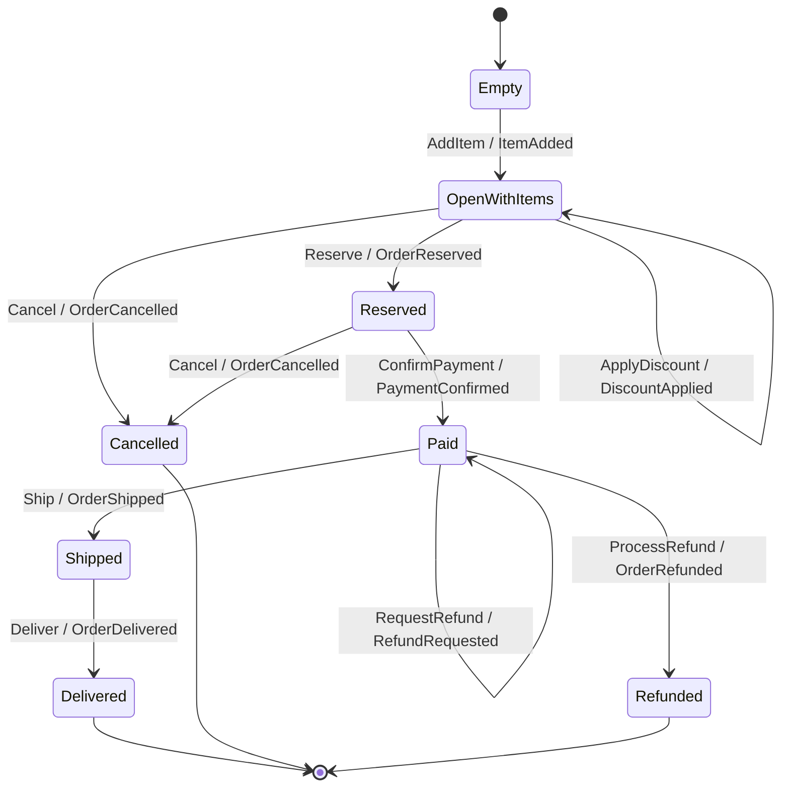

You will build `OrderCart`, a realistic order lifecycle: a cart fills with items, is reserved, paid,
shipped, and delivered — with cancel and refund branches off the main line. By the end you will have a
twelve-edge, eight-vertex transducer authored with the `Keiki.Builder` DSL, and you will replay the
happy path, a cancellation, and a refund — each recovered by `reconstitute` with **no hand-written
`evolve`**.

<Callout type="info">
  This is a tutorial: a guided lesson. Follow every step in order. You need a working Haskell toolchain
  (GHC 9.12) and the keiki library. If you have not built a single-command aggregate yet, do
  [Your first aggregate](/docs/keiki/tutorials/your-first-aggregate) first — this tutorial assumes that
  shape and scales it up to many commands and branches.
</Callout>

## What you will build

`OrderCart` has eight control vertices. The canonical happy path is
`Empty → OpenWithItems → Reserved → Paid → Shipped → Delivered`, with `Cancelled` reachable from
`OpenWithItems` and `Reserved`, and `Refunded` reachable from `Paid`. `Delivered`, `Cancelled`, and
`Refunded` are terminal.



It matches `jitsurei/src/Jitsurei/OrderCart.hs` in the keiki repository exactly, so you can read the
finished module and its test (`jitsurei/test/Jitsurei/OrderCartBuilderSpec.hs`) alongside this page.

## Before you begin

You need GHC 9.12, `cabal`, and the `keiki` package. In the keiki repository, `nix develop` provides
the exact toolchain. z3 is *not* required for this tutorial — it is only for the optional symbolic
checks, which this tutorial does not run.

Create a module with the extensions the authoring DSL relies on:

```haskell
{-# LANGUAGE BlockArguments #-}
{-# LANGUAGE DeriveGeneric #-}
{-# LANGUAGE GADTs #-}
{-# LANGUAGE PolyKinds #-}
{-# LANGUAGE QualifiedDo #-}
{-# LANGUAGE TemplateHaskell #-}

module MyOrderCart where

import Data.Text (Text)
import Data.Time (UTCTime)
import Data.Word (Word16, Word32, Word64)
import GHC.Generics (Generic)
import Keiki.Core
import qualified Keiki.Builder as B
import Keiki.Builder ((.=))
import Keiki.Generics (emptyRegFile)
import Keiki.Generics.TH (deriveAggregate)
```

## Steps

<Steps>
<Step>

### Declare the domain types

`OrderCart` works with a handful of aliases. The numeric ones matter: `ItemCount` is the tally slot,
and fixed-point `Money` keeps arithmetic integer (and solver-visible):

```haskell
type Sku          = Text
type DiscountBp   = Word16   -- discount in basis points (0–10000)
type ItemQuantity = Word16
type Money        = Word64   -- fixed-point currency (e.g. cents)
type ItemCount    = Word32   -- items currently in the cart
```

</Step>
<Step>

### Declare the register file and control vertices

The **register file** is eleven slots. `itemCount` is a running tally evolved by arithmetic on
add/remove (rather than a `Map` of line items — see
[Model a collection](/docs/keiki/how-to/model-a-collection)); the rest are per-event scalar copies:

```haskell
type OrderCartRegs =
  '[ '("itemCount",       ItemCount)
   , '("discountBp",      DiscountBp)
   , '("reservationId",   Text)
   , '("paymentRef",      Text)
   , '("amountPaid",      Money)
   , '("shippingCarrier", Text)
   , '("trackingId",      Text)
   , '("shippedAt",       UTCTime)
   , '("deliveredAt",     UTCTime)
   , '("cancelledAt",     UTCTime)
   , '("refundedAt",      UTCTime)
   ]
```

The **control vertices** are an ordinary enum:

```haskell
data OrderVertex
  = Empty
  | OpenWithItems
  | Reserved
  | Paid
  | Shipped
  | Delivered
  | Cancelled
  | Refunded
  deriving (Eq, Show, Enum, Bounded)

emptyOrderRegs :: RegFile OrderCartRegs
emptyOrderRegs = emptyRegFile
```

</Step>
<Step>

### Declare the commands and events

Ten commands and ten events, each a record wrapped in a sum type, every type `deriving Generic` (the
Template Haskell reads the `Generic` representation). A representative slice — the full list is in the
source module:

```haskell
data AddItemData = AddItemData
  { sku :: Sku, quantity :: ItemQuantity, price :: Money, at :: UTCTime }
  deriving (Eq, Show, Generic)

data ReserveData = ReserveData { reservationId :: Text, at :: UTCTime }
  deriving (Eq, Show, Generic)

-- … RemoveItem, ApplyDiscount, ConfirmPayment, Ship, Deliver,
--    Cancel, RequestRefund, ProcessRefund follow the same shape

data OrderCmd
  = AddItem        AddItemData
  | RemoveItem     RemoveItemData
  | ApplyDiscount  ApplyDiscountData
  | Reserve        ReserveData
  | ConfirmPayment ConfirmPaymentData
  | Ship           ShipData
  | Deliver        DeliverData
  | Cancel         CancelData
  | RequestRefund  RequestRefundData
  | ProcessRefund  ProcessRefundData
  deriving (Eq, Show, Generic)
```

Each event mirrors its command. Five event constructors carry an `Order` prefix
(`OrderReserved`, `OrderShipped`, `OrderDelivered`, `OrderCancelled`, `OrderRefunded`) so they don't
collide with the same-named vertex constructors — two data constructors can't share a name in one
module:

```haskell
data OrderEvent
  = ItemAdded         ItemAddedData
  | ItemRemoved       ItemRemovedData
  | DiscountApplied   DiscountAppliedData
  | OrderReserved     OrderReservedData
  | PaymentConfirmed  PaymentConfirmedData
  | OrderShipped      OrderShippedData
  | OrderDelivered    OrderDeliveredData
  | OrderCancelled    OrderCancelledData
  | RefundRequested   RefundRequestedData
  | OrderRefunded     OrderRefundedData
  deriving (Eq, Show, Generic)
```

</Step>
<Step>

### Derive the per-constructor machinery with one fused splice

`OrderCart` uses the **fused** splice `deriveAggregate`, which derives every command-side
`inCtor`/`inp`/`is` declaration *and* every event-side `wire` declaration (plus each
`<Ctor>TermFields` record) in one go, defaulting each short name to the constructor's own name:

```haskell
$(deriveAggregate ''OrderCmd ''OrderCartRegs ''OrderEvent)
```

This generates `inCtorAddItem`, `inpAddItem`, `isAddItem`, `wireItemAdded`, `ItemAddedTermFields`, and
their siblings for all ten constructors. (The three-splice form
`deriveAggregateCtors`/`deriveWireCtors`/`deriveView` from the first tutorial is equivalent; the fused
form is terser once you know what it produces.)

</Step>
<Step>

### Author the entrance and the open-cart edges

`buildTransducer` takes the initial vertex, initial registers, and the finality predicate, then a
`QualifiedDo` block. From `Empty`, the **first** `AddItem` seeds the tally from a literal rather than
reading the still-uninitialised `#itemCount`:

```haskell
orderCart :: Guarded OrderCartRegs OrderVertex OrderCmd OrderEvent
orderCart = B.buildTransducer Empty emptyOrderRegs
              (\case Delivered -> True
                     Cancelled -> True
                     Refunded  -> True
                     _         -> False) do

  B.from Empty do
    B.onCmd inCtorAddItem $ \d -> B.do
      B.slot @"itemCount" .= lit (1 :: ItemCount)
      B.emit wireItemAdded ItemAddedTermFields
        { sku = d.sku, quantity = d.quantity, price = d.price, at = d.at }
      B.goto OpenWithItems
```

`OpenWithItems` holds five edges. The two tally edges evolve `#itemCount` by arithmetic; the rest
record a field and either self-loop or advance:

```haskell
  B.from OpenWithItems do
    B.onCmd inCtorAddItem $ \d -> B.do
      B.slot @"itemCount" .= TApp1 (+ 1) #itemCount
      B.emit wireItemAdded ItemAddedTermFields
        { sku = d.sku, quantity = d.quantity, price = d.price, at = d.at }
      B.goto OpenWithItems

    B.onCmd inCtorRemoveItem $ \d -> B.do
      B.slot @"itemCount" .= TApp1 (subtract 1) #itemCount
      B.emit wireItemRemoved ItemRemovedTermFields { sku = d.sku, at = d.at }
      B.goto OpenWithItems

    B.onCmd inCtorApplyDiscount $ \d -> B.do
      B.slot @"discountBp" .= d.percentBp
      B.emit wireDiscountApplied DiscountAppliedTermFields
        { code = d.code, percentBp = d.percentBp, at = d.at }
      B.goto OpenWithItems

    B.onCmd inCtorReserve $ \d -> B.do
      B.slot @"reservationId" .= d.reservationId
      B.emit wireOrderReserved OrderReservedTermFields
        { reservationId = d.reservationId, at = d.at }
      B.goto Reserved

    B.onCmd inCtorCancel $ \d -> B.do
      B.slot @"cancelledAt" .= d.at
      B.emit wireOrderCancelled OrderCancelledTermFields
        { reason = d.reason, at = d.at }
      B.goto Cancelled
```

<Callout type="info">
  Each `onCmd` is matched by its input constructor's guard, so the five edges leaving `OpenWithItems`
  are disjoint — at most one fires for any command. That is what makes the branch out of `OpenWithItems`
  (advance vs cancel) deterministic, and it is the same disjoint-edge pattern you'd use for any
  multi-way decision.
</Callout>

</Step>
<Step>

### Author Reserved, Paid, and Shipped

`Reserved` advances to `Paid` on payment or branches to `Cancelled`. Note `ConfirmPayment` writes two
slots in one body (`paymentRef` and `amountPaid`) — distinct slots, so the builder's distinct-target
check is satisfied:

```haskell
  B.from Reserved do
    B.onCmd inCtorConfirmPayment $ \d -> B.do
      B.slot @"paymentRef" .= d.paymentRef
      B.slot @"amountPaid" .= d.amountPaid
      B.emit wirePaymentConfirmed PaymentConfirmedTermFields
        { paymentRef = d.paymentRef, amountPaid = d.amountPaid, at = d.at }
      B.goto Paid

    B.onCmd inCtorCancel $ \d -> B.do
      B.slot @"cancelledAt" .= d.at
      B.emit wireOrderCancelled OrderCancelledTermFields
        { reason = d.reason, at = d.at }
      B.goto Cancelled
```

`Paid` ships, or self-loops on a refund *request* (an audit event that writes no slot), or processes
the actual refund:

```haskell
  B.from Paid do
    B.onCmd inCtorShip $ \d -> B.do
      B.slot @"shippingCarrier" .= d.carrier
      B.slot @"trackingId"      .= d.trackingId
      B.slot @"shippedAt"       .= d.at
      B.emit wireOrderShipped OrderShippedTermFields
        { carrier = d.carrier, trackingId = d.trackingId, at = d.at }
      B.goto Shipped

    B.onCmd inCtorRequestRefund $ \d -> B.do
      B.emit wireRefundRequested RefundRequestedTermFields
        { reason = d.reason, at = d.at }
      B.goto Paid                       -- self-loop: emits, writes no slot

    B.onCmd inCtorProcessRefund $ \d -> B.do
      B.slot @"refundedAt" .= d.at
      B.emit wireOrderRefunded OrderRefundedTermFields
        { refundRef = d.refundRef, amountRefunded = d.amountRefunded, at = d.at }
      B.goto Refunded

  B.from Shipped do
    B.onCmd inCtorDeliver $ \d -> B.do
      B.slot @"deliveredAt" .= d.at
      B.emit wireOrderDelivered OrderDeliveredTermFields { at = d.at }
      B.goto Delivered

  -- Delivered, Cancelled, Refunded are terminal (no `from`, default []).
```

That completes all twelve edges. `Guarded OrderCartRegs OrderVertex OrderCmd OrderEvent` is the alias
for `SymTransducer (HsPred OrderCartRegs OrderCmd) OrderCartRegs OrderVertex OrderCmd OrderEvent`.

</Step>
<Step>

### Compile it

From the keiki repository (inside `nix develop` for GHC 9.12):

```bash
cabal build jitsurei
```

The Template Haskell splice runs at compile time, so a wrong slot name or a misnamed field is a
**compile error**, not a runtime surprise.

</Step>
<Step>

### Replay the happy path with no hand-written `evolve` — the payoff

`reconstitute` replays an event log back into `(state, registers)`. Feed it the canonical happy-path
log — four `ItemAdded`s, a discount, reserve, payment, ship, deliver — and it lands in `Delivered`:

```haskell
reconstitute :: (BoolAlg phi (RegFile rs, ci), Eq co)
             => SymTransducer phi rs s ci co
             -> [co]
             -> Maybe (s, RegFile rs)
```

```haskell
-- => Just (Delivered, regs)   -- every happy-path slot bound
reconstitute orderCart
  [ ItemAdded        (ItemAddedData        "S0001" 1    100  t0)
  , ItemAdded        (ItemAddedData        "S0002" 2    250  t1)
  , ItemAdded        (ItemAddedData        "S0003" 1    500  t2)
  , ItemAdded        (ItemAddedData        "S0004" 5    125  t3)
  , DiscountApplied  (DiscountAppliedData  "SAVE10" 1000      t4)
  , OrderReserved    (OrderReservedData    "RES-42"          t5)
  , PaymentConfirmed (PaymentConfirmedData "PAY-99" 1925      t6)
  , OrderShipped     (OrderShippedData     "UPS" "TRACK-1"   t7)
  , OrderDelivered   (OrderDeliveredData                     t8)
  ]
```

You never wrote an `evolve`. keiki derived replay from the *same* declaration you used to author the
edges, so the command path and the replay path can't drift apart.

</Step>
<Step>

### Replay the cancel and refund branches

The same `reconstitute` walks the branches. A cancellation lands in `Cancelled`:

```haskell
-- => Just (Cancelled, regs)
reconstitute orderCart
  [ ItemAdded      (ItemAddedData      "S0001" 1 100 t0)
  , OrderCancelled (OrderCancelledData "out-of-stock" t1)
  ]
```

And a refund — including the `RefundRequested` self-loop on `Paid` before `OrderRefunded` — lands in
`Refunded`:

```haskell
-- => Just (Refunded, regs)
reconstitute orderCart
  [ ItemAdded        (ItemAddedData        "S0001" 1 100 t0)
  , OrderReserved    (OrderReservedData     "RES-7"      t1)
  , PaymentConfirmed (PaymentConfirmedData  "PAY-7" 100  t2)
  , RefundRequested  (RefundRequestedData   "buyer-remorse" t3)
  , OrderRefunded    (OrderRefundedData     "RFND-7" 100 t4)
  ]
```

</Step>
<Step>

### (Optional) run the test

The repository's spec replays all three logs and asserts the builder form and a hand-written AST form
agree on `reconstitute`, per-step `applyEvent`, `isFinal`, and edge counts across every vertex:

```bash
cabal test jitsurei --test-options='--match "OrderCart"'
```

</Step>
</Steps>

## What you built

A complete twelve-edge, eight-vertex `OrderCart`: a multi-command lifecycle with a happy path and two
branches, a scalar tally instead of a stored collection, an audit self-loop, and three event logs
recovered by `reconstitute` with no hand-written `evolve`. To go further, see
[Write a multi-event command](/docs/keiki/how-to/write-a-multi-event-command) (emit several events from
one transition), [Model a collection](/docs/keiki/how-to/model-a-collection) (the tally decision in
depth), and [Drop down to the AST](/docs/keiki/how-to/drop-down-to-the-ast) (the `orderCartAST` form
this tutorial's test checks against).
