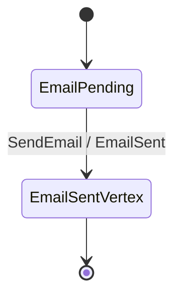

You will build the smallest useful keiki aggregate — `EmailDelivery`, a two-vertex state machine —
with the `Keiki.Builder` DSL, feed a command through it, and watch `reconstituteEither` rebuild the
aggregate's state from its event log **with no hand-written `evolve`**. That last step is the payoff:
in keiki, replay is *derived* from the same declaration you used to handle the command, so the two
can never silently drift apart.

<Callout type="info">
  This is a tutorial: a guided lesson. Follow every step in order. You need only a working Haskell
  toolchain (GHC 9.12) and the keiki library; no prior keiki knowledge is assumed. By the end you
  will have a real, compiling aggregate and will have seen `reconstituteEither` recover its state
  or explain precisely why persisted history cannot be replayed.
</Callout>

## What you will build

`EmailDelivery` has two control vertices — an idle `EmailPending` and a terminal `EmailSentVertex` —
and one command, `SendEmail`, which emits one event, `EmailSent`:



It matches `jitsurei/src/Jitsurei/EmailDelivery.hs` in the keiki repository exactly, so you can read
the finished module and its test (`jitsurei/test/Jitsurei/EmailDeliveryBuilderSpec.hs`) alongside
this page.

## Before you begin

You need GHC 9.12, `cabal`, and the `keiki` package as a dependency. In the keiki repository,
`nix develop` provides the exact toolchain. **z3 is *not* required for this tutorial** — it is only
needed for the optional symbolic single-valuedness check, which this tutorial does not run.

Create a module with the language extensions keiki's authoring DSL relies on:

```haskell
{-# LANGUAGE BlockArguments #-}
{-# LANGUAGE DeriveGeneric #-}
{-# LANGUAGE GADTs #-}
{-# LANGUAGE PolyKinds #-}
{-# LANGUAGE QualifiedDo #-}
{-# LANGUAGE TemplateHaskell #-}

module MyFirstAggregate where

import Data.Text (Text)
import Data.Time (UTCTime)
import GHC.Generics (Generic)
import Keiki.Core
import qualified Keiki.Builder as B
import Keiki.Builder ((.=))
import Keiki.Generics (emptyRegFile)
import Keiki.Generics.TH (deriveAggregateCtors, deriveView, deriveWireCtors)
```

## Steps

<Steps>
<Step>

### Declare the domain types

`EmailDelivery` works with two simple aliases. Both are just `Text`:

```haskell
type Email   = Text
type Subject = Text
```

</Step>
<Step>

### Declare the register file, commands, and events

The **register file** is keiki's typed data memory: a type-level list of `'(name, type)` slots. This
aggregate remembers who the email went to, its subject, and when it was sent:

```haskell
type EmailRegs =
  '[ '("emailRecipient", Email)
   , '("emailSubject",   Subject)
   , '("emailSentAt",    UTCTime)
   ]
```

The **control vertices** are an ordinary enum:

```haskell
data EmailVertex = EmailPending | EmailSentVertex
  deriving (Eq, Show, Enum, Bounded)
```

The **command** and **event** are records wrapped in a sum type, each `deriving Generic` (keiki's
Template Haskell reads the `Generic` representation):

```haskell
data SendEmailData = SendEmailData
  { recipient :: Email
  , subject   :: Subject
  , at        :: UTCTime
  } deriving (Eq, Show, Generic)

data EmailCmd = SendEmail SendEmailData
  deriving (Eq, Show, Generic)

data EmailSentData = EmailSentData
  { recipient :: Email
  , subject   :: Subject
  , at        :: UTCTime
  } deriving (Eq, Show, Generic)

data EmailEvent = EmailSent EmailSentData
  deriving (Eq, Show, Generic)
```

The initial register file pre-binds every slot to a deferred `"uninit: <slot>"` error via
`emptyRegFile` — reading a slot before it is set is a clear error, not a silent default:

```haskell
emptyEmailRegs :: RegFile EmailRegs
emptyEmailRegs = emptyRegFile
```

</Step>
<Step>

### Derive the per-constructor machinery with Template Haskell

Three splices generate everything the builder and the derivations need from your plain records. Each
takes the type name and a list of `(constructorName, generatedSuffix)` pairs.

`deriveAggregateCtors` generates, for each command constructor, an **input constructor**
(`inCtorSendEmail`), an **input projection** (`inpSendEmail`, which reads command fields), and the
guard helpers:

```haskell
$(deriveAggregateCtors ''EmailCmd ''EmailRegs
    [ ("SendEmail", "SendEmail")
    ])
```

`deriveWireCtors` generates the **wire constructor** for each event (`wireEmailSent`) and the
`EmailSentTermFields` record you fill in when emitting it:

```haskell
$(deriveWireCtors ''EmailEvent
    [ ("EmailSent", "EmailSent")
    ])
```

`deriveView` generates the per-vertex **B-presentation view** — a type that exposes only the slots
that are live in each vertex (`EmailPending` is nullary; `EmailSentVertex` carries all three slots):

```haskell
$(deriveView ''EmailVertex ''EmailRegs
    "SEmailVertex" "EmailView" "emailView"
    [ ("EmailPending",     [])
    , ("EmailSentVertex",  ["emailRecipient", "emailSubject", "emailSentAt"])
    ])
```

<Callout type="info">
  There is a fused splice, `deriveAggregate`, that bundles all three at once. The three-splice form
  above is the clearer teaching shape because you can see exactly what each one produces.
</Callout>

</Step>
<Step>

### Author the transducer with the builder

Now the heart of it. `buildTransducerEither` takes the initial vertex, the initial register file, and
the finality predicate, followed by a `QualifiedDo` block of builder statements. It returns every
located construction defect instead of throwing. `B.from` opens a
vertex; `B.onCmd` matches a command via its input constructor and binds its projected fields as `d`;
`B.slot @"name" .= expr` writes a register; `B.emit` emits an event; `B.goto` names the target
vertex:

```haskell
emailDelivery :: Guarded EmailRegs EmailVertex EmailCmd EmailEvent
emailDelivery =
  case B.buildTransducerEither EmailPending emptyEmailRegs
         (\case EmailSentVertex -> True; _ -> False) do
    B.from EmailPending do
      B.onCmd inCtorSendEmail $ \d -> B.do
        B.slot @"emailRecipient" .= d.recipient
        B.slot @"emailSubject"   .= d.subject
        B.slot @"emailSentAt"    .= d.at
        B.emit wireEmailSent EmailSentTermFields
          { recipient = d.recipient
          , subject   = d.subject
          , at        = d.at
          }
        B.goto EmailSentVertex
  of
    Left errors -> error (B.renderBuilderErrors errors)
    Right transducer -> transducer
```

`Guarded EmailRegs EmailVertex EmailCmd EmailEvent` is an alias for
`SymTransducer (HsPred EmailRegs EmailCmd) EmailRegs EmailVertex EmailCmd EmailEvent` — your finished
aggregate.

`B.emit` is not optional bookkeeping: it declares this edge's output intent. In keiki 0.2 every
`onCmd` and `onEpsilon` body must call `emit`/`emitWith` one or more times, or call `B.noEmit` to say
the edge is deliberately silent. A bare `goto` is an eager `DefectMissingOutputIntent` returned by
`buildTransducerEither` with its source vertex and edge index.

</Step>
<Step>

### Compile it

From the keiki repository (inside `nix develop` for GHC 9.12):

```bash
cabal build jitsurei
```

You should see it compile cleanly. The Template Haskell splices run at compile time, so a mistake in
a slot name or a field is a **compile error**, not a runtime surprise.

</Step>
<Step>

### Run a command

Feed a `SendEmail` command through `stepEither`, starting from the initial vertex and register file.
It combines the transition (`delta`) and output (`omega`) and preserves the reason when no unique
edge fires:

```haskell
stepEither :: BoolAlg phi (RegFile rs, ci)
           => SymTransducer phi rs s ci co
           -> (s, RegFile rs)
           -> ci
           -> Either (StepFailure s) (s, RegFile rs, [co])
```

```haskell
-- => Right (EmailSentVertex, regs, [EmailSent (EmailSentData "alice@x" "Subject" t0)])
stepEither emailDelivery (EmailPending, emptyEmailRegs)
  (SendEmail (SendEmailData "alice@x" "Subject" t0))
```

It lands in `EmailSentVertex`, emits exactly one `EmailSent`, and the returned `regs` now has all
three slots bound. Repeating the command from the terminal vertex returns
`Left (NoOutgoingEdges EmailSentVertex)`: an ordinary command rejection, not a replay failure.

</Step>
<Step>

### Replay with no hand-written `evolve` — the payoff

`reconstituteEither` replays an event log back into `(state, registers)` and locates malformed or
incompatible history:

```haskell
reconstituteEither :: (BoolAlg phi (RegFile rs, ci), Eq co)
                  => SymTransducer phi rs s ci co
                  -> [co]
                  -> Either (ReplayFailure s co) (s, RegFile rs)
```

```haskell
-- => Right (EmailSentVertex, regs)  -- all three slots are bound
reconstituteEither emailDelivery
  [EmailSent (EmailSentData "alice@x" "Subject" t0)]
```

You never wrote an `evolve` function. keiki derived replay from the *same* declaration you used to
handle the command, so the command path and the replay path are guaranteed consistent by
construction. A duplicate event is malformed history because the first event already reaches the
terminal vertex:

```haskell
case reconstituteEither emailDelivery
       [ EmailSent (EmailSentData "alice@x" "Subject" t0)
       , EmailSent (EmailSentData "alice@x" "Subject" t0)
       ] of
  Left failure ->
    (replayFailedIndex failure, replayFailureReason failure)
    -- => (1, ReplayEventFailed (ReplayNoInvertingEdge EmailSentVertex []))
  Right _ -> error "duplicate terminal event unexpectedly replayed"
```

That `ReplayFailure` is about persisted history and the deployed model. Do not translate it into
`NoMatchingEdge`: the latter describes a command that was validly rejected before persistence.
`reconstitute` remains as a `Maybe` compatibility wrapper, but it would erase the event index and
reason shown above.

</Step>
<Step>

### (Optional) run the test

The repository's spec asserts the builder form and a hand-written AST form agree on the forward and
replay paths for the canonical command:

```bash
cabal test jitsurei --test-options='--match "EmailDelivery"'
```

</Step>
</Steps>

## What you built

A complete, compiling keiki aggregate: domain types, a register file, derived command/event
machinery, a builder-authored transducer validated through `buildTransducerEither`, a command run
through `stepEither`, and state recovered by `reconstituteEither` with no hand-written `evolve`. To understand the model you just used — what each
parameter of `SymTransducer phi rs s ci co` means, and how the register file differs from the control
state — read the [Explanation](/docs/keiki/explanation) thread, and look up exact signatures in the
[Reference](/docs/keiki/reference).
