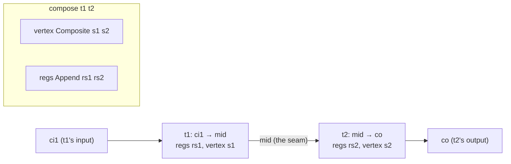

This is an **ordered source tour** of keiki (継起)'s *composition algebra* — the machinery that takes
two single-aggregate `SymTransducer`s and wires them into one. It reads the real Haskell in
`src/Keiki/Composition.hs` end to end — every exported binding, plus the internal helpers that make the
exports work — and explains *why* the code is shaped the way it is. The intended reader is a would-be
contributor who wants to understand the algebra, not just call it.

This tour reads the real source. Pinned at keiki `0.1.0.0`, commit `344c4ca`.

<Callout type="info">
Every chapter links back here: [00 — Start here](/docs/keiki/walkthrough/composition/00-start-here).
Read the chapters in order — the substitution algorithm (chapter 03) is the load-bearing piece, and
`compose` (chapter 04) is built directly on the weakening (chapter 02) and substitution helpers.
</Callout>

## What this tour covers

`Keiki.Composition` exports three construction combinators — `compose`, `alternative`, and
`feedback1` — plus `checkComposeAlignment`/`composeChecked`, the `Composite` vertex, and weakening /
substitution / lifting helpers. The combinators all build on one shared idea: the composite
of two transducers has a **product vertex** (`Composite s1 s2`) and an **appended register file**
(`Append rs1 rs2`), and every edge of the result is some rewrite of the source edges over that merged
register file.

The two halves of the tour:

- **The composition algebra** (chapters 01–10): the `Composite` vertex, the `weakenL*`/`weakenR*`
  weakening family, the `subst*` substitution algorithm, `compose`, `alternative`, `feedback1`, the
  n-ary coproduct injectors, and the `Category`/`Choice`/`Strong`/`Arrow` instances.
- **The cross-context capstone** (chapter 11): a worked async process tour that explains why mapped
  topology is not an admitted replay pipeline and why the runtime owns cross-stream dispatch.

## The design in one picture

`compose t1 t2` threads `t1`'s output alphabet (`mid`) into `t2`'s input. The composite consumes `t1`'s
input and emits `t2`'s output; its vertex is the pair, and its register file is the two files appended:



The seam at `mid` is where the work happens. A `t2`-side edge reads its input through the `mid` alphabet;
`compose` *substitutes* `t1`'s emitted output for that input, so the composite edge reads `t1`'s input
directly. That substitution — plus the weakening that lifts each side's register reads into the merged
register file — is the whole algebra.

## The chapters

<Cards>
  <Card title="01 — The composite vertex" href="/docs/keiki/walkthrough/composition/01-composite-vertex" description="The Composite pair type and its hand-rolled Bounded / column-major Enum / NoThunks instances, and why they avoid orphans." />
  <Card title="02 — Weakening" href="/docs/keiki/walkthrough/composition/02-weakening" description="The WeakenR class and the weakenL* / weakenR* family that lift register reads across the appended register file." />
  <Card title="03 — Substitution" href="/docs/keiki/walkthrough/composition/03-substitution" description="substTerm / substPred / substUpdate / substOut: the mid-alphabet elimination, the name invariant, and the unsafeCoerce justification." />
  <Card title="04 — compose" href="/docs/keiki/walkthrough/composition/04-compose" description="composeChecked, structural alignment warnings, and state-threaded multi-event path expansion." />
  <Card title="05 — Either-lifters and alternative" href="/docs/keiki/walkthrough/composition/05-either-lifters-and-alternative" description="The Either lifters, explicit PLeftArm / PRightArm exclusion, and independent-arm dispatch." />
  <Card title="06 — feedback1" href="/docs/keiki/walkthrough/composition/06-feedback1" description="The two-copy cascade as stacked composes, its empty-register constraint, and why it is not shared-state feedback." />
  <Card title="07 — N-ary families" href="/docs/keiki/walkthrough/composition/07-nary-families" description="The arity-3 coproduct injectors built from the binary lifts, and the name-uniqueness obligation across summed families." />
  <Card title="08 — Existential wrapper and Profunctor" href="/docs/keiki/walkthrough/composition/08-existential-wrapper-and-profunctor" description="The existential transducer wrapper and the Profunctor instance over it." />
  <Card title="09 — Category and the overlap check" href="/docs/keiki/walkthrough/composition/09-category-and-overlap-check" description="Poison rejection, runtime slot overlap, and real KnownSlots witness induction." />
  <Card title="10 — Choice, Strong, Arrow" href="/docs/keiki/walkthrough/composition/10-choice-strong-arrow" description="Choice arm exclusion and the poison-provenance limits of Strong and Arrow." />
  <Card title="11 — Cross-context process tour" href="/docs/keiki/walkthrough/composition/11-cross-context-process-tour" description="The async runtime capstone and why the legacy mapped composite is topology-only." />
</Cards>

The source files this tour reads:

```text
src/Keiki/Composition.hs                       -- the whole composition algebra
test/Keiki/CompositionSpec.hs                  -- compose acceptance (AlertSource ⨾ EmailDelivery)
test/Keiki/CompositionMultiEventSpec.hs        -- multi-event chain-expansion acceptance
test/Keiki/CompositionAlternativeSpec.hs       -- alternative acceptance (Either-arm routing)
```

For the conceptual model behind the algebra, read
[The composition algebra](/docs/keiki/explanation/the-composition-algebra); for what a `SymTransducer`
*is*, read [The SymTransducer](/docs/keiki/explanation/the-symtransducer) first.

Next: [01 — The composite vertex](/docs/keiki/walkthrough/composition/01-composite-vertex).
