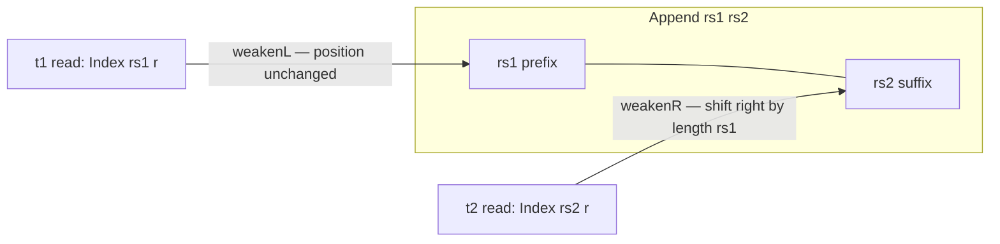

This chapter reads the weakening section of `src/Keiki/Composition.hs`. Weakening is the half of the
algebra that handles **registers**: a composite's register file is `Append rs1 rs2`, so every register
read inside a source edge has to be re-indexed into the merged file before it can appear in a composite
edge. Read [00 — Start here](/docs/keiki/walkthrough/composition/00-start-here) for the overview.

## The problem weakening solves

`compose t1 t2` (chapter 04) builds a transducer whose register file is `Append rs1 rs2` — `t1`'s slots
followed by `t2`'s slots. But `t1`'s edges read registers via `Index rs1 r` (pointers into `rs1` alone),
and `t2`'s edges read via `Index rs2 r` (pointers into `rs2` alone). Neither index is valid against the
appended file as-is:

- A `t1` read points into the **prefix** `rs1`. The merged file starts with `rs1`, so the *position* is
  unchanged — but the *type* must be retargeted to `Append rs1 rs2`. That is **weakenL** ("lift a
  head-side index across an `rs2` suffix").
- A `t2` read points into `rs2`, which sits **after** the `rs1` prefix in the merged file. Its position
  must shift right by `length rs1`. That is **weakenR** ("lift a tail-side index across an `rs1`
  prefix").



## `weakenL`: retarget a head-side index (position unchanged)

Because the merged file begins with `rs1`, a head-side index keeps its integer position — `weakenL` just
walks the existing `Index` shape and rebuilds it at the wider type:

```haskell
-- src/Keiki/Composition.hs
-- | Lift a head-side 'Index' across an rs2 suffix. Walks the
-- existing 'Index' shape; @ZIdx@ stays @ZIdx@, @SIdx i@ recurses.
weakenL :: forall rs1 rs2 r. Index rs1 r -> Index (Append rs1 rs2) r
weakenL ZIdx     = ZIdx
weakenL (SIdx i) = SIdx (weakenL @_ @rs2 i)
```

`ZIdx` (position 0) stays `ZIdx`; `SIdx i` recurses. Operationally it is an identity on positions — the
work is purely making GHC accept the wider index type.

## `WeakenR`: shift a tail-side index right by the prefix length

`weakenR` is the harder direction: it has to *prepend* one `SIdx` per slot in `rs1`. There is no value to
recurse on (the input index doesn't mention `rs1`), so the recursion is driven by a **type class indexed
on `rs1`**:

```haskell
-- src/Keiki/Composition.hs
-- | Lift a tail-side 'Index' (or 'IndexN') across an rs1 prefix.
-- The class is indexed by @rs1@; instances walk rs1's slot list with
-- 'SIdx' / 'IS' prepends, converting an @'Index' rs2 r@ into an
-- @'Index' (Append rs1 rs2) r@ and an @'IndexN' s rs2 r@ into an
-- @'IndexN' s (Append rs1 rs2) r@.
class WeakenR (rs1 :: [Slot]) where
  weakenR
    :: forall rs2 r. Index rs2 r -> Index (Append rs1 rs2) r
  weakenRIndexN
    :: forall rs2 s r. IndexN s rs2 r -> IndexN s (Append rs1 rs2) r

instance WeakenR '[] where
  weakenR       i = i
  weakenRIndexN i = i

instance WeakenR rs1 => WeakenR ('(s, t) ': rs1) where
  weakenR       i = SIdx (weakenR       @rs1 i)
  weakenRIndexN i = IS   (weakenRIndexN @rs1 i)
```

Read the instances as structural recursion over `rs1`'s slot list:

- the `'[]` instance is the identity — no prefix, no shift;
- the cons instance prepends one `SIdx` (for `Index`) or one `IS` (for the slot-name-tagged `IndexN`)
  and recurses on the prefix tail.

So `WeakenR rs1`'s `weakenR` adds exactly `length rs1` skips to the front of the tail-side index — the
shift right.

<Callout type="info">
This is why `WeakenR rs1` is a constraint on every combinator in the module (`compose`, `alternative`,
`feedback1`). The class instance *is* the runtime evidence needed to shift `t2`'s reads; GHC resolves it
from the shape of `rs1` at the composite's call site. The slot-name variant `weakenRIndexN` exists
because `USet` writes through an `IndexN` that carries the slot symbol — that name must survive the shift
(chapter 02 of the core tour, [Internal slots](/docs/keiki/walkthrough/core-and-builder/01-internal-slots)).
</Callout>

## Walking the AST: `weakenL*` over terms, predicates, updates

`weakenL` re-indexes a single register pointer. The `weakenL*` family lifts that over the whole edge AST.
A `Term` only touches the register file through `TReg`, so the walk recurses structurally and re-indexes
exactly at the leaf:

```haskell
-- src/Keiki/Composition.hs
-- | Walk a 'Term' and weaken every register read across an rs2
-- suffix. 'TInpCtorField' / 'TLit' do not touch the register file,
-- so they pass through unchanged.
weakenLTerm
  :: forall rs1 rs2 ci ifs r.
     Term rs1 ci ifs r -> Term (Append rs1 rs2) ci ifs r
weakenLTerm (TLit r)              = TLit r
weakenLTerm (TReg ix)             = TReg (weakenL @rs1 @rs2 ix)
weakenLTerm (TInpCtorField ic ix) = TInpCtorField ic ix
weakenLTerm (TApp1 f t)           = TApp1 f (weakenLTerm @rs1 @rs2 t)
weakenLTerm (TArith op a b)       =
  TArith op (weakenLTerm @rs1 @rs2 a) (weakenLTerm @rs1 @rs2 b)
weakenLTerm (TApp2 f a b)         = TApp2 f (weakenLTerm @rs1 @rs2 a)
                                              (weakenLTerm @rs1 @rs2 b)
```

The two non-recursive cases are the point: `TLit` is a constant and `TInpCtorField` reads the *input*,
not a register — neither mentions `rs1`, so both pass through with only the result type widened.
`weakenLPred` and `weakenLUpdate` are the same idea one level up — they recurse through the predicate /
update structure and delegate every embedded term to `weakenLTerm`:

```haskell
-- src/Keiki/Composition.hs
weakenLPred (PEq a b)     = PEq  (weakenLTerm @rs1 @rs2 a)
                                  (weakenLTerm @rs1 @rs2 b)
weakenLPred (PInCtor ic)  = PInCtor ic
-- ...
weakenLUpdate (USet ix t)    = USet (weakenLIndexN @rs1 @rs2 ix)
                                     (weakenLTerm @rs1 @rs2 t)
```

Note `weakenLUpdate` weakens *both* the write target (`weakenLIndexN`, the slot-name-tagged variant of
`weakenL`) and the right-hand-side term. The haddock makes the type-level claim explicit:

```haskell
-- src/Keiki/Composition.hs
-- | Walk an 'Update' and weaken every register write + every
-- right-hand-side 'Term'. The slot-name index @w@ is preserved by
-- weakening — adding new slots to the right of @rs1@ does not change
-- which slot names the update writes.
```

The `(w :: [Symbol])` index — the *set of slot names this update writes* — is unchanged by weakening,
because appending new slots on the right doesn't rename any existing slot.

## The `weakenR*` family: same walk, the other direction

The tail-side family mirrors the head-side family one-for-one, except every register read goes through
`weakenR @rs1` (the class method) instead of `weakenL`, and the functions carry a `WeakenR rs1`
constraint:

```haskell
-- src/Keiki/Composition.hs
weakenRTerm
  :: forall rs1 rs2 ci ifs r.
     WeakenR rs1
  => Term rs2 ci ifs r -> Term (Append rs1 rs2) ci ifs r
weakenRTerm (TReg ix)             = TReg (weakenR @rs1 ix)
-- TLit / TInpCtorField / TApp1 / TArith / TApp2 recurse as above
```

`weakenRPred`, `weakenRUpdate`, `weakenROutFields`, and `weakenROut` follow the same pattern. `weakenROut`
is worth a glance — it shows that the `OPack` *wrapping* (the input/wire constructor tags) is structurally
preserved; only the inner `OutFields` term chain gets walked:

```haskell
-- src/Keiki/Composition.hs
-- | Walk an 'OutTerm' on a tail-side register file and lift every
-- register read across an rs1 prefix. The 'OPack' wrapping is
-- structurally preserved; only the underlying 'OutFields' chain is
-- walked.
weakenROut (OPack ic wc fs) =
  OPack ic wc (weakenROutFields @rs1 @rs2 fs)
```

There is also a `weakenLOut` (the head-side output variant) used by `alternative` (chapter 05).

<Callout type="info">
Why two families instead of one symmetric one? Because the two sides play different roles. In
`compose`, `t1`'s contribution is weakened *left* (its reads stay in place, the file grows to the
right), while `t2`'s contribution is *substituted* (chapter 03) — substitution itself uses `weakenR`
internally for `t2`'s genuine register reads. In `alternative`, both arms are independent: `t1` is
weakened left, `t2` is weakened right, and there is no substitution. So the module needs both
directions, and `alternative` is where you see them paired.
</Callout>

These weakening helpers are exported "for advanced uses" but their day job is internal: they are the
register-side plumbing of `compose` (chapter 04) and `alternative` (chapter 05). The acceptance fixture
`AlertSource ⨾ EmailDelivery` exercises them through `compose` — `alertSource`'s register writes are
weakened into the `Append AlertRegs EmailRegs` file, and the round-trip in `test/Keiki/CompositionSpec.hs`
confirms each field arrives intact.

Next: [03 — Substitution](/docs/keiki/walkthrough/composition/03-substitution).

Previous: [01 — The composite vertex](/docs/keiki/walkthrough/composition/01-composite-vertex).
