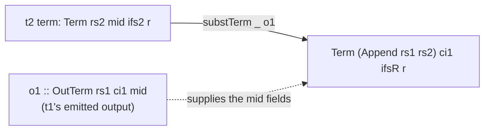

This chapter reads the substitution section of `src/Keiki/Composition.hs`. Substitution is the load-bearing
half of the composition algebra: where weakening (chapter 02) handles registers, substitution eliminates
the **seam alphabet** `mid`. It is what lets a `t2`-side edge — written against `t2`'s input — be rewritten
to read `t1`'s input directly. Read
[00 — Start here](/docs/keiki/walkthrough/composition/00-start-here) for the overview.

## What substitution does

`t2`'s edges read their input through the `mid` alphabet — every `TInpCtorField` in `t2` reads a field of
some `mid` constructor. But in the composite, `mid` never materializes as a value: `t1` emits it
*symbolically* as an `OutTerm rs1 ci1 mid` (the `o1` argument below), and the composite reads `t1`'s
input `ci1`. So substitution replaces each `t2`-side `mid` read with the corresponding field of `t1`'s
output term `o1`, producing a term over `Append rs1 rs2` and `ci1`:



The full family — `substTerm`, `substPred`, `substUpdate`, `substOutFields`, `substOut` — walks each part
of a `t2` edge and threads `o1` through. They are exported "for advanced uses" but their job is to be the
inner machinery of `compose` (chapter 04).

## `substTerm`: the four cases

```haskell
-- src/Keiki/Composition.hs
substTerm
  :: forall rs1 rs2 ci1 mid ifs2 ifsR r.
     WeakenR rs1
  => Term rs2 mid ifs2 r
  -> OutTerm rs1 ci1 mid
  -> Term (Append rs1 rs2) ci1 ifsR r
substTerm (TLit r)              _o1 = TLit r
substTerm (TReg ix2)            _o1 = TReg (weakenR @rs1 ix2)
substTerm (TInpCtorField ic2 ix2) o1 =
  case o1 of
    OPack _ic1 wc1 of1
      | icName ic2 == wcName wc1 -> ...
```

Four cases, each principled:

- **`TLit`** — a constant; it doesn't depend on `mid`, so it passes through.
- **`TReg ix2`** — a *genuine* `t2` register read. It still reads `rs2`, but in the composite that slot
  has moved right past the `rs1` prefix, so it is weakened with `weakenR @rs1` (chapter 02). This is the
  one place substitution and weakening meet: `t2`'s registers survive, only its *input* reads are
  rewritten.
- **`TInpCtorField ic2 ix2`** — the substitution proper, below.
- **`TApp1` / `TArith` / `TApp2`** — congruence cases; recurse and thread `o1` through each subterm.

## The `TInpCtorField` case: positional field extraction

This is the core of the algorithm. `t2` reads field `ix2` of constructor `ic2` of the `mid` alphabet.
`t1`'s output `o1` is an `OPack _ic1 wc1 of1` — it was packed under wire constructor `wc1` with field
terms `of1`. If the names line up, substitution pulls the `n`-th field term out of `of1`:

```haskell
-- src/Keiki/Composition.hs
substTerm (TInpCtorField ic2 ix2) o1 =
  case o1 of
    OPack _ic1 wc1 of1
      | icName ic2 == wcName wc1 ->
          let n = indexInt ix2
          in case nthTerm n of1 of
               Just (SomeTerm tm) ->
                 weakenLTerm @rs1 @rs2 (unsafeCoerceTerm tm)
               Nothing -> error ...
      | otherwise -> error ...
```

Step by step:

<Steps>
<Step>
**Project the read position.** `indexInt ix2` is the integer position of the field `t2` is reading.
(`indexInt` is a local replica of `Keiki.Core`'s internal `indexInt`, which isn't exported there.)
</Step>
<Step>
**Pull the matching field term from `t1`'s output.** `nthTerm n of1` walks `t1`'s emitted `OutFields`
chain to position `n` and returns the term `t1` used to *build* that field — wrapped existentially as
`SomeTerm` so its field type doesn't escape.
</Step>
<Step>
**Weaken it into the merged file.** That term reads `t1`'s registers (`rs1`), so it is weakened *left*
(`weakenLTerm`) into `Append rs1 rs2`. After the substitution, `t2`'s read of a `mid` field has become
`t1`'s computation of that field — which reads `t1`'s input and `t1`'s registers.
</Step>
</Steps>

`nthTerm` returns `Maybe` and `Nothing` is an `error`, because overrunning the field chain is a caller
bug, not a recoverable condition:

```haskell
-- src/Keiki/Composition.hs
-- | Walk an 'OutFields' chain to position @n@. Returns @Nothing@
-- when @n@ overshoots the chain (a bug in the caller; the design's
-- structural-alignment assumption guarantees @n@ is in range when
-- the constructor names match).
nthTerm :: Int -> OutFields rs ci ifs fs -> Maybe (SomeTerm rs ci)
nthTerm _  OFNil           = Nothing
nthTerm 0  (OFCons t _)    = Just (SomeTerm t)
nthTerm n  (OFCons _ rest)
  | n > 0     = nthTerm (n - 1) rest
  | otherwise = Nothing
```

## The `icName == wcName` invariant

Substitution is only sound when `t2`'s constructor for the `mid` field matches the constructor `t1`
actually emitted. The guard `icName ic2 == wcName wc1` is **string equality** of constructor names — the
same name-based matching `solveOutput` uses. The two branches that don't match are both hard errors:

```haskell
-- src/Keiki/Composition.hs
      | otherwise -> error
          ("Keiki.Composition.compose: TInpCtorField over " <> icName ic2
           <> " but t1's edge produced " <> wcName wc1
           <> " — caller should ensure structural alignment of mid's\
              \ constructors. Substitution at this position is\
              \ unsound; the composite edge guard's PInCtor\
              \ substitution should make the edge unsatisfiable\
              \ before evaluation reaches this term.")
```

<Callout type="warn">
The error message names the resolution: when the constructors *don't* match, the composite edge's guard
is already unsatisfiable, so a correct caller never reaches this term. That collapse happens in
`substPred` on the `PInCtor` case — a name mismatch rewrites the constructor predicate to `PBot`:

```haskell
-- src/Keiki/Composition.hs
substPred (PInCtor ic2)  o1 =
  case o1 of
    OPack _ wc1 _
      | icName ic2 == wcName wc1 -> PTop
      | otherwise                -> PBot
```

A `t2`-edge that demands `mid` constructor *X* paired against a `t1`-edge that emits constructor *Y*
becomes a guard containing `PBot` — an edge that can never fire. The `error` in `substTerm` is the
defensive backstop for the case where a caller bypasses the guard; in normal `compose` it is unreachable.
This is also why `compose` over the multi-event fixture (chapter 04) produces four structurally-present
edges of which three carry `PBot` guards.
</Callout>

## The `unsafeCoerce` justification

The `Just (SomeTerm tm)` branch calls `unsafeCoerceTerm`. This is the algorithm's one unsound-in-general
operation, and the source documents exactly why it is sound *here*:

```haskell
-- src/Keiki/Composition.hs
-- | Existentially-coerce a 'Term''s result type /and/ input field
-- schema. Unsound in general; justified here by the structural-
-- alignment invariant the design note documents: when
-- @icName ic2 == wcName wc1@, the slot list of @ic2@ and the field
-- tuple of @wc1@ are derived from the same 'Generic' representation, so
-- positional reads agree on type; and the substituted term reads t1's
-- input at t1's 'OPack' schema, which is the schema the composite
-- 'OPack' is rebuilt at (see 'substOut').
unsafeCoerceTerm
  :: forall rs ci ifs ifs' r r'. Term rs ci ifs' r' -> Term rs ci ifs r
unsafeCoerceTerm = unsafeCoerce
```

The coercion realigns two things GHC can't see are equal: the term's *result type* (`r' ~ r`) and its
*input field schema* (`ifs' ~ ifsR`). The justification is the structural-alignment invariant: when the
names match, `ic2`'s slot list and `wc1`'s field tuple are derived from the **same `Generic`
representation** (via the `GRecord`/`GTuple` walks, see
[the generic record walk](/docs/keiki/walkthrough/derivations/02-generic-record-walk)), so positional
reads agree on type. The coercion is a type-system gap-filler over an equality the derivation guarantees.

## `substOut`: re-tagging with `t1`'s input constructor

`substOut` is where the composite's output term gets rebuilt — and it has a subtle move. The composite's
`OPack` is tagged with **`t1`'s** input constructor `ic1`, not `t2`'s `ic2_co`:

```haskell
-- src/Keiki/Composition.hs
-- | Substitute a t2-side 'OutTerm' against t1's edge output. The
-- composite's 'OPack' is tagged with t1's input constructor (the
-- @ic1@ from o1) — not t2's @ic2_co@. See the design note's
-- "Substituting an OutTerm" section.
substOut (OPack _ic2_co wc2_co of2) o1 =
  case o1 of
    OPack ic1 _wc1 _of1 ->
      OPack (unsafeCoerceInCtor ic1)
            wc2_co
            (substOutFields @rs1 @rs2 of2 o1)
```

The wire constructor `wc2_co` is kept from `t2` (the composite emits `t2`'s output alphabet `co`), and
the field chain is the substituted `of2`. But the `InCtor` is `t1`'s `ic1`. Why?

<Callout type="info">
The `InCtor` on an `OPack` is what `solveOutput` uses to *invert* a wire event back to the originating
command. The composite consumes `ci1` (t1's input), so when `solveOutput` walks the composite's output
back, it must rebuild a `ci1` — using `ic1`'s `icMatch` / `icBuild`. Tagging the `OPack` with `ic1` is
exactly what makes mechanical inversion recover `ci1` rather than the intermediate `mid` command. This is
the structural counterpart of the `unsafeCoerceTerm` step: the substituted field terms read `t1`'s input
at `t1`'s schema, and `substOut` ensures the rebuilt `OPack` is tagged at that same schema.
</Callout>

The `InCtor` re-tag needs its own coercion, and the source is explicit that this one is a structural
identity rather than a genuine cross-type cast:

```haskell
-- src/Keiki/Composition.hs
-- | Coerce an 'InCtor''s @ci@ type. Unsound in general; the
-- composite uses ic1 (originally over @ci1@) and the type already
-- aligns — the call site is a structural identity. We use coerce
-- here only because the @InCtor@ shape doesn't admit a phantom
-- @ci@ tag we could thread through; this is a one-line escape
-- to keep the substitution writable. The runtime behaviour is
-- correct: ic1's icMatch / icBuild are exactly what 'solveOutput'
-- on the composite needs.
unsafeCoerceInCtor :: InCtor ci ifs -> InCtor ci' ifs
unsafeCoerceInCtor = unsafeCoerce
```

`ic1` is already over `ci1`, which is the composite's input alphabet — the coercion only exists because
`InCtor` carries no phantom `ci` tag to thread through cleanly. The runtime behaviour is correct.

## `substPred`, `substUpdate`, `substOutFields`: the congruence walks

The remaining three substitutors are structural congruences that delegate to `substTerm` (and, for
`PInCtor`, to the name check above). `substUpdate` preserves the written-slot index `w`:

```haskell
-- src/Keiki/Composition.hs
-- | Substitute a t2-side 'Update' against t1's edge output. The
-- slot-name index @w@ is preserved by substitution — substituting
-- input reads inside the right-hand-side 'Term's does not change
-- which slot names the update writes.
substUpdate (USet ix2 t)      o1 = USet (weakenRIndexN @rs1 ix2)
                                          (substTerm @rs1 @rs2 t o1)
```

Note the write target `ix2` is weakened with `weakenRIndexN` (it is a `t2` slot, shifting right), while
the RHS term is *substituted* (it may read `mid` input fields). That split — weaken the write, substitute
the read — is the whole edge-rewrite in miniature, and it is exactly what `productEdge` assembles in the
next chapter.

The acceptance anchor for the whole family is `test/Keiki/CompositionSpec.hs`: the
`AlertSource ⨾ EmailDelivery` round-trip succeeds only because `emailDelivery`'s edges (written against
`EmailCmd`, the `mid` alphabet) are correctly substituted against `alertSource`'s `EmailCmd`-shaped
output, recovering the original `AlertCmd` fields on inversion.

Next: [04 — compose](/docs/keiki/walkthrough/composition/04-compose).

Previous: [02 — Weakening](/docs/keiki/walkthrough/composition/02-weakening).
