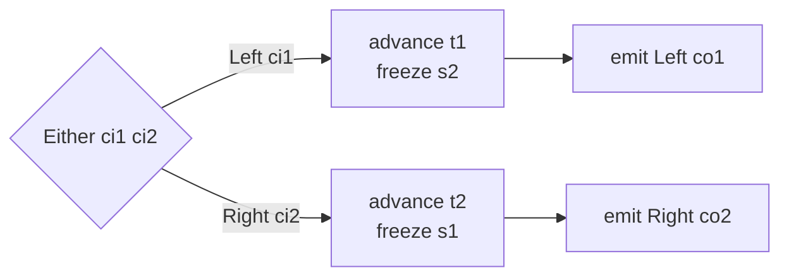

This chapter reads the Either-lifter section and `alternative` in `src/Keiki/Composition.hs`. Where
`compose` (chapter 04) *chains* two transducers through a shared `mid` alphabet, `alternative` *routes*
between two independent transducers on a `Left` / `Right` tag. The two combinators share the `Composite`
vertex but use entirely different edge plumbing — `compose` substitutes, `alternative` lifts into an
`Either` alphabet. Read [00 — Start here](/docs/keiki/walkthrough/composition/00-start-here) for the
overview.

## The shape

`alternative t1 t2` consumes `Either ci1 ci2` and emits `Either co1 co2`: a `Left ci1` advances `t1`
(freezing `t2`'s sub-vertex), a `Right ci2` advances `t2` (freezing `t1`'s). The two arms have
**independent state** in one product vertex, evolving in parallel as commands arrive for each arm:



To make a `t1`-edge — written against `ci1` and `co1` — fit the composite's `Either` alphabets, every
constructor and term inside it has to be *lifted* into the `Left` arm. That family of lifters is the bulk
of this section.

## The constructor lifters

The four ctor lifters re-wrap a single constructor so it operates on one arm of an `Either`. `leftInCtor`
matches only `Left _` inputs and rebuilds through `Left`:

```haskell
-- src/Keiki/Composition.hs
-- | Lift an 'InCtor' from the left arm of an 'Either' input alphabet.
-- The resulting 'InCtor' matches only on @Left _@ inputs and
-- preserves the underlying constructor's slot list and round-trip;
-- 'icBuild' wraps the rebuilt @ci1@ in 'Left' so the lifted
-- transducer's 'solveOutput' walks back to the original input form.
leftInCtor :: InCtor ci1 ifs -> InCtor (Either ci1 ci2) ifs
leftInCtor InCtor { icName = n, icMatch = m, icBuild = b } = InCtor
  { icName  = n
  , icMatch = \case
      Left c1 -> m c1
      Right _ -> Nothing
  , icBuild = Left . b
  }
```

The name is preserved (`icName = n`); `icMatch` runs the underlying matcher only on the `Left` branch and
returns `Nothing` on `Right`; `icBuild` wraps the rebuilt command back in `Left` so inversion recovers
the `Either`-tagged form. `rightInCtor` is the mirror image (`Right` branch, `Right . b`), and
`leftWireCtor` / `rightWireCtor` do the same for the *output* alphabet's `WireCtor`. These four are the
atoms every higher lifter is built from.

<Callout type="info">
`alternative` also conjoins each complete lifted edge with a real `PLeftArm` or `PRightArm` predicate.
That explicit discriminator matters for epsilon and register-only guards such as `PTop`, which may
contain no `InCtor` to lift. The concrete evaluator and SBV translator make the two arm predicates
mutually exclusive, so single-valuedness reduces to each arm's own check.
</Callout>

## The term / pred / update / output lifters

The `liftL*Alt` family walks an edge AST and retags every constructor read through the left lifters.
`TInpCtorField` is the only term case that touches the input alphabet, so it is the only one that
changes:

```haskell
-- src/Keiki/Composition.hs
-- | Lift a 'Term' from the left side's input alphabet to
-- @Either ci1 ci2@. Walks the AST and adjusts every 'TInpCtorField'
-- to read through 'leftInCtor'. 'TLit' / 'TReg' don't depend on
-- @ci@ and pass through unchanged.
liftLTermAlt (TLit r)              = TLit r
liftLTermAlt (TReg ix)             = TReg ix
liftLTermAlt (TInpCtorField ic ix) = TInpCtorField (leftInCtor ic) ix
liftLTermAlt (TApp1 f t)           = TApp1 f (liftLTermAlt @rs @ci1 @ci2 t)
-- TArith / TApp2 recurse
```

`TLit` and `TReg` don't mention `ci`, so they pass through; `TInpCtorField` retags through `leftInCtor`.
Crucially, these lifters **do not touch the register file** — `TReg` is unchanged. That is the difference
from weakening (chapter 02): weakening shifts register indices into `Append rs1 rs2`; the `Alt` lifters
only re-tag the *alphabet*. `alternative` uses both, in sequence.

`liftLPredAlt` recurses through predicate structure and also handles `PInCtor` (retagging through
`leftInCtor`); `liftLUpdateAlt` preserves the written-slot index `w` and lifts only the RHS terms; and
`liftLOutAlt` re-tags an entire output term — both the `InCtor` and the `WireCtor` — for the left arm:

```haskell
-- src/Keiki/Composition.hs
-- | Lift an 'OutTerm' from the left side's alphabets to
-- @Either ci1 ci2@ on the input and @Either co1 co2@ on the output.
-- The 'OPack' is re-tagged: the 'InCtor' becomes 'leftInCtor', the
-- 'WireCtor' becomes 'leftWireCtor', and every 'Term' inside the
-- 'OutFields' is lifted via 'liftLTermAlt'.
liftLOutAlt (OPack ic wc fs) =
  OPack (leftInCtor ic)
        (leftWireCtor wc)
        (liftLOutFieldsAlt @rs @ci1 @ci2 fs)
```

The `liftR*Alt` family is the exact mirror, retagging through the `right*` lifters.

## `alternative`: the union of two lifted edge sets

```haskell
-- src/Keiki/Composition.hs
alternative
  :: forall rs1 rs2 s1 s2 ci1 ci2 co1 co2.
     ( WeakenR rs1
     , Disjoint (Names rs1) (Names rs2)
     )
  => SymTransducer (HsPred rs1 ci1) rs1 s1 ci1 co1
  -> SymTransducer (HsPred rs2 ci2) rs2 s2 ci2 co2
  -> SymTransducer (HsPred (Append rs1 rs2) (Either ci1 ci2))
                   (Append rs1 rs2)
                   (Composite s1 s2)
                   (Either ci1 ci2)
                   (Either co1 co2)
```

Same constraints and same product vertex / appended register file as `compose`, but no shared `mid` — the
two alphabets stay disjoint via `Either`. The transducer record mirrors `compose`'s, including the
both-arms-final rule:

```haskell
-- src/Keiki/Composition.hs
alternative t1 t2 = SymTransducer
  { edgesOut    = altEdges
  , initial     = Composite (initial t1) (initial t2)
  , initialRegs = appendRegFile (initialRegs t1) (initialRegs t2)
  , isFinal     = \(Composite s1 s2) -> isFinal t1 s1 && isFinal t2 s2
  }
```

The edges from a composite vertex are the **union** of both arms' lifted edges:

```haskell
-- src/Keiki/Composition.hs
altEdges (Composite s1 s2) =
  map (liftEdgeL s2) (edgesOut t1 s1)
    ++ map (liftEdgeR s1) (edgesOut t2 s2)
```

## `liftEdgeL` and `liftEdgeR`: weaken, then lift, freeze the other arm

`liftEdgeL` takes a `t1`-edge and produces a composite edge for the `Left` arm. Two transformations stack
on each field: first **weaken** into the merged register file (chapter 02), then **lift** into the
`Either` alphabet:

```haskell
-- src/Keiki/Composition.hs
liftEdgeL s2 e1 = case e1 of
  Edge { update = u1 } -> Edge
    { guard  = PAnd PLeftArm
                 (liftLPredAlt @(Append rs1 rs2) @ci1 @ci2
                   (weakenLPred @rs1 @rs2 (guard e1)))
    , update = liftLUpdateAlt @(Append rs1 rs2) @_ @ci1 @ci2
                               (weakenLUpdate @rs1 @rs2 u1)
    , output = map (liftLOutAlt @(Append rs1 rs2) @ci1 @ci2 @co1 @co2
                      . weakenLOut @rs1 @rs2)
                   (output e1)
    , target = Composite (target e1) s2
    }
```

Read each field as `lift . weaken`: `weakenLPred` then `liftLPredAlt`, `weakenLUpdate` then
`liftLUpdateAlt`, `weakenLOut` then `liftLOutAlt`. The two passes are orthogonal — one fixes registers,
the other fixes the alphabet — while `PLeftArm`/`PRightArm` supplies the top-level discriminator. The
target advances `t1`'s vertex and **freezes `s2`** at its incoming
value (`Composite (target e1) s2`): a `Left` command moves only the left arm.

`liftEdgeR` is the mirror — `weakenR*` then `liftR*Alt`, freezing `s1`:

```haskell
-- src/Keiki/Composition.hs
liftEdgeR s1 e2 = case e2 of
  Edge { update = u2 } -> Edge
    { guard  = PAnd PRightArm
                 (liftRPredAlt @(Append rs1 rs2) @ci1 @ci2
                   (weakenRPred @rs1 @rs2 (guard e2)))
    , update = liftRUpdateAlt @(Append rs1 rs2) @_ @ci1 @ci2
                               (weakenRUpdate @rs1 @rs2 u2)
    , output = map (liftROutAlt @(Append rs1 rs2) @ci1 @ci2 @co1 @co2
                      . weakenROut @rs1 @rs2)
                   (output e2)
    , target = Composite s1 (target e2)
    }
```

Here the `t2`-edges weaken *right* (their registers shift past the `rs1` prefix) and lift into the
*right* arm, freezing `s1`. Together, `liftEdgeL` and `liftEdgeR` produce two non-overlapping edge sets:
the `Left`-gated edges advance only the left axis, the `Right`-gated edges advance only the right.

<Callout type="info">
This freezing is why the composite vertex is a **product**, not a sum. Both arms always carry their own
sub-state; a command for one arm leaves the other's sub-state untouched. The acceptance test calls this
out: after a `Left sampleSendEmail` followed by a `Right samplePing`, both arms have advanced
independently — `EmailSentVertex` *and* `PingDone`.
</Callout>

## The acceptance anchor

`test/Keiki/CompositionAlternativeSpec.hs` composes `emailDelivery` (left) with an inline `pinger`
(right) into `siblings = alternative emailDelivery pinger`, over disjoint slot names so the
`Disjoint (Names rs1) (Names rs2)` constraint resolves automatically. The routing assertions are the spec
of the lifters:

```haskell
-- test/Keiki/CompositionAlternativeSpec.hs
it "Left input advances the EmailDelivery arm and emits Left output" $
  case step siblings (initial siblings, initialRegs siblings)
            (Left sampleSendEmail) of
    Just (Composite ev pv, _, [Left co]) -> do
      ev `shouldBe` EmailSentVertex
      pv `shouldBe` PingIdle           -- Pinger arm unchanged
      co `shouldBe` sampleEmailEvent
```

A `Left` advances only the email arm and emits a `Left` event; a `Right` advances only the pinger arm and
emits a `Right`; an interleaved `Left`-then-`Right` advances both. The composite is single-valued
(`isSingleValuedSym`) and round-trips under `reconstitute` in either log order — confirming the lifted
`icBuild`/`wcBuild` invert the `Either` wrapping cleanly.

Next: [06 — feedback1](/docs/keiki/walkthrough/composition/06-feedback1).

Previous: [04 — compose](/docs/keiki/walkthrough/composition/04-compose).
